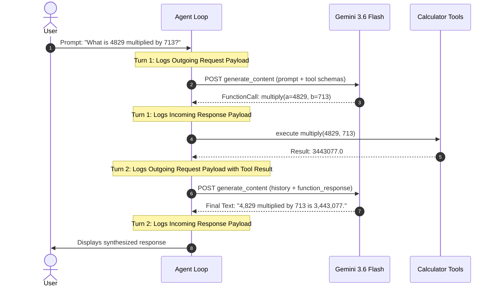

# AI Agent with Calculator Tool Calling (Gemini 3.6 Flash)

Demonstration notebook and script showing a complete **AI Agent** using **Gemini 3.6 Flash (`gemini-3.6-flash`)** and tool calling (Function Calling).

Every interaction turn logs the **complete request payload** (messages, roles, parts, function responses) and the **complete response payload** (candidates, tool calls, token usage) so you can inspect the exact API content in and out.

---

## 📁 Project Structure

- [`gemini_agent_calculator.ipynb`](file:///Users/vung.do/projects/hometask1/src/gemini/agent-sample-1/gemini_agent_calculator.ipynb): Interactive Jupyter Notebook with rich walkthrough, Mermaid diagram, payload logging, and test scenarios.
- [`agent.py`](file:///Users/vung.do/projects/hometask1/src/gemini/agent-sample-1/agent.py): Standalone runnable Python script equivalent.
- [`multi_tool_turn_demo.py`](file:///Users/vung.do/projects/hometask1/src/gemini/agent-sample-1/multi_tool_turn_demo.py): Dedicated demonstration of **multiple / parallel tool calls in a single turn**. Supports both live API and offline `--mock` simulation.
- [`requirements.txt`](file:///Users/vung.do/projects/hometask1/src/gemini/agent-sample-1/requirements.txt): Pinned dependencies (`google-genai`, `ipykernel`, etc.).

---

## 🚀 Getting Started

### 1. Set your Gemini API Key
Obtain an API key from [Google AI Studio](https://aistudio.google.com/):
```bash
export GEMINI_API_KEY="your-api-key-here"
```

### 2. Activate the Virtual Environment
A virtual environment `.venv` is already configured in this directory:
```bash
source .venv/bin/activate
```
*(Or install in your own environment with `pip install -r requirements.txt`)*

### 3. Run the Jupyter Notebook
Open the notebook in your favorite IDE (VS Code, Cursor, Antigravity, JupyterLab) or run:
```bash
.venv/bin/python -m jupyter notebook gemini_agent_calculator.ipynb
```

### 4. Or Run the Standalone Script
```bash
.venv/bin/python agent.py
```

### 5. Run Parallel / Multiple Tool Calling Demo
```bash
# Live with Gemini API key:
.venv/bin/python multi_tool_turn_demo.py

# Or offline mock simulation (requires no API key):
.venv/bin/python multi_tool_turn_demo.py --mock
```

---

## 🔬 How the Agent Loop Works



### Inspected Payloads

1. **Turn Request (`contents`)**:
   - Outgoing array of `Content` objects containing text or `function_response` parts.
   - List of active tool schemas provided to the model.
2. **Turn Response (`candidates`)**:
   - `function_calls`: name of the tool and arguments chosen by Gemini.
   - `usage_metadata`: prompt tokens, candidate tokens, total tokens.
3. **Tool Execution**:
   - Real-time display of local Python tool invocation and returned scalar.
4. **HTTP Wire Logging (Optional)**:
   - Built-in hook via `httpx` to view raw network frames sent to `generativelanguage.googleapis.com`.
