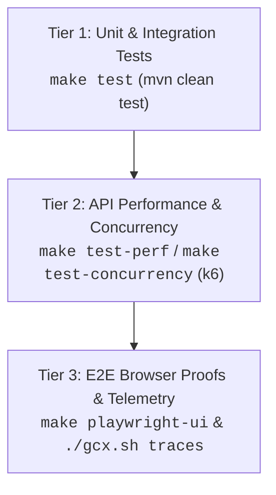

# Polaris Project Development Best Practices & Tooling Guide

This skill provides human engineers and AI agents with repository-specific operational best practices, inner-loop development recipes, and verification tooling for the **Polaris** project.

> [!NOTE]
> Authoritative principles, architecture contracts, and deep specifications are maintained in:
> - [AGENTS.md](file:///Users/vung.do/projects/hometask1/src/java/03-Polaris/AGENTS.md) — Core architecture & design principles (Simplicity, Change Scope, Cross-Cutting Discipline).
> - [Engineer-Guidelines.md](file:///Users/vung.do/projects/hometask1/src/java/03-Polaris/Engineer-Guidelines.md) — Network topology, TLS truststore, inner-loop debugging, and fleet roles.
> - [tests/perf/README.md](file:///Users/vung.do/projects/hometask1/src/java/03-Polaris/tests/perf/README.md) — Comprehensive k6 performance suite options.
> - [tests/e2e/README.md](file:///Users/vung.do/projects/hometask1/src/java/03-Polaris/tests/e2e/README.md) — End-to-end testing overview.
> - [.agents/skills/playwright-cli/SKILL.md](file:///Users/vung.do/projects/hometask1/src/java/03-Polaris/.agents/skills/playwright-cli/SKILL.md) — Complete Playwright CLI reference.

---

## 1. Environment & System Lifecycle via Makefile

Always use the root [Makefile](file:///Users/vung.do/projects/hometask1/src/java/03-Polaris/Makefile) for container lifecycle and local execution. Avoid invoking ad-hoc `docker compose` commands directly.

### Core Lifecycle Commands

| Target | Command | Purpose & Best Practice |
|---|---|---|
| **Boot Stack** | `make up` | Starts all services in the background (`docker compose up -d --build`). First run boots Postgres, Keycloak, Nginx gateway (`https://polaris.local`), apps, and LGTM telemetry stack. |
| **Stop Stack** | `make down` | Gracefully stops all containers while **preserving** database and telemetry volume state. |
| **Clean Reset** | `make clean` | Stops containers and purges volumes/orphans. Use when database state needs a fresh start. |
| **Rebuild Images** | `make build` | Rebuilds Spring Boot application Docker images without restarting containers. |
| **Inspect Health** | `make status` | Quick status check (`docker compose ps`) across all containers. |
| **Targeted Restart** | `make restart-<service>` | Restarts a single container (e.g. `make restart-polaris`, `make restart-polaris-assistant`) without tearing down the rest of the stack. |
| **Database Shell** | `make polaris-sql` | Drops into `psql` on the `polaris-db` PostgreSQL container. |

### Fast Inner Loop (Host Mode)
When iterating on Java code with a debugger or hot reload:
1. Keep the infrastructure containers running (`make up`).
2. Run the application directly on the host:
   - Core API: `make run` (`apps/polaris` on port `8080`)
   - AI Assistant: `make run-assistant` (`apps/polaris-assistant` on port `8081`)

---

## 2. Observability & Distributed Tracing with Grafana `gcx` CLI

The local stack includes a pre-configured `gcx-cli` container running Grafana's unified CLI (`gcx`), connected directly to the internal Grafana instance (`http://grafana:3000`), Tempo (`:3200`), and Loki (`:3100`).

### Interactive vs. Non-Interactive / Agent Invocations

- **Human Interactive Shell**: Run `make gcx` to drop into an interactive shell inside the container (`docker exec -it gcx-cli sh`).
- **Non-Interactive & Agent Execution**: Use the host wrapper script [./gcx.sh](file:///Users/vung.do/projects/hometask1/src/java/03-Polaris/gcx.sh) (e.g., `./gcx.sh <command>`). This avoids pseudo-TTY allocation errors in subshells, CI, and agent execution.

### Common `gcx` Recipes

#### A. Tempo Distributed Tracing
Polaris propagates W3C `traceparent` headers (`00-{traceId}-{spanId}-01`) and echoes `X-Trace-Id` on responses. Use `gcx` to inspect the generated spans:

```bash
# 1. Discover available trace tags / labels
./gcx.sh traces labels

# 2. Retrieve the complete trace span tree by Trace ID (from response X-Trace-Id or test log)
./gcx.sh traces get <trace-id>

# 3. Query recent traces for Polaris via TraceQL
./gcx.sh traces query '{resource.service.name = "polaris"}'

# 4. Filter traces with errors
./gcx.sh traces query '{resource.service.name = "polaris" && status = error}'
```

#### B. Loki Log Queries
```bash
# Query recent logs for polaris
./gcx.sh logs query '{service_name="polaris"}'

# Query logs containing error
./gcx.sh logs query '{service_name="polaris"} |= "ERROR"'
```

#### C. Machine-Readable Agent Output
Add `--agent` to any `gcx` command to receive clean, unformatted JSON instead of ANSI-styled tables:
```bash
./gcx.sh --agent traces get <trace-id>
```

---

## 3. Performance & Concurrency Validation with `k6`

Polaris uses `k6` test suites under [tests/perf/](file:///Users/vung.do/projects/hometask1/src/java/03-Polaris/tests/perf/) to validate latency SLOs, RFC 7807 ProblemDetail contracts, and pessimistic lock concurrency. Tests run via Docker (`grafana/k6`) with zero host dependency requirements.

### Running via Makefile / Docker

```bash
# Standard API performance & contract verification (p95 < 200ms, W3C traceparent check)
make test-perf

# High-concurrency inventory race condition audit (pessimistic locking, zero overselling)
make test-concurrency
```

### Direct Docker Run Commands (Advanced Customization)

```bash
# Custom virtual users and duration for general API suite:
docker run --network host --rm -i \
  -v $(pwd)/tests/perf:/scripts -w /scripts \
  -e BASE_URL=https://polaris.local \
  -e VUS=10 \
  -e DURATION=30s \
  grafana/k6 run api-test.js

# Custom SKU and iterations for concurrency test:
docker run --network host --rm -i \
  -v $(pwd)/tests/perf:/scripts -w /scripts \
  -e BASE_URL=https://polaris.local \
  -e VUS=20 \
  -e ITERATIONS=50 \
  -e SKU=NG-CHARGER-02 \
  grafana/k6 run order-concurrency-test.js
```

### Verification Criteria
- **Thresholds**: `http_req_duration: p(95) < 200ms` (p(95) < 500ms under write lock contention), `checks: rate > 0.95`.
- **Concurrency Invariant**: Under parallel buyer saturation, `final_stock >= 0`, `total_sold <= initial_stock`, and exhausted inventory returns `400 Bad Request` with ProblemDetail type `out-of-stock`.

---

## 4. End-to-End Verification with `playwright-cli`

End-to-End browser verification uses `playwright-cli` against the running local stack (`https://polaris.local`).

> [!TIP]
> For the comprehensive `playwright-cli` command dictionary, refer to [.agents/skills/playwright-cli/SKILL.md](file:///Users/vung.do/projects/hometask1/src/java/03-Polaris/.agents/skills/playwright-cli/SKILL.md).

### Common Workflows

```bash
# 1. Open Swagger UI in Playwright browser session
make playwright-ui

# 2. Take an accessibility & DOM snapshot
playwright-cli snapshot

# 3. Fill and interact with elements using snapshot element refs (e.g. e5)
playwright-cli click e5
playwright-cli fill e7 "test input"

# 4. Capture screenshot proof for work order audit
playwright-cli screenshot --filename=.playwright-cli/verification-proof.png

# 5. Clean up open browser sessions
make playwright-close
```

### Evidence Storage Convention
All E2E session evidence (snapshots, traces, screenshots) must be preserved under `.playwright-cli/` to serve as verifiable proof for slice completion audits.

---

## 5. Verification Hierarchy Quick-Card

When completing a vertical slice or bug fix, progress through the verification tiers in order:



1. **Tier 1 (Local CI / Seams)**: `make test` verifies domain invariants, controller validation, and repository persistence.
2. **Tier 2 (SLA & Race Conditions)**: `make test-perf` ensures latency within thresholds and no lock degradation.
3. **Tier 3 (User & System Acceptance)**: `playwright-cli` captures browser interaction proofs, and `./gcx.sh` validates end-to-end distributed trace propagation.
