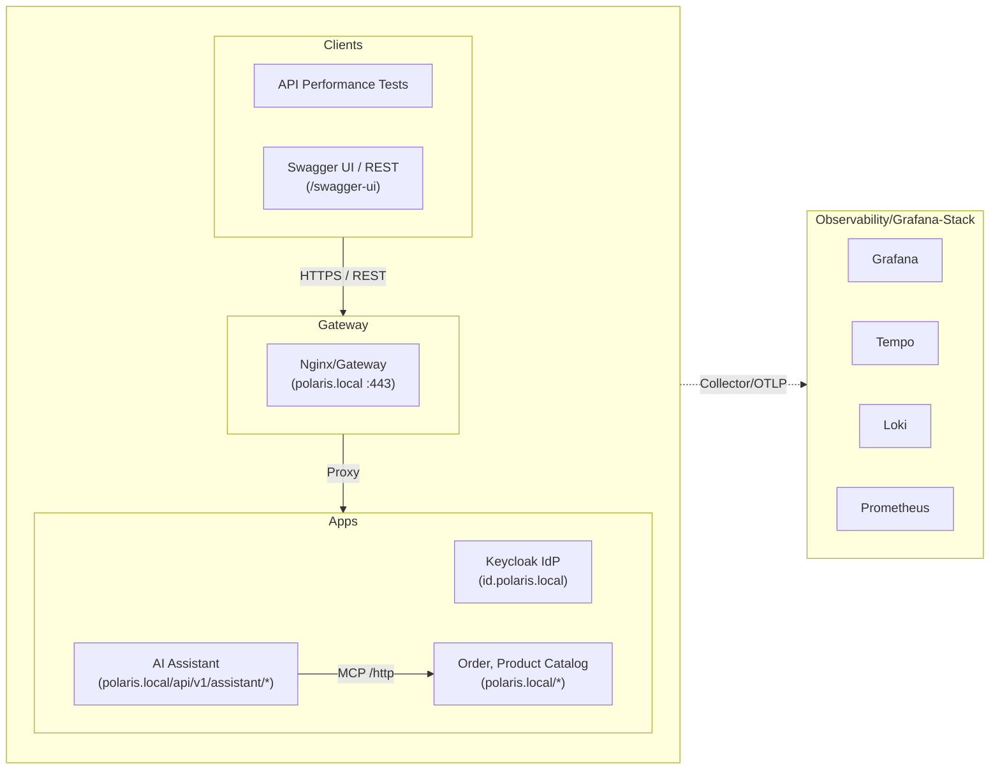

# Polaris - Enterprise Assistant Backend

Polaris is an enterprise backend service powering intelligent e-commerce operations, product discovery, conversational shopping, and order lifecycle management. Designed for direct integration with AI assistants and modern web clients, Polaris is organized as a modular polyglot monorepo exposing standards-compliant REST APIs secured by OAuth2/OIDC alongside a native Model Context Protocol (MCP) server.

---

## Business Domains & Capabilities

Polaris is organized around clear bounded contexts adhering to Domain-Driven Design (DDD) principles:

### 1. Product Catalog and Order management 
- (`/api/v1/products`): manage product & inventory
- (`/api/v1/categories`): manage product category
- (`/api/v1/orders`): manage orders

### 2. AI Assistant Context (`/api/v1/assistant/chat`)
* **Autonomous Microservice**: Standalone service (`apps/polaris-assistant`) decoupled from core commerce databases, routed via gateway sub-path `/api/v1/assistant/*` under `https://polaris.local`.
* **Turn-Level Distributed Observability**: Enclosing distributed tracing span (`agent.turn`) with structured lifecycle milestone events (`agent.request.received`, `tools.discovered`, `agent.iteration.started`, `model.request`, `model.response`, `agent.tool.call`, `agent.tool.result`, `agent.response.generated`, `agent.completed`) capturing autonomous ReAct loop progression in Grafana Tempo.
* **Structured Decision Observability**: High-cardinality decision auditing (`AgentDecisionRecorder`) emitting JSON-structured correlated events (`DecisionEvent` under `[STARTING]`, `[COMPLETED]`, `[FAILED]`, `[ERROR]`) and semantic tags (`decision.action`, `decision.intent`, `decision.confidence`, `decision.policy`, `decision.outcome.*`) on `agent.turn` spans.

### 3. Integration
* **MCP Integration**: Consumes product catalog and order operations from Polaris Core exclusively via Model Context Protocol (`/mcp`).


* **Enterprise Security**: OAuth2/OIDC Bearer token authentication strictly enforced across all MCP endpoints (zero security bypass).

### 4. Identity & Access Context (`https://id.polaris.local`)
* **Standards-Based Authentication**: OAuth 2.0 and OpenID Connect (OIDC) via Keycloak (`polaris` realm).
* **Cryptographic Token Verification**: Stateless JWT validation with PKCE support for client browsers, Swagger UI, and autonomous assistants.

---

## Development Architecture



---

## Up the Stack in a Minute

Get the entire environment—including local HTTPS, identity provider, core backend, PostgreSQL databases, and telemetry—running locally in under 60 seconds:

### 1. Prerequisites
- Docker & Docker Compose
- macOS or Linux
- [`mkcert`](https://github.com/FiloSottile/mkcert) (for trusted local TLS certificates)

### 2. Quick Start
```bash
# 1. Initialize environment file
cp .env.template .env

# 2. Configure local TLS certificates and hostnames (one-time setup)
./scripts/setup-local-https-mac-m1.sh

# 3. Boot the complete local stack
make up
```

### 3. Access & Verify Endpoints

| Portal | URL | Credentials / Action |
|---|---|---|
| **Polaris Swagger UI** | [https://polaris.local/swagger-ui/index.html](https://polaris.local/swagger-ui/index.html) | Unified Swagger UI for Core & Assistant (select definition in top dropdown) &rarr; Authorize with `testuser` / `testpass` |
| **Assistant Chat API** | `POST https://polaris.local/api/v1/assistant/chat` | AI Assistant chat conversation endpoint (Requires OAuth2 Bearer token) |
| **Polaris MCP Endpoint** | `POST https://polaris.local/mcp`<br/>[https://polaris.local/mcp/sse](https://polaris.local/mcp/sse) | MCP JSON-RPC stateless HTTP & SSE endpoints (Requires OAuth2 Bearer token) |
| **Keycloak Admin** | [https://id.polaris.local](https://id.polaris.local) | Username: `admin` \| Password: `admin` |
| **Grafana Telemetry** | [https://grafana.polaris.local](https://grafana.polaris.local) | Username: `admin` \| Password: `admin` (or Keycloak SSO) |
| **Polaris Database** | Internal `polaris-db:5432` | `make polaris-sql` opens psql into PostgreSQL 16 database |

---

## Essential Developer Commands

| Target | Command | Purpose |
|---|---|---|
| **Start Stack** | `make up` | Starts all services in the background (Apps + DBs + LGTM stack) |
| **Check Stack Status**| `make status` | Inspects container health, ports, and lifecycle states |
| **Stop Stack** | `make down` | Stops containers and networks (preserves persistent dev volumes) |
| **Clean Stack** | `make clean` | Stops containers, removes orphan containers and volumes |
| **Rebuild Images** | `make build` | Rebuilds the Polaris Spring Boot application container images |
| **Restart Service** | `make restart-<service>` | Restarts a single container (e.g. `make restart-polaris`) |
| **Run All Tests** | `make test` / `mvn clean test` | Executes local Java unit & domain integration tests across all modules |
| **Performance Tests** | `make test-perf` | Executes k6 API performance and contract validation suite in Docker |
| **Concurrency Tests** | `make test-concurrency` | Executes k6 high-concurrency inventory race condition audit in Docker |
| **Telemetry CLI** | `make gcx` / `./gcx.sh` | Queries Tempo traces and Loki logs in-terminal via Grafana gcx CLI |
| **Test Single Module** | `mvn test -pl apps/polaris` | Executes tests for a single module (e.g. `apps/polaris`) |
| **Playwright UI Testing** | `make playwright-ui` | Opens Swagger UI in Playwright for browser automation |
| **Close Playwright** | `make playwright-close` | Closes all open Playwright browser sessions |
| **Access Polaris DB** | `make polaris-sql` | Opens psql shell into the containerized PostgreSQL DB |

---

## Detailed Guides & Deep Dives

To keep daily development focused, detailed guides for specialized areas are maintained separately:

- 🔐 [**Local HTTPS Setup**](scripts/setup-local-https-mac-m1.sh): Manual setup script for `mkcert` and Java truststore.
- 📐 [**Architecture Decision Records (ADRs)**](docs/adr/): Formal architecture records (e.g., [ADR-0008: Polaris Assistant Isolation](docs/adr/0008-polaris-assistant-independent-application-mcp-architecture.md), [ADR-0009: Unified Gateway Sub-Path Routing](docs/adr/0009-gateway-subpath-routing-for-applications.md), [ADR-0010: MCP Client Authentication](docs/adr/0010-mcp-client-authentication-and-token-forwarding.md)).
- 🔍 [**ADR-0011: Gemini Distributed Tracing**](docs/adr/0011-gemini-model-call-distributed-tracing.md): Distributed tracing and W3C context propagation for AI model calls.
- 🌐 [**ADR-0012: MCP Cross-Service Distributed Tracing**](docs/adr/0012-mcp-cross-service-distributed-tracing.md): Cross-service trace propagation via W3C `traceparent` and server-side MCP tool execution spans.
- ⏱️ [**ADR-0013: AI Assistant Turn Observability & Lifecycle Events**](docs/adr/0013-agent-turn-span-and-lifecycle-events.md): Enclosing trace span (`agent.turn`) and structured span events for ReAct agent loop execution.
- 🎯 [**ADR-0014: Agent Decision Events and Observability Schema**](docs/adr/0014-agent-decision-events-and-observability-schema.md): Structured decision event schema (`DecisionEvent`), alternative evaluation, policy enforcement, and correlated trace/log observability for AI agent turns.
- 🛡️ [**ADR-0015: Intent Management and Policy Engine Architecture**](docs/adr/0015-intent-management-and-policy-engine-architecture.md): Proactive tool set narrowing, defensive tool validation, OAuth2 scope authorization, and intent observability.
- 📋 [**Product Requirements (PRDs)**](docs/prds/): Product requirement documents for catalog, orders, and AI assistant.
- 📋 [**PRD-004: AI Model Observability**](docs/prds/PRD-004-gemini-model-observability-and-distributed-tracing.md): Business requirements and personas for GenAI distributed tracing.
- 📋 [**PRD-005: AI Assistant Turn Observability**](docs/prds/PRD-005-agent-turn-observability-and-lifecycle-events.md): Business requirements, personas, and acceptance criteria for agent turn lifecycle telemetry.
- 🏛️ [**Architecture, Design & Code Principles**](AGENTS.md): Foundational requirements for lower-layer protocol alignment, bounded context containment, and cross-cutting observability.
- 🛠️ [**Engineer Guidelines**](Engineer-Guidelines.md): Operational conventions, inner-loop debugging, test hierarchy, and fleet roles.