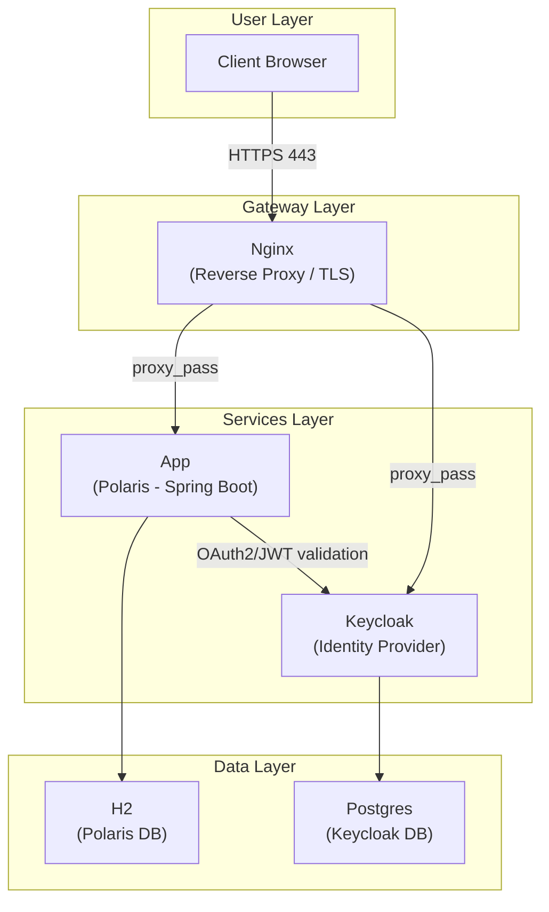

# Introduction
This is a java learning project for a .net developer who was/is switching to java springboot.

# Approach
I use top-down approach: 
- Draw from highlevel architecture for a production ready system
- Identity the GAPs top-down
- Choose one of the GAPs and deep dive 

## Architecture

# GAPS

## Java starter
- init a java srping boot web api project
- package management, common packages for a springboot web project
- maven, compile, run, test
- testing for a springboot web project with WebMVC layer, Services layer, JPA (java persistence layer)
- mocking framework
- integration test

## Intermediate
- @Configuration, @Value
- SecurityFilter with auth2
- Spring-doc openapi

## Advanced
To setup production like system:
- Database migration with flyway
- Gateway (use nginx for local, setup self-signed certificate for domain polaris.local)
- Observability
- Optimistic & pessimistic approaches for concurency problem.

## Learn java idioms
- Read effective java

# Customer Support Agent
## Problem context
We will provide tools via MCP for a customer support agent where user can
- asking for production information
- place an order (purchase is optional)
- check order status
- cancel/request refund for an order.

User might be required to identify before any action, ideally they must perform login with keycloak service.
Security should be consider here too like PII data.

## AI stack
- https://docs.litellm.ai/docs/providers/github
- gemini

## Backend
- java springboot

## observability 
- protocol: opentelemetry with otel collector
- tools: prometheus, grafana, jaeger