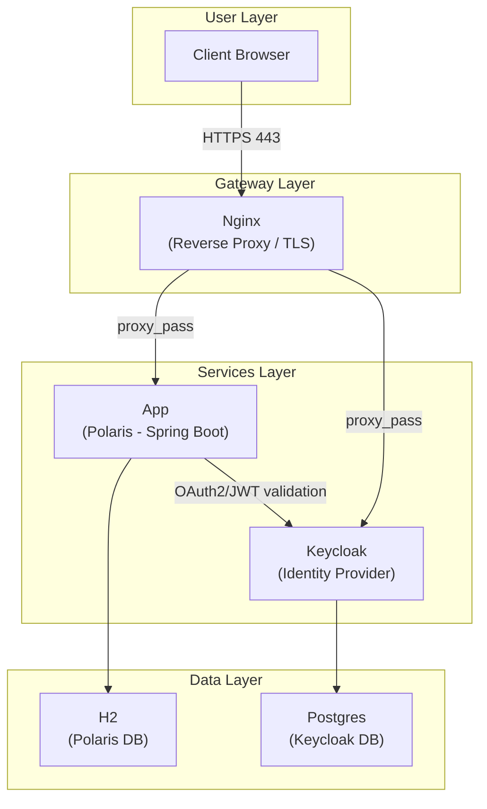

# Introduction
This is a simple demonstration of new generation of application with LLM.
This is an internal AI user assistant for an organisation, where user can
- Ask about a product (TBD, data generation will implement later)
- Place an order
- Ask about the order status
- Cancel the order in particular conditions 

## Architecture

Given we have a backend like this with API ready, we will integrate with AI assistent via MCP in later.

