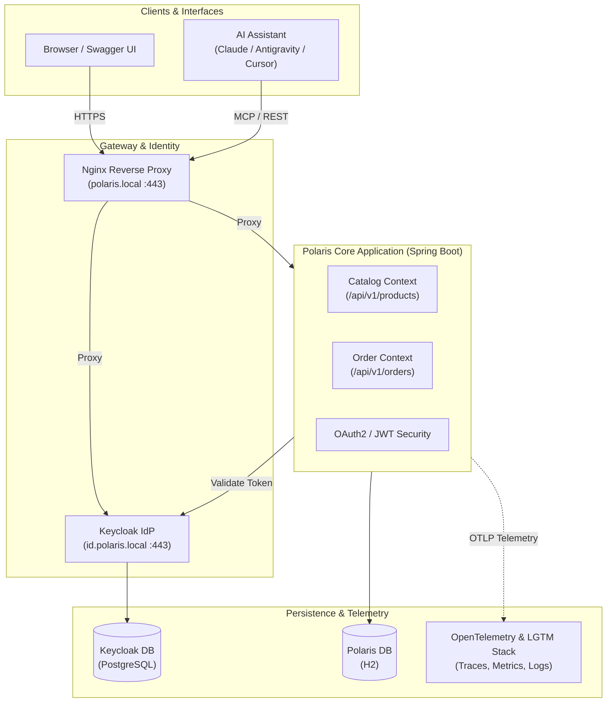

# Polaris - Enterprise Assistant Backend

Polaris is an enterprise backend service powering intelligent e-commerce operations, product discovery, and order lifecycle management. Designed for direct integration with AI assistants and modern web clients, Polaris exposes standards-compliant REST APIs secured by OAuth2/OIDC alongside a standard Model Context Protocol (MCP) server.

---

## Business Domains & Capabilities

Polaris is organized around clear bounded contexts adhering to Domain-Driven Design (DDD) principles:

### 1. Product Catalog Context (`/api/v1/products`)
* **Dynamic Exploration**: Multi-criteria search supporting keyword matching, category filtering (`Audio`, `Wearables`, `Accessories`), and price boundaries.
* **Live Inventory Awareness**: Real-time availability filtering (`available_only=true`) ensuring clients and AI assistants only surface purchasable, active inventory.
* **Product Specifications**: Live SKU-level lookup with inventory status and pricing guarantees.

### 2. Order Management Context (`/api/v1/orders`)
* **Order Placement**: Transactional checkout capturing customer identity, line items, and pricing snapshots.
* **Lifecycle State Machine**: Governs order transitions across defined states:
  $$\text{CREATED} \longrightarrow \text{PROCESSING} \longrightarrow \text{SHIPPED}$$
  $$\text{CREATED / PROCESSING} \longrightarrow \text{CANCELLED}$$
* **Domain Invariants & Rules**: Enforces business constraints (e.g. orders in `SHIPPED` state cannot be cancelled; invalid cancellations return standardized RFC 7807 Problem Details).

### 3. Identity & Access Context (`https://id.polaris.local`)
* **Standards-Based Authentication**: OAuth 2.0 and OpenID Connect (OIDC) via Keycloak (`polaris` realm).
* **Cryptographic Token Verification**: Stateless JWT validation with PKCE support for client browsers and autonomous assistants.

---

## Domain Architecture



---

## Up the Stack in a Minute

Get the entire environment—including local HTTPS, identity provider, core backend, and telemetry—running locally in under 60 seconds:

### 1. Prerequisites
- Docker & Docker Compose
- macOS or Linux
- [`mkcert`](https://github.com/FiloSottile/mkcert) (for trusted local TLS certificates)

### 2. Quick Start
```bash
# 1. Initialize environment file
cp .env.template .env

# 2. Configure local TLS certificates and hostnames (one-time setup)
./scripts/setup-local-https-mac-m1.sh

# 3. Boot the complete local stack
make up
```

### 3. Access & Verify Endpoints

| Portal | URL | Credentials / Action |
|---|---|---|
| **Polaris Swagger UI** | [https://polaris.local/swagger-ui/index.html](https://polaris.local/swagger-ui/index.html) | Click **Authorize** &rarr; select `polaris-app` &rarr; log in with `testuser` / `testpass` |
| **Keycloak Admin** | [https://id.polaris.local](https://id.polaris.local) | Username: `admin` \| Password: `admin` |
| **Grafana Telemetry** | [http://localhost:3000](http://localhost:3000) | Username: `admin` \| Password: `admin` |

---

## Essential Developer Commands

| Target | Command | Purpose |
|---|---|---|
| **Start Stack** | `make up` | Starts all services in the background |
| **Stop Stack** | `make down` | Stops containers, networks, and persistent dev volumes |
| **Rebuild Images** | `make build` | Rebuilds the Polaris Spring Boot application image |
| **Restart Service** | `make restart-<service>` | Restarts a single container (e.g. `make restart-polaris`) |
| **Run Unit Tests** | `mvn clean test` | Executes local Java unit & domain integration tests |

---

## Detailed Guides & Deep Dives

To keep daily development focused, detailed guides for specialized areas are maintained separately:

- 🤖 [**AI Assistant & Development Guide**](docs/ai-development.md): Integration guide for **Claude Code**, **Antigravity**, **Cursor**, MCP server setup (`mcp/mcp_polaris_products.py`), and diagram validation guards.
- 🔍 [**AI Product Search Agent Specification**](docs/ai-product-search-agent.md): Tool definitions, schemas, and system prompt engineering for product search assistants.
- 📊 [**Observability & Telemetry (LGTM Stack)**](docs/observability.md): Distributed tracing (Tempo), metrics collection (Prometheus), structured logging (Loki), and GCX CLI automation.
- 📐 [**Architecture Decision Records (ADRs)**](docs/adr/): Formal architecture records (e.g., [ADR 0001: MCP Server Alternatives](docs/adr/0001-mcp-server-alternatives.md)).
- 🔐 [**Local HTTPS & Truststore Architecture**](scripts/setup-local.md): In-depth manual instructions for `mkcert`, Java truststore creation, and TLS troubleshooting.
