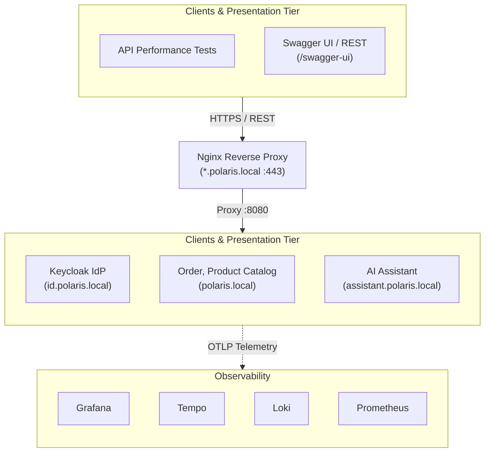

# Polaris - Enterprise Assistant Backend

Polaris is an enterprise backend service powering intelligent e-commerce operations, product discovery, conversational shopping, and order lifecycle management. Designed for direct integration with AI assistants and modern web clients, Polaris is organized as a modular polyglot monorepo exposing standards-compliant REST APIs secured by OAuth2/OIDC alongside a native Model Context Protocol (MCP) server.

---

## Business Domains & Capabilities

Polaris is organized around clear bounded contexts adhering to Domain-Driven Design (DDD) principles:

### 1. Product Catalog Context (`/api/v1/products`)
* **Dynamic Exploration**: Multi-criteria search supporting keyword matching, category filtering (`Audio`, `Wearables`, `Accessories`), and price boundaries.
* **Live Inventory Awareness**: Real-time availability filtering (`available_only=true`) ensuring clients and AI assistants only surface purchasable, active inventory.
* **Product Specifications**: Live SKU-level lookup with inventory status and pricing guarantees.

### 2. Order Management Context (`/api/v1/orders`)
* **Order Placement**: Transactional checkout capturing customer identity, line items, and pricing snapshots.
* **Lifecycle State Machine**: Governs order transitions across defined states:
  $$\text{CREATED} \longrightarrow \text{PROCESSING} \longrightarrow \text{SHIPPED}$$
  $$\text{CREATED / PROCESSING} \longrightarrow \text{CANCELLED}$$
* **Domain Invariants & Rules**: Enforces business constraints (e.g. orders in `SHIPPED` state cannot be cancelled; invalid cancellations return standardized RFC 7807 Problem Details).

### 3. AI Assistant & Conversational Commerce Context (`/api/v1/assistant/**`, `/chat`)
* **Perception & Dual-Transport Streaming**: Full-duplex Server-Sent Events (SSE) streaming (`thought`, `token`, `widget`, `draft`, `done`) alongside transactional REST endpoints.
* **Cognitive Agency Orchestrator**: Pluggable AI engine supporting both zero-config deterministic local rules and external cloud foundation model providers.
* **Durable Sessions & Cart Staging**: Server-side session history and staged order drafts persisted with a 15-minute Time-To-Live (TTL).
* **Mandatory Human-in-the-Loop (HITL) Safety Gate**: Strict pre-commit verification and user confirmation (`POST .../drafts/{draftId}/confirm` with `Idempotency-Key`) before order creation; zero autonomous state mutations.
* **Anti-IDOR Security & Self-Healing Diagnostics**: Role-scoped access control (`ROLE_USER` retail shoppers bounded strictly to caller ID; `ROLE_STAFF`/`ROLE_ADMIN` assisted sales) and self-healing RFC 7807 Problem Cards with actionable remedy buttons.

### 4. Model Context Protocol (MCP) Gateway Context (`/mcp/sse`, `/mcp/message`)
* **In-Process MCP Server**: Native Spring Boot MCP SDK integration exposing standard JSON-RPC tools (`search_available_products`, `get_product_by_sku`, order query tools) for AI assistants.
* **Enterprise Security**: OAuth2/OIDC Bearer token authentication strictly enforced across all MCP endpoints (zero security bypass).

### 5. Identity & Access Context (`https://id.polaris.local`)
* **Standards-Based Authentication**: OAuth 2.0 and OpenID Connect (OIDC) via Keycloak (`polaris` realm).
* **Cryptographic Token Verification**: Stateless JWT validation with PKCE support for client browsers, Swagger UI, and autonomous assistants.

---

## Domain Architecture



---

## Modular Monorepo Architecture

Polaris is structured as a polyglot monorepo with a Maven multi-module reactor governing compile-time domain boundaries ([ADR-0005](docs/adr/0005-transition-to-polyglot-monorepo-architecture.md)):

```text
03-Polaris/
├── apps/
│   ├── polaris/            # Unified catalog + order + mcp-server Spring Boot application
│   ├── polaris-assistant/  # AI agency orchestrator, session/draft persistence, and SSE streaming
│   └── web-chat/           # Decoupled browser chat UI (OIDC PKCE, SSE streaming, interactive cards)
├── libs/
│   └── polaris-common/     # Shared kernel, RFC 7807 problem details, tracing filters, validation helpers, migrations
├── infra/                  # Consolidated platform infrastructure (nginx, keycloak, telemetry)
└── tests/                  # System verification suites (k6 performance, Playwright browser E2E)
```

---

## Up the Stack in a Minute

Get the entire environment—including local HTTPS, identity provider, core backend, PostgreSQL databases, and telemetry—running locally in under 60 seconds:

### 1. Prerequisites
- Docker & Docker Compose
- macOS or Linux
- [`mkcert`](https://github.com/FiloSottile/mkcert) (for trusted local TLS certificates)

### 2. Quick Start
```bash
# 1. Initialize environment file
cp .env.template .env

# 2. Configure local TLS certificates and hostnames (one-time setup)
./scripts/setup-local-https-mac-m1.sh

# 3. Boot the complete local stack
make up
```

### 3. Access & Verify Endpoints

| Portal | URL | Credentials / Action |
|---|---|---|
| **Polaris Web Chat UI** | [https://polaris.local/chat](https://polaris.local/chat) | Click **Login** &rarr; authenticate via Keycloak PKCE with `testuser` / `testpass` |
| **Polaris Swagger UI** | [https://polaris.local/swagger-ui/index.html](https://polaris.local/swagger-ui/index.html) | Click **Authorize** &rarr; select `polaris-app` &rarr; log in with `testuser` / `testpass` |
| **Polaris MCP Endpoint** | [https://polaris.local/mcp/sse](https://polaris.local/mcp/sse) | MCP JSON-RPC SSE endpoint (Requires OAuth2 Bearer token) |
| **Keycloak Admin** | [https://id.polaris.local](https://id.polaris.local) | Username: `admin` \| Password: `admin` |
| **Grafana Telemetry** | [https://grafana.polaris.local](https://grafana.polaris.local) | Username: `admin` \| Password: `admin` (or Keycloak SSO) |
| **Polaris Database** | Internal `polaris-db:5432` | `make polaris-sql` opens psql into PostgreSQL 16 database |

---

## Essential Developer Commands

| Target | Command | Purpose |
|---|---|---|
| **Start Stack** | `make up` | Starts all services in the background (Apps + DBs + LGTM stack) |
| **Check Stack Status**| `make status` | Inspects container health, ports, and lifecycle states |
| **Stop Stack** | `make down` | Stops containers, networks, and persistent dev volumes |
| **Rebuild Images** | `make build` | Rebuilds the multi-module Polaris Spring Boot application image |
| **Restart Service** | `make restart-<service>` | Restarts a single container (e.g. `make restart-polaris`) |
| **Run All Tests** | `make test` / `mvn clean test` | Executes local Java unit & domain integration tests across all modules |
| **Test Single Module** | `mvn test -pl apps/polaris` | Executes tests for a single module (e.g. `apps/polaris`) |
| **Playwright UI Testing** | `make playwright-ui` | Opens Swagger UI in Playwright for browser automation |
| **Close Playwright** | `make playwright-close` | Closes all open Playwright browser sessions |
| **Access Polaris DB** | `make polaris-sql` | Opens psql shell into the containerized PostgreSQL DB |

---

## Detailed Guides & Deep Dives

To keep daily development focused, detailed guides for specialized areas are maintained separately:

- 🛠️ [**Technical & Implementation Guidelines**](docs/fleet/technical-guidelines.md): Code conventions, RFC 7807 Problem Details, SSE Virtual Threads, **Comprehensive Local Stack Architecture**, **4-Step Slice Lifecycle**, and **Playwright CLI Verification Recipes**.
- 🤖 [**AI Assistant & Development Guide**](docs/ai-development.md): Integration guide for **Claude Code**, **Antigravity**, **Cursor**, MCP server setup, and diagram validation guards.
- 🔍 [**AI Product Search Agent Specification**](docs/ai-product-search-agent.md): Tool definitions, schemas, and system prompt engineering for product search assistants.
- 📊 [**Observability & Telemetry (LGTM Stack)**](docs/observability.md): Distributed tracing (Tempo), metrics collection (Prometheus), structured logging (Loki), and GCX CLI automation.
- 📐 [**Architecture Decision Records (ADRs)**](docs/adr/): Formal architecture records (e.g., [ADR 0005: Polyglot Monorepo](docs/adr/0005-transition-to-polyglot-monorepo-architecture.md), [ADR 0004: AI Assistant Architecture](docs/adr/0004-web-chat-ai-assistant-architecture.md), [ADR 0003: PostgreSQL Persistence](docs/adr/0003-postgresql-container-persistence.md)).
- 🔐 [**Local HTTPS & Truststore Architecture**](scripts/setup-local.md): In-depth manual instructions for `mkcert`, Java truststore creation, and TLS troubleshooting.
