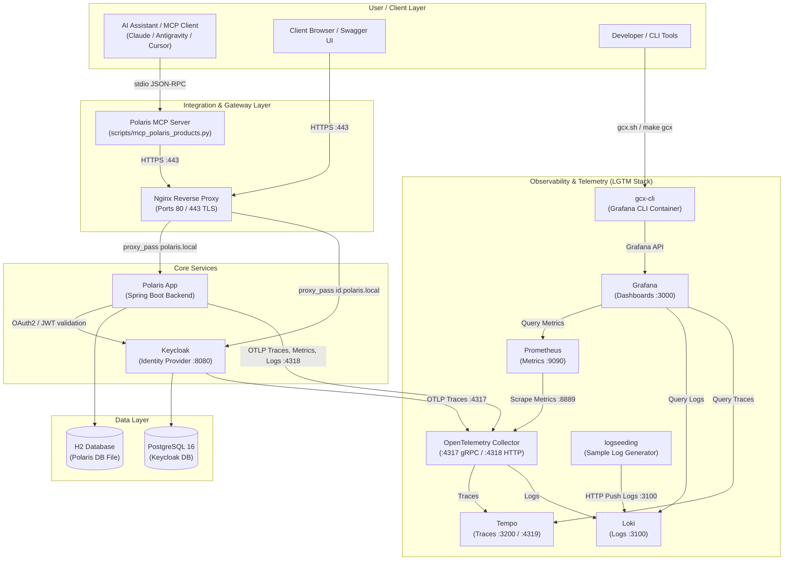

# Polaris - Internal AI Assistant Backend

## Introduction
This is a demonstration of a next-generation enterprise application designed for LLM integration. Polaris acts as the core backend service for an internal organizational AI assistant, supporting key workflows such as:
- Asking about products (catalog exploration)
- Placing orders
- Checking order status
- Cancelling orders under specific business conditions

Polaris provides REST APIs secured by OAuth2/OpenID Connect (OIDC). It is designed to expose endpoints that can be integrated with AI assistants via the Model Context Protocol (MCP).

---

## Architecture

The system is deployed locally via Docker docker-compose.yml (core services) and docker-compose.override.yml (observability and developer tooling stack).



---

## Services & Infrastructure Catalog

| Service | Container Name | Image / Source | Host Port / Access URL | Credentials / Notes | Purpose |
|---|---|---|---|---|---|
| **nginx** | `nginx` | `nginx:alpine` | `http://localhost:80`<br/>`https://polaris.local`<br/>`https://id.polaris.local` | Custom certs via `mkcert` | Reverse proxy and TLS termination gateway |
| **polaris** | `polaris` | `build: .` (Spring Boot) | Routed via Nginx (`https://polaris.local`) | - | Core backend application API and business logic |
| **polaris-mcp** | - | `scripts/mcp_polaris_products.py` | Stdio JSON-RPC 2.0 | Connects via `https://polaris.local` | Model Context Protocol server exposing product search and details to AI assistants |
| **keycloak** | `keycloak` | `quay.io/keycloak/keycloak:26.2` | Routed via Nginx (`https://id.polaris.local`) | Admin: `admin` / `admin` | Identity and Access Management (OAuth2 / OIDC) |
| **postgres** | `keycloak-postgres` | `postgres:16` | Internal only (`postgres:5432`) | `keycloak` / `keycloak` | Persistent relational database for Keycloak |
| **otel-collector** | `otel-collector` | `otel/opentelemetry-collector-contrib:latest` | `4317` (gRPC OTLP)<br/>`4318` (HTTP OTLP)<br/>`8889` (Prometheus scrape) | - | Central telemetry collector, processor, and exporter |
| **prometheus** | `prometheus` | `prom/prometheus:latest` | `http://localhost:9090` | - | Time-series metrics database and scraper |
| **tempo** | `tempo` | `grafana/tempo:latest` | `http://localhost:3200`<br/>`4319` (mapped from :4317) | - | Distributed tracing backend |
| **loki** | `loki` | `grafana/loki:3.1.0` | `http://localhost:3100` | - | Log aggregation engine |
| **grafana** | `grafana` | `grafana/grafana:latest` | `http://localhost:3000` | `admin` / `admin` | Unified visualization dashboard (Loki, Tempo, Prometheus pre-configured) |
| **logseeding** | `logseeding` | `python:3.11-slim` | Internal only | - | Utility container to push sample logs into Loki |
| **gcx-cli** | `gcx-cli` | `debian:bookworm-slim` | CLI via `make gcx` or `./gcx.sh` | Pre-authenticated to Grafana | Grafana companion CLI container |

---

## Observability & Telemetry (LGTM Stack)

The development environment includes full end-to-end telemetry:

1. **Metrics**:
   - Polaris exports OTLP metrics to `otel-collector:4318/v1/metrics`.
   - Prometheus scrapes metrics from the OpenTelemetry Collector endpoint (`otel-collector:8889`).
   - Metrics can be inspected in Prometheus (`http://localhost:9090`) or visualized in Grafana (`http://localhost:3000`).

2. **Distributed Tracing**:
   - Polaris exports traces via OTLP HTTP to `otel-collector:4318/v1/traces` (100% sample rate in local dev).
   - Keycloak exports traces via OTLP gRPC to `otel-collector:4317` (`KC_TRACING_ENABLED=true`).
   - OTel Collector batches and exports traces to Tempo (`tempo:4317`).
   - Trace search and visualization are available in Grafana through the Tempo datasource.

3. **Logs**:
   - Polaris exports application logs to `otel-collector:4318/v1/logs`, which forward to Loki (`http://loki:3100/otlp`).
   - Sample logs can be streamed to Loki via the `logseeding` container:
     ```bash
     # Send a single batch of 50 sample logs
     docker compose exec logseeding python logseeding.py --url http://loki:3100 --count 50

     # Continuously stream sample logs
     docker compose exec logseeding python logseeding.py --url http://loki:3100 --stream --interval 1.0
     ```

4. **Grafana & GCX CLI**:
   - Grafana is accessible at `http://localhost:3000` (credentials: `admin` / `admin`).
   - Datasources for **Prometheus** (default), **Loki**, and **Tempo** are automatically provisioned.
   - Use `gcx` (Grafana CLI) directly via the helper script or Make target:
     ```bash
     ./gcx.sh --help
     ./gcx.sh dashboards list
     # or open an interactive shell in the CLI container:
     make gcx
     ```

---

## Quick Start & Local Setup

### 1. Prerequisites
- Docker and Docker Compose
- macOS (Apple Silicon / Intel) or Linux
- `mkcert` and `nss` (for local trusted TLS certificates)

### 2. Configure Environment Variables
Copy `.env.template` to `.env` (already contains default `POLARIS_DOMAIN=polaris.local`):
```bash
cp .env.template .env
```

### 3. Local HTTPS & Hosts Setup (macOS)
Run the setup script to install local CA certificates, update `/etc/hosts`, and build the Java truststore:
```bash
./scripts/setup-local-https-mac-m1.sh
```
This script ensures:
- Domain mappings for `127.0.0.1 polaris.local` and `127.0.0.1 id.polaris.local` in `/etc/hosts`.
- Generation of local TLS certificates in `nginx/certs/`.
- Generation of `nginx/truststore.jks` and `rootCA.pem` so Spring Boot JVM trusts Keycloak over HTTPS.

*(For cleanup, you can run `./scripts/clean.sh`)*.

### 4. Build and Start the Stack
Start all services (core services and telemetry stack):
```bash
# Using Makefile
make pull
make build
make up

# Or using Docker Compose directly
docker compose up -d --build
```

### 5. Access Endpoints
- **Polaris Swagger UI**: [https://polaris.local/swagger-ui/index.html](https://polaris.local/swagger-ui/index.html)
- **Keycloak Admin Console**: [https://id.polaris.local](https://id.polaris.local) (Username: `admin`, Password: `admin`)
- **Grafana Observability**: [http://localhost:3000](http://localhost:3000) (Username: `admin`, Password: `admin`)
- **Prometheus**: [http://localhost:9090](http://localhost:9090)
- **Tempo**: [http://localhost:3200](http://localhost:3200)
- **Loki**: [http://localhost:3100](http://localhost:3100)

---

## Authentication & Security

- **Keycloak Realm**: Pre-configured `polaris` realm imported from `./keycloak/realm-export.json`.
- **Clients**:
  - `polaris-app`: Configured for Swagger UI with PKCE (`https://polaris.local/swagger-ui/index.html`).
  - `polaris-local`: Configured for local development on `http://localhost:8080`.
- **Pre-seeded Test User**:
  - **Username**: `testuser`
  - **Password**: `testpass`
  - **Email**: `testuser@novagadgets.local`

In Swagger UI, click **Authorize**, select the `polaris-app` client, and log in with `testuser` / `testpass` to test authenticated endpoints.

---

## Helpful Commands

| Action | Makefile Target | Docker Compose Equivalent |
|---|---|---|
| Build services | `make build` | `docker compose build` |
| Start all services in background | `make up` | `docker compose up -d` |
| Stop and remove containers, networks, volumes | `make down` | `docker compose down --volumes --remove-orphans` |
| Restart a specific service | `make restart-<service>` | `docker compose restart <service>` |
| Access Grafana CLI (`gcx`) shell | `make gcx` | `docker exec -it gcx-cli sh` |
| Seed sample logs | - | `docker compose exec logseeding python logseeding.py --stream` |
