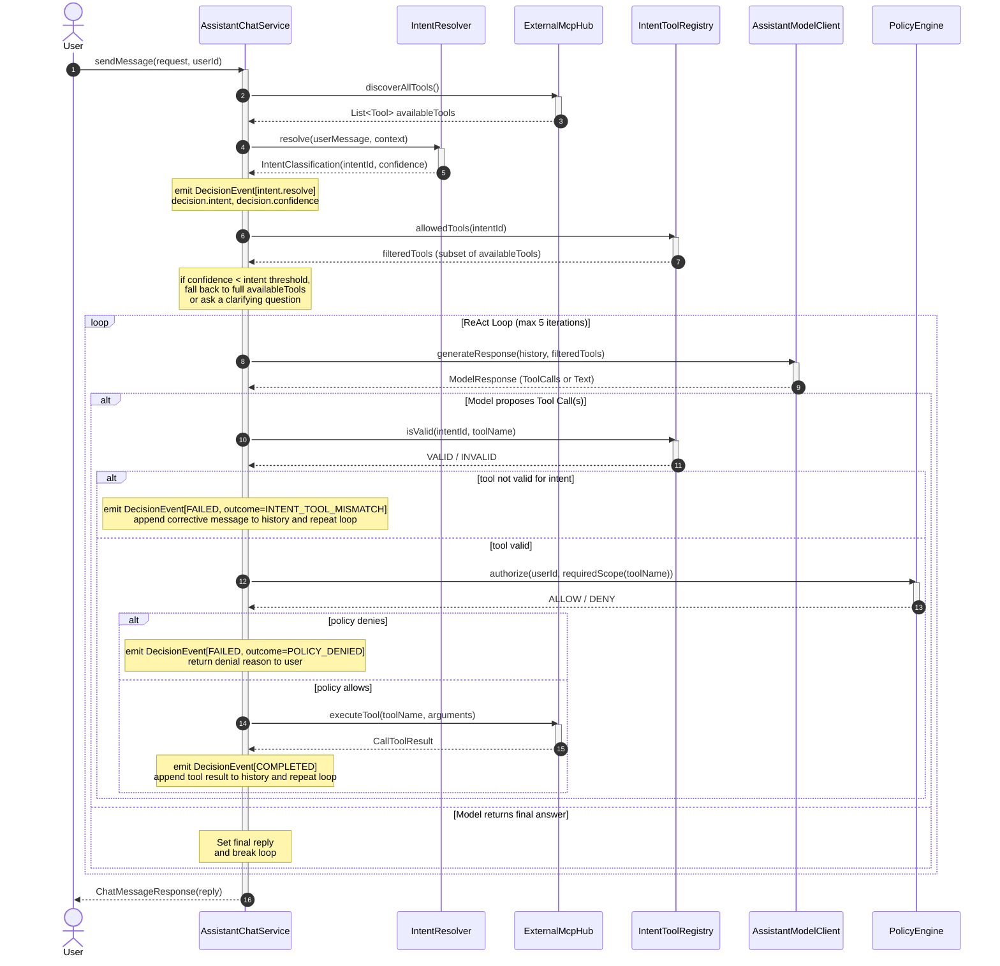

# Polaris Assistant Communication Sequence

This document illustrates the main communication flow between [`AssistantChatService`](apps/polaris-assistant/src/main/java/vn/danang/polaris/assistant/service/AssistantChatService.java), [`IntentResolver`](apps/polaris-assistant/src/main/java/vn/danang/polaris/assistant/intent/IntentResolver.java), [`IntentToolRegistry`](apps/polaris-assistant/src/main/java/vn/danang/polaris/assistant/intent/IntentToolRegistry.java), [`PolicyEngine`](apps/polaris-assistant/src/main/java/vn/danang/polaris/assistant/intent/PolicyEngine.java), [`AssistantModelClient`](apps/polaris-assistant/src/main/java/vn/danang/polaris/assistant/model/AssistantModelClient.java), and [`ExternalMcpHub`](apps/polaris-assistant/src/main/java/vn/danang/polaris/assistant/mcp/ExternalMcpHub.java).

Intent resolution runs **once per user turn**, before the ReAct loop starts, and narrows the tool set the model is offered. Registry validation and policy authorization then run **per proposed tool call**, as a guard directly in front of `ExternalMcpHub.executeTool(...)`, so the model is checked both proactively (smaller tool surface) and defensively (every actual call re-validated against the resolved intent).



## Key Flow Steps

1. **Tool Discovery**: `AssistantChatService` calls `ExternalMcpHub.discoverAllTools()` to discover all registered tools from the MCP server.
2. **Intent Resolution (once per turn)**: `AssistantChatService` calls `IntentResolver.resolve(...)` with the user's message and conversation context, returning an `IntentClassification` (`intentId`, `confidence`). This is emitted as its own decision event, tagging `decision.action="intent.resolve"`, `decision.intent`, `decision.confidence`, and `decision.outcome.status="RESOLVED"` (or `"LOW_CONFIDENCE"`).
3. **Tool Set Filtering & Threshold Check**:
   - `AssistantChatService` looks up the resolved intent in `IntentToolRegistry`.
   - If confidence is below the intent's configured threshold:
     - For mutating intents (`commerce.order.place`, `commerce.order.cancel`), the assistant immediately returns a clarifying question to the user without offering mutating tools or guessing.
     - For read-only intents, the assistant falls back to the full tool set (`availableTools`) tagged `LOW_CONFIDENCE`.
   - If confidence meets or exceeds threshold:
     - `AssistantChatService` calls `IntentToolRegistry.allowedTools(intentId, availableTools)` to offer only permissible tools to the model. For `general.conversation`, the filtered list is empty, allowing the model to answer directly.
4. **ReAct Loop Execution**:
   - `AssistantChatService` invokes `AssistantModelClient.generateResponse(...)` with the message history and the filtered tool set.
   - If the model returns a tool invocation, `AssistantChatService` first calls `IntentToolRegistry.isValid(intentId, toolName)` to defensively confirm the proposed tool is actually permitted for the resolved intent — catching cases where the model strays outside the offered set.
   - If tool is not valid: `AssistantChatService` emits a decision event with `decision.action="registry.validate"` and `decision.outcome.status="TOOL_MISMATCH"`, appends a corrective warning to conversation history, and continues the loop so the model can recover.
   - If tool is valid: `AssistantChatService` emits a decision event with `decision.action="registry.validate"` and `decision.outcome.status="VALID"`, then calls `PolicyEngine.authorize(userId, requiredScope)` to confirm the caller's OAuth2/OIDC scopes permit the action (e.g. `order.read` vs `order.write`).
   - If policy denies: `AssistantChatService` emits a decision event with `decision.action="policy.authorize"`, `decision.policy=requiredScope`, and `decision.outcome.status="DENY"`, breaks the loop, and returns the denial reason to the user.
   - If policy allows: `AssistantChatService` emits a decision event with `decision.action="policy.authorize"` and `decision.outcome.status="ALLOW"`, calls `ExternalMcpHub.executeTool(...)` (recorded via `AgentDecisionRecorder`), appends the tool result to conversation history, and continues the loop.
   - Once the model produces a final direct answer (or the iteration limit is reached), the loop terminates.
5. **Response Generation**: `AssistantChatService` stores the assistant's reply and returns `ChatMessageResponse` to the client.

## New Components

| Component | Responsibility | Public Interface / Methods |
|---|---|---|
| `IntentResolver` | Classifies the user's utterance into a taxonomy intent ID with a confidence score, once per turn. | `IntentClassification resolve(String userMessage, List<AssistantMessage> context)` |
| `IntentClassification` | Immutable record representing classification outcome. | `String intentId()`, `double confidence()` |
| `IntentTaxonomy` / `IntentDefinition` | Configuration model of `intentId` → description, examples, allowed tools, required OAuth2 scope, and confidence threshold. | Properties / YAML mapping |
| `IntentToolRegistry` | Loads taxonomy; answers allowed tools, intent metadata, and validates tool permissions. | `List<Tool> allowedTools(String intentId, List<Tool> availableTools)`, `boolean isValid(String intentId, String toolName)`, `String getRequiredScope(String toolName)`, `Optional<IntentDefinition> getIntent(String intentId)` |
| `PolicyEngine` | Authorizes an action against caller's token scopes (`decision.policy`); enforcement point for read/write distinctions. | `PolicyDecision authorize(String userId, String requiredScope)` |
| `PolicyDecision` | Immutable record indicating authorization outcome. | `boolean isAllowed()`, `String reason()` |

## Intent Taxonomy — mapped to the actual MCP tool set

This is the concrete `IntentTaxonomy` config derived from the current `/mcp` `tools/list` response (7 tools: `search_available_products`, `get_product_by_sku`, `get_order_status`, `get_order_details`, `place_order`, `list_customer_orders`, `cancel_order`) plus `general.conversation` for non-commerce inquiries:

```yaml
intents:
  - id: general.conversation
    description: "User engages in greetings, small talk, or general inquiries unrelated to catalog or orders"
    examples:
      - "hello"
      - "hi there"
      - "who are you"
      - "help me"
    allowedTools: []
    requiredScope: null
    confidenceThreshold: 0.50

  - id: catalog.product.search
    description: "User wants to browse or search for products by keyword, category, or price range"
    examples:
      - "show me running shoes under $100"
      - "what electronics do you have in stock"
      - "find chargers"
    allowedTools:
      - search_available_products
    requiredScope: catalog.read
    confidenceThreshold: 0.80

  - id: catalog.product.lookup
    description: "User wants details on a specific, already-identified product by SKU"
    examples:
      - "tell me more about SM-PH-001"
      - "is PROD-001 in stock"
      - "check sku NG-CHARGER-02"
    allowedTools:
      - get_product_by_sku
    requiredScope: catalog.read
    confidenceThreshold: 0.85

  - id: information.lookup.order.status
    description: "User wants a quick status check on a single known order — not full details"
    examples:
      - "where is my order ORD-1001"
      - "status of order 1234"
      - "track order ORD-55"
    allowedTools:
      - get_order_status
    requiredScope: order.read
    confidenceThreshold: 0.85

  - id: information.lookup.order.details
    description: "User wants full order contents — line items, pricing, fulfillment — not just status"
    examples:
      - "what did I order in ORD-1001"
      - "show me the full details of my last order"
      - "view details for order ORD-999"
    allowedTools:
      - get_order_details
    requiredScope: order.read
    confidenceThreshold: 0.85

  - id: information.lookup.order.history
    description: "User wants to see multiple past orders, optionally filtered by status"
    examples:
      - "show my order history"
      - "list my cancelled orders"
      - "show all my previous purchases"
    allowedTools:
      - list_customer_orders
    requiredScope: order.read
    confidenceThreshold: 0.80

  - id: commerce.order.place
    description: "User wants to place a new order for one or more items"
    examples:
      - "order 2 of NG-EARBUD-01"
      - "buy the wireless earbuds"
      - "place order for item PROD-1"
    allowedTools:
      - place_order
    requiredScope: order.write
    confidenceThreshold: 0.92   # mutating + financial — high bar before acting

  - id: commerce.order.cancel
    description: "User wants to cancel an existing order"
    examples:
      - "cancel my order ORD-1001"
      - "I want to cancel that last order"
    allowedTools:
      - cancel_order
    requiredScope: order.write
    confidenceThreshold: 0.92   # mutating — high bar before acting
```

Notes on thresholds: the two mutating intents (`commerce.order.place`, `commerce.order.cancel`) are deliberately set well above the read-only intents. Per the failure-mode handling above, falling below threshold on a read intent just widens the tool set the model sees; falling below threshold on a mutating intent triggers a clarifying question instead — preventing ambiguous guessing on mutating actions.

## Decision Observability Mapping (ADR-0014)

| Stage | `decision.action` | `decision.intent` | `decision.confidence` | `decision.policy` | `decision.outcome.status` |
|---|---|---|---|---|---|
| Intent resolved | `intent.resolve` | e.g. `information.lookup.order.status` | e.g. `0.96` | — | `RESOLVED` / `LOW_CONFIDENCE` |
| Registry check | `registry.validate` | same | — | — | `VALID` / `TOOL_MISMATCH` |
| Policy check | `policy.authorize` | same | — | e.g. `order.read` | `ALLOW` / `DENY` |
| Tool execution | `tool.execute` / `<toolName>` | same | — | — | `SUCCESS` / `FAILURE` |

This keeps intent resolution, registry validation, and policy enforcement entirely inside `apps/polaris-assistant`, consistent with ADR-0008 (assistant isolation) — no changes to Polaris Core or the MCP surface are required.