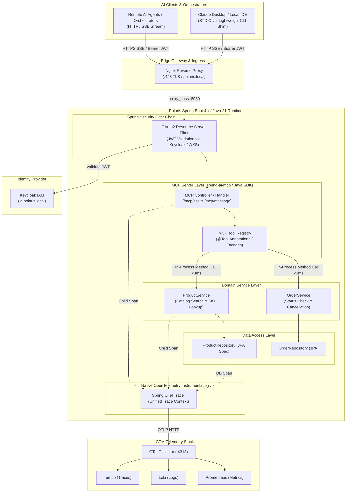
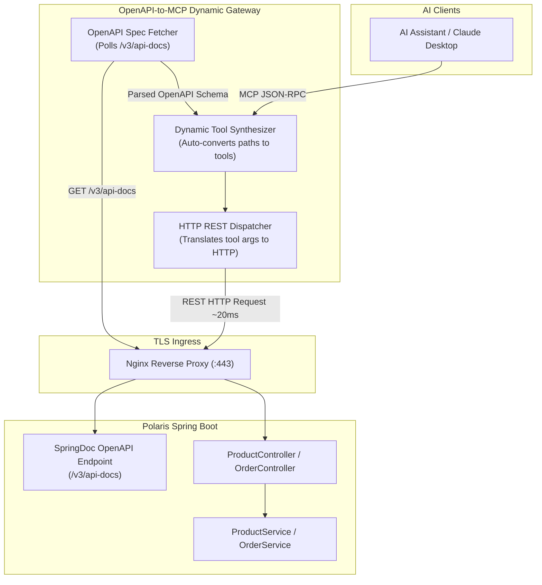
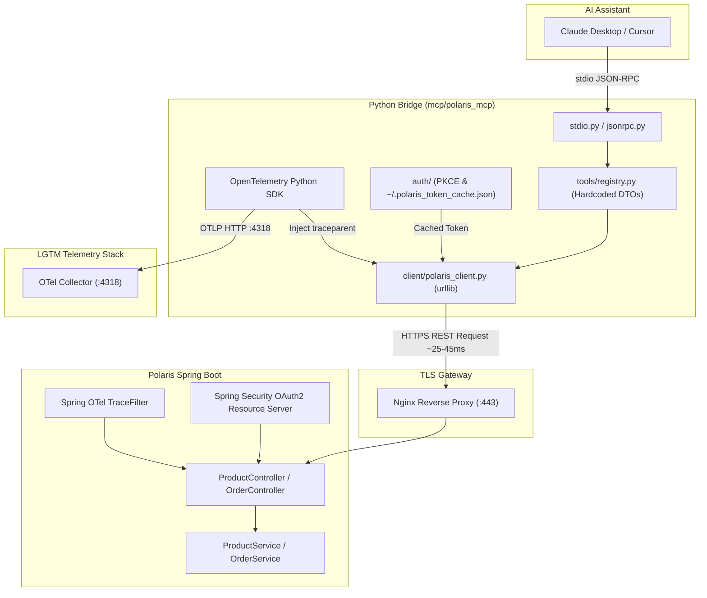
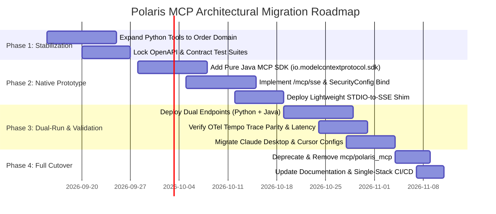

# ADR-0001: Architectural Alternatives for Exposing Polaris Services via Model Context Protocol (MCP)

* Status: Proposed
* Deciders: Polaris Architecture Team, Core Platform Engineering
* Date: 2026-09-08
* Technical Story: Transition from prototype Python FastMCP bridge to an enterprise-grade, observable, secure, and unified MCP server architecture

## Context and Problem Statement

Polaris serves as the core enterprise backend for internal AI assistants (such as Claude Desktop, Cursor, and autonomous agent frameworks), providing domain capabilities including product catalog exploration, stock availability searches, and order lifecycle management. To enable AI assistants to discover, reason about, and invoke these operations, Polaris exposes its domain operations via the Model Context Protocol (MCP, specification version 2024-11-05).

The initial prototype implementation relies on an external Python client and bridge ([`mcp/mcp_polaris_products.py`](../../mcp/mcp_polaris_products.py) backed by the modular [`polaris_mcp`](../../mcp/polaris_mcp/) package) operating over JSON-RPC 2.0 stdio. While this Python bridge successfully proved the viability of agent-based product discovery and established patterns for PKCE authentication and W3C `traceparent` propagation, it introduces significant architectural liabilities for long-term production operations:

1. **Polyglot Runtime Overhead:** Maintaining a secondary Python 3.11 runtime, virtual environments, pip dependencies, and packaging configurations alongside the primary Java 21 / Spring Boot backend increases developer setup friction and CI/CD maintenance.
2. **Schema Drift & Duplication Risk:** Tool definitions, input parameter schemas, and response DTO transformations in [`mcp/polaris_mcp/tools/`](../../mcp/polaris_mcp/tools/) must be manually authored and synchronized whenever Spring Boot REST controllers or domain DTOs (`ProductResponse`, `OrderResponse`) evolve.
3. **Double-Hop Network Latency:** Invocations from AI clients traverse the local stdio channel into the Python process, which performs TLS termination and HTTP calls over Nginx to Spring Boot, incurring serialization, deserialization, and round-trip network penalties.
4. **Security Context Disconnect:** The Python bridge manages token caches (`~/.polaris_token_cache.json`) and OAuth2 PKCE flows independently of the core Spring Security context, introducing local token lifecycle vulnerabilities and operational complexity.
5. **Transport Rigidity:** The Python bridge is constrained to stdio, creating friction when scaling to remote, web-based, or containerized AI agent workers that require Server-Sent Events (HTTP/SSE) or Streamable HTTP transports.

How should Polaris architect its Model Context Protocol integration to ensure minimal operational overhead, zero schema drift, sub-millisecond dispatch latency, end-to-end distributed tracing, and strict alignment with the Polaris Architecture Principles ([`AGENTS.md`](../../AGENTS.md))?

## Decision Drivers

* **Language & Runtime Homogeneity:** Minimizing polyglot operational overhead by standardizing on the primary backend stack (Java 21 / Spring Boot 4.x/3.x) and eliminating extraneous container and interpreter runtimes.
* **Latency & Execution Overhead:** Achieving near-zero dispatch overhead by eliminating redundant network hops, intermediate process invocations, and JSON re-serialization layers.
* **Security & OAuth2/OIDC Token Propagation:** Seamless integration with Keycloak (<https://id.polaris.local/realms/polaris>) via standard RFC 6749, RFC 7636 (PKCE), and Spring Security OAuth2 Resource Server; avoiding unsanctioned token storage.
* **End-to-End Observability (W3C Traceparent & OTel):** Unbroken propagation of W3C `traceparent` context across all layers (Agent -> MCP Server -> Domain Services -> Database) and unified emission of metrics and structured logs to the LGTM stack (Loki, Grafana, Tempo, Prometheus).
* **Schema Drift Risk & Type Safety:** Ensuring tool definitions, input schemas, and return types remain strongly typed and automatically synchronized with domain DTOs (`ProductResponse`, `OrderResponse`).
* **Protocol & Ecosystem Maturity:** Compliance with the MCP 2024-11-05 specification, supporting dual transports (STDIO for local IDEs/Claude Desktop and HTTP/SSE for remote/containerized agents), backed by stable SDKs.
* **Alignment with Polaris Principles ([`AGENTS.md`](../../AGENTS.md)):** Compliance with Principle 1 (Lower-layer protocol alignment), Principle 2 (Bounded context isolation), and Principle 3 (Observability by default and anti-monolith modularity).

## Considered Options

* **Option 1: Native Java / Spring Boot MCP Server (In-Process via Spring AI & Java MCP SDK)**
* **Option 2: OpenAPI-to-MCP Dynamic Gateway (Automated Proxy via SpringDoc `/v3/api-docs`)**
* **Option 3: Dedicated TypeScript / Go Gateway Sidecar (Standalone Reverse Proxy)**
* **Option 4: Python FastMCP Bridge (Status Quo - [`mcp/polaris_mcp`](../../mcp/polaris_mcp/))**

### Option 1: Native Java / Spring Boot MCP Server

Implement the MCP server directly within the `vn.danang.polaris` Spring Boot application utilizing `spring-ai-starter-mcp-server-webmvc` or the official Java MCP SDK (`io.modelcontextprotocol.sdk:mcp`). Exposes tools directly from Spring services via annotations or functional tool definitions over both HTTP/SSE and STDIO.

* **Good, because** it eliminates the polyglot runtime; developers and CI/CD pipelines only manage Java 21 and Maven ([`pom.xml`](../../pom.xml)).
* **Good, because** it eliminates network hops and JSON re-serialization for tool execution, yielding sub-3ms dispatch latency.
* **Good, because** it shares Spring Boot's native OpenTelemetry context (`spring-boot-starter-opentelemetry`), creating unbroken traces in Tempo from tool call to database query.
* **Good, because** tool schemas are strongly typed and bound to Java records at compile time, completely eliminating schema drift.
* **Good, because** it leverages the existing `SecurityConfig` OAuth2 Resource Server for JWT validation over HTTP/SSE.
* **Bad, because** cold-starting a full Spring Boot application for an ephemeral STDIO client has a 2–4 second JVM startup overhead unless mitigated via a lightweight STDIO-to-SSE bridge daemon or compiled with GraalVM Native Image.
* **Bad, because** the Java MCP SDK and Spring AI starters have fewer community examples compared to the reference TypeScript SDK.

### Option 2: OpenAPI-to-MCP Dynamic Gateway

Deploy an automated proxy/gateway (e.g., Cloudflare OpenAPI-to-MCP or a lightweight dynamic bridge) that consumes the SpringDoc OpenAPI v3 specification (<https://polaris.local/v3/api-docs>) at startup and dynamically generates MCP tool definitions for all documented endpoints.

* **Good, because** it achieves zero manual code changes when adding new REST endpoints; any `@Operation` in Spring Boot immediately becomes an MCP tool.
* **Good, because** it strictly enforces Principle 2 (Bounded Context Isolation) by interacting with Polaris solely through published REST contracts.
* **Good, because** it delegates authentication directly to Polaris by passing incoming `Authorization: Bearer` headers.
* **Bad, because** raw OpenAPI definitions often produce non-optimal LLM tool interfaces (e.g., exposing pagination objects `pageable.page`, `pageable.sort` rather than concise agent-friendly arguments like `available_only`).
* **Bad, because** REST responses returned to the LLM contain verbose JSON metadata (HATEOAS links, page metadata), consuming excessive LLM context tokens compared to curated tool summaries.
* **Bad, because** it introduces an additional network hop, increasing latency (15–30ms) and operational failure points.
* **Bad, because** distributed tracing requires the gateway to correctly propagate W3C `traceparent` headers to Polaris's `TraceFilter`.

### Option 3: Dedicated TypeScript / Go Gateway Sidecar

Develop a bespoke standalone gateway service using the official TypeScript SDK (`@modelcontextprotocol/sdk`) or Go SDK (`mark3labs/mcp-go`) deployed as a companion container in `docker-compose.yml` or a local binary. The sidecar translates MCP JSON-RPC into REST API calls against Polaris.

* **Good, because** the TypeScript SDK is the primary reference implementation maintained by Anthropic, guaranteeing immediate compatibility with new MCP specification revisions.
* **Good, because** a compiled Go binary is extremely lightweight (<20MB RAM, <10ms startup), making it ideal for STDIO desktop clients.
* **Good, because** it maintains clean architectural separation between the MCP presentation layer and the backend service.
* **Bad, because** it introduces polyglot complexity (Node.js/TypeScript or Go build chains, linters, package managers) into a Java-centric repository.
* **Bad, because** tool schemas must be manually synchronized with Java DTOs, presenting high schema drift risk.
* **Bad, because** distributed tracing and OAuth2 token handling must be independently implemented and maintained in the sidecar.
* **Bad, because** extra HTTP hops over Nginx add 15–30ms round-trip latency per tool invocation.

### Option 4: Python FastMCP Bridge (Status Quo)

Maintain the existing Python 3.11 implementation ([`mcp/mcp_polaris_products.py`](../../mcp/mcp_polaris_products.py) and package [`polaris_mcp`](../../mcp/polaris_mcp/)), which translates STDIO JSON-RPC 2.0 requests into HTTP calls to <https://polaris.local> using urllib, OAuth2 PKCE/token caching, and OpenTelemetry Python instrumentation.

* **Good, because** it is already implemented, fully functional, and verified with existing unit tests ([`mcp/tests/test_mcp_polaris.py`](../../mcp/tests/test_mcp_polaris.py)).
* **Good, because** it provides an immediate CLI test interface (`--test-search`, `--test-sku`) for local developer debugging.
* **Good, because** it already adheres to W3C `traceparent` header injection and OTLP export to Tempo/Loki.
* **Bad, because** it imposes polyglot operational overhead, requiring Python 3.11, pip packages, and virtual environment setup in developer environments.
* **Bad, because** tool definitions are hardcoded Python dictionaries, leading to severe schema drift as the `Order` domain and other features evolve.
* **Bad, because** token caching in `~/.polaris_token_cache.json` presents token synchronization and local security issues.
* **Bad, because** it only supports STDIO; supporting remote containerized agents via SSE requires significant additional engineering.
* **Bad, because** multi-hop network round trips result in 25–45ms execution latency.

### Comprehensive Trade-Off Matrix

The following scoring matrix evaluates the four architectural alternatives across key engineering and architectural dimensions (scored 1–5, where 5 is optimal). All weighted totals reflect exact arithmetic products:

| Evaluation Dimension | Weight | Option 1: Native Java / Spring Boot MCP | Option 2: OpenAPI-to-MCP Dynamic Gateway | Option 3: TypeScript / Go Sidecar | Option 4: Python FastMCP Bridge (Status Quo) |
| :--- | :---: | :---: | :---: | :---: | :---: |
| **Language & Runtime Homogeneity** | 20% | **5/5** (Pure Java 21 / Maven) | **3/5** (Node/Go container required) | **2/5** (Polyglot TS/Go build chain) | **2/5** (Polyglot Python 3.11 env) |
| **Observability (OTel Traceparent)** | 20% | **5/5** (Native in-process trace context) | **3/5** (Requires proxy header injection) | **3/5** (Custom SDK OTel setup) | **4/5** (Implemented, cross-process) |
| **Security & Auth Flow** | 15% | **5/5** (Native Spring Security / Keycloak) | **4/5** (Direct Bearer token forwarding) | **3/5** (Sidecar PKCE / Token cache) | **3/5** (Local PKCE / File cache) |
| **Schema Drift Risk** | 15% | **5/5** (Compile-time DTO binding) | **5/5** (Zero drift, dynamic OpenAPI) | **2/5** (Manual schema duplicate) | **1/5** (Manual Python dictionary sync) |
| **Latency & Call Overhead** | 15% | **5/5** (In-process <3ms dispatch) | **3/5** (HTTP hop + parse ~20ms) | **3/5** (HTTP hop + parse ~15ms) | **2/5** (Stdio + HTTP hop ~35ms) |
| **Maintenance Burden** | 15% | **4/5** (Single repo & CI/CD pipeline) | **4/5** (Minimal code, config-driven) | **2/5** (Dual toolchain & testing) | **2/5** (Dual codebase & manual sync) |
| **Weighted Total Score** | **100%** | **4.85 / 5.0** | **3.60 / 5.0** | **2.50 / 5.0** | **2.40 / 5.0** |

*Scoring Calculation Details:*
* Option 1: `(0.20 × 5) + (0.20 × 5) + (0.15 × 5) + (0.15 × 5) + (0.15 × 5) + (0.15 × 4) = 1.00 + 1.00 + 0.75 + 0.75 + 0.75 + 0.60 = 4.85`
* Option 2: `(0.20 × 3) + (0.20 × 3) + (0.15 × 4) + (0.15 × 5) + (0.15 × 3) + (0.15 × 4) = 0.60 + 0.60 + 0.60 + 0.75 + 0.45 + 0.60 = 3.60`
* Option 3: `(0.20 × 2) + (0.20 × 3) + (0.15 × 3) + (0.15 × 2) + (0.15 × 3) + (0.15 × 2) = 0.40 + 0.60 + 0.45 + 0.30 + 0.45 + 0.30 = 2.50`
* Option 4: `(0.20 × 2) + (0.20 × 4) + (0.15 × 3) + (0.15 × 1) + (0.15 × 2) + (0.15 × 2) = 0.40 + 0.80 + 0.45 + 0.15 + 0.30 + 0.30 = 2.40`

### Architecture Diagrams for Considered Options

#### 1. Option 1: Native Spring Boot MCP Server (Target Architecture)



#### 2. Option 2: OpenAPI-to-MCP Dynamic Gateway Architecture



#### 3. Option 3: Dedicated TypeScript / Go Gateway Sidecar Architecture

```mermaid
flowchart TB
    subgraph Clients["AI Clients"]
        Claude["Claude Desktop / Web Agents"]
    end

    subgraph Sidecar["Standalone Sidecar Container (TS / Go)"]
        McpCore["Official TS SDK / Go mcp-go"]
        ManualSchemas["Manually Maintained Tool Schemas<br/>(Risk of Schema Drift)"]
        SidecarAuth["Sidecar OAuth2 / Token Cache"]
        HttpClient["HTTP Client + OTel Propagator"]
    end

    subgraph Ingress["TLS Ingress"]
        Nginx["Nginx Reverse Proxy (:443)"]
    end

    subgraph PolarisBackend["Polaris Spring Boot"]
        Security["Spring Security OAuth2"]
        RestControllers["REST Controllers"]
        Services["Domain Services"]
    end

    Claude -->|MCP JSON-RPC (STDIO / SSE)| McpCore
    McpCore --> ManualSchemas
    ManualSchemas --> HttpClient
    SidecarAuth --> HttpClient
    HttpClient -->|HTTP REST Forwarding ~15-30ms| Nginx
    Nginx --> Security
    Security --> RestControllers
    RestControllers --> Services
```

#### 4. Option 4: Python FastMCP Bridge (Status Quo Architecture)



#### 5. End-to-End Sequence Diagram: In-Process Tool Call with Distributed Tracing

```mermaid
sequenceDiagram
    autonumber
    actor Agent as AI Assistant (Claude / Orchestrator)
    participant Nginx as Nginx (:443 / TLS)
    participant Sec as Spring Security (OAuth2)
    participant MCP as Polaris MCP Handler (/mcp/sse)
    participant Svc as ProductService (Java In-Process)
    participant DB as H2 Database (JPA)
    participant OTel as OpenTelemetry Collector (:4318)

    Agent->>Nginx: POST /mcp/message (tools/call: search_available_products) [Bearer JWT, traceparent]
    Nginx->>Sec: Forward request with headers
    Sec->>Sec: Validate JWT signature & claims against Keycloak JWKS
    Sec->>MCP: Dispatch authenticated request (SecurityContext populated)
    Note over MCP: Start Span: "mcp.tool_call search_available_products"
    MCP->>Svc: searchProducts(query="charger", maxPrice=30, available=true)
    Note over Svc: Start Child Span: "ProductService.searchProducts"
    Svc->>DB: Execute JPA Specification Query (stock_qty > 0 AND is_active = true)
    DB-->>Svc: List<Product> entity results
    Svc-->>MCP: Page<ProductResponse> (strongly-typed record)
    Note over MCP: Format clean LLM summary; End Spans (Status=OK)
    MCP-->>Nginx: 200 OK SSE Event (JSON-RPC Result)
    Nginx-->>Agent: Tool Response with available product details

    par Async Telemetry Export
        MCP-->>OTel: Export contiguous trace: [mcp.tool_call -> service -> db.query]
        MCP-->>OTel: Record metrics (mcp_tool_calls_total, mcp_tool_duration_seconds)
    end
```

#### 6. Desktop STDIO Cold-Start Mitigation Sequence Diagram

```mermaid
sequenceDiagram
    autonumber
    actor Desktop as Claude Desktop / Local IDE (STDIO)
    participant Shim as Lightweight CLI Shim (polaris-mcp-cli)
    participant Polaris as Live Polaris Server (http://localhost:8080)
    participant Svc as ProductService (In-Process)

    Note over Desktop,Shim: Claude launches shim via STDIO in <10ms
    Desktop->>Shim: stdin: {"jsonrpc":"2.0","method":"tools/call",...}
    Note over Shim: Translates stdio to HTTP/SSE without launching a JVM
    Shim->>Polaris: POST /mcp/message (Content-Type: application/json, traceparent)
    Note over Shim,Polaris: Propagates W3C traceparent context across loopback HTTP hop
    Polaris->>Svc: productService.searchProducts(...) [<3ms]
    Svc-->>Polaris: Page<ProductResponse>
    Polaris-->>Shim: HTTP 200 SSE stream response
    Shim-->>Desktop: stdout: {"jsonrpc":"2.0","result":{...}}
    Note over Desktop: Zero JVM cold-start penalty; sub-15ms total turnaround
```

## Decision Outcome

Chosen option: **Option 1: Native Java / Spring Boot MCP Server (In-Process via Spring AI & Java MCP SDK)**, supplemented by a phased transition strategy starting from the existing Python implementation.

### Rationale & Trade-Off Justification

Option 1 provides the highest architectural alignment with Polaris's strategic goals and core principles:

1. **Single Runtime & Zero Polyglot Debt:** Embedding the MCP server directly into the Polaris Spring Boot application unifies all operational, testing, building, and deployment workflows into a single Java 21 / Maven environment ([`pom.xml`](../../pom.xml)), completely eliminating Python/Node sidecars.
2. **Sub-Millisecond In-Process Dispatch:** Eliminates the intermediate HTTP loopback hop over Nginx for internal tool execution. The MCP tool dispatcher invokes Spring service beans (`ProductService`, `OrderService`) directly via Java method calls, reducing latency from ~25–45ms down to <3ms.
3. **Unified Security Context:** When deployed over HTTP/SSE, incoming requests carry Bearer tokens that are natively authenticated by Polaris's existing [`SecurityConfig.java`](../../src/main/java/vn/danang/polaris/config/SecurityConfig.java) via Spring Security OAuth2 Resource Server. The authenticated `Jwt` principal and claims are directly available in `SecurityContextHolder`.
4. **Native Trace Continuity:** Leverages `spring-boot-starter-opentelemetry` and Micrometer Tracing out of the box. In-process execution guarantees that the MCP session, tool dispatch, domain service execution, and Hibernate/JPA SQL queries belong to a single, contiguous distributed trace without manual header serialization or context detachment.
5. **Zero Schema Drift via Compile-Time Binding:** MCP tools are defined using Spring AI `@Tool` annotations directly over Java records and domain contracts. Any refactoring of `ProductResponse` or `OrderResponse` is enforced by the Java compiler and immediately reflected in the generated MCP tool schema.
6. **Dual-Transport Flexibility with STDIO Mitigation:** Supports both HTTP/SSE (for production containerized agent orchestrators behind Nginx) and STDIO (via a lightweight local bridge or GraalVM AOT native CLI shim for desktop clients like Claude Desktop).

## Consequences

### Positive Consequences

* **Unified Technology Stack:** Unifies the entire engineering ecosystem on Java 21 / Spring Boot; simplifies CI/CD to a single Maven build and removes Python virtual environment maintenance.
* **Elimination of Schema Drift:** Eliminates manual schema duplication between Python dictionary schemas and Java DTOs. Changes to domain records are checked at compile time.
* **Sub-Millisecond Execution:** Drastically lowers execution latency and CPU overhead by replacing external HTTP loopbacks with in-process method invocations (<3ms dispatch).
* **Unbroken Distributed Tracing:** Provides full end-to-end distributed tracing in Grafana Tempo spanning tool dispatch to SQL execution without cross-process context loss.
* **Consistent Security Policies:** Direct integration with Spring Security ensures consistent RBAC, token validation, and tenant isolation across both REST and MCP channels.
* **Standardized Protocol Compliance:** Adheres to the official MCP 2024-11-05 specification with standard Server-Sent Events (SSE) for remote AI agents and modern web clients.

### Negative Consequences

* **Desktop STDIO Cold-Start Latency:** For local desktop AI assistants (e.g., Claude Desktop on macOS) requiring STDIO process invocation, launching a full Spring Boot JVM on every startup incurs a 2–4 second JVM warm-up penalty unless mitigated.
* **Java MCP Ecosystem Evolution:** The Java MCP SDK (`io.modelcontextprotocol.sdk:mcp`) and Spring AI starters are younger than the reference TypeScript SDK, requiring careful tracking of upstream specification updates.
* **Migration Investment:** Requires a phased refactoring effort to migrate tool registration, testing, and developer configuration profiles from Python to Java.

### Neutral Consequences

* **Dual-Endpoint Co-existence:** Both REST endpoints (`/api/v1/products`, `/api/v1/orders`) and MCP endpoints (`/mcp/sse`) will co-exist during the migration phase, requiring clear boundary separation in the Gateway domain.
* **Test Harness Migration:** The existing Python test suite ([`mcp/tests/test_mcp_polaris.py`](../../mcp/tests/test_mcp_polaris.py)) will be superseded by Java MockMvc / Spring AI integration tests.

### Desktop STDIO Cold-Start Latency Mitigation Architecture

To address the 2–4 second JVM startup overhead when desktop AI assistants (such as Claude Desktop or Cursor on macOS) launch MCP servers via STDIO, Polaris establishes a three-tier mitigation strategy, explicitly demarcating the operational tradeoffs between live-server dependent bridges (Tier 1) and true standalone execution (Tier 3):

1. **Tier 1: Lightweight STDIO-to-SSE Bridge (Primary Developer Recommendation):**
   * Instead of configuring Claude Desktop to launch `java -jar polaris.jar` directly for every session, developers configure a lightweight CLI shim (`polaris-mcp-cli` in Go, Python, or Node).
   * The shim starts in `<10ms`, establishes a connection over local HTTP/SSE to the already-running Polaris Spring Boot server (<http://localhost:8080/mcp/sse> or <https://polaris.local/mcp/sse>), translates `stdin` JSON-RPC lines into POST requests to `/mcp/message`, and writes SSE responses to `stdout`.
   * **Outcome:** Completely bypasses JVM cold-start latency; enables instant response times (<15ms) while allowing live application hot-reloading during backend development.
2. **Tier 2: Persistent Local Daemon Mode:**
   * Polaris runs as a persistent background daemon managed by macOS `launchd`, Linux `systemd`, or Docker Compose.
   * The desktop assistant communicates with the daemon via a local Unix Domain Socket (UDS) or loopback HTTP stream, eliminating startup overhead entirely.
3. **Tier 3: GraalVM AOT Native Image (`polaris-mcp-native`):**
   * For standalone CLI usage where running a background server is impossible or undesirable, Polaris can be compiled into an ahead-of-time (AOT) native executable using GraalVM Native Image (`mvn -Pnative native:compile`).
   * **Outcome:** Drops process startup latency from ~3,200ms down to **25–40ms** and reduces memory consumption from 350MB to **~45MB**, matching the performance profile of Go or Rust binaries.

#### Operational Trade-Off Demarcation: Tier 1 (CLI Bridge) vs Tier 3 (GraalVM Standalone)

The following matrix explicitly demarcates the operational tradeoffs between Tier 1 (requiring a running Polaris server) and Tier 3 (true standalone execution without a live server):

| Operational Dimension | Tier 1: Lightweight CLI Bridge (`polaris-mcp-cli`) | Tier 3: GraalVM AOT Native Image (`polaris-mcp-native`) |
| :--- | :--- | :--- |
| **Execution Topology** | Thin proxy (50-line Go/Node/Python script) forwarding STDIO to live HTTP/SSE. | Self-contained compiled binary executing embedded Spring runtime + JPA + H2 in-process. |
| **Live Server Requirement** | **Mandatory.** Polaris must be running locally (`mvn spring-boot:run` or Docker). | **None (True Standalone).** Operates completely independently without any background server. |
| **Failure Mode if Server Inactive** | Immediate connection error (`ECONNREFUSED`); Claude Desktop fails tool initialization. | Not applicable; process launches its own embedded execution environment instantly. |
| **Database Concurrency & Locking** | **Safe.** Shares the live server's existing database connection pool and JPA transaction manager. | **File Lock Risk.** Concurrent access to persistent disk-backed H2 (`polaris.mv.db`) can trigger lock errors (`Database already in use`). Requires read-only mode (`ACCESS_MODE_DATA=r`) or separate in-memory catalog cache. |
| **Process Startup Latency** | **<10ms** (Proxy process initialization only; zero JVM warm-up). | **25–40ms** (Instantaneous GraalVM AOT native binary bootstrap). |
| **Memory Footprint (RAM)** | **<15MB** for the proxy process (Spring Boot runs in its own existing process). | **~45MB** total dedicated RSS memory. |
| **CI/CD Build & Compilation Time** | **<5 seconds** (no compilation needed for script, or sub-second Go compile). | **2–4 minutes** heavy native image compilation (`native-image`) in GitHub Actions. |
| **Reflection & Metadata Burden** | Zero metadata maintenance; standard dynamic runtime behavior. | Requires reachability metadata (`reflect-config.json`, `proxy-config.json`) for JPA/Hibernate and Jackson. |
| **Developer Hot-Reloading** | **Supported.** Code edits in Spring Boot are hot-reloaded and instantly reflected in tool calls. | **Unsupported.** Any code change requires re-running the multi-minute native compilation. |
| **Target Persona & Use Case** | **Primary backend developers** actively coding on Polaris with local server running. | **Non-developer end-users, CI automated evaluation agents, or offline desktop users** who want zero setup. |

#### H2 Database Concurrency & File Locking Analysis in Local Developer Scenarios

A critical operational challenge when deploying Tier 3 (`polaris-mcp-native` standalone binary) is file-level concurrency against the disk-backed H2 database (`./data/polaris.mv.db`). In local development environments, backend engineers typically have the Polaris Spring Boot application running (via `mvn spring-boot:run` or Docker Compose). If Claude Desktop or an automated agent spawns an independent native binary, both processes contend for the same database storage layer.

The following connection modes govern H2 behavior in local multi-process developer scenarios:

1. **Direct Embedded File Access (`jdbc:h2:file:./data/polaris`) — *High Failure Risk*:**
   * **Mechanism:** The opening process obtains an exclusive OS file lock on `polaris.mv.db` using Java NIO file locking (`FileChannel.lock()`).
   * **Failure Mode:** If the Polaris server is already running, the standalone native process immediately crashes during Flyway migration or DataSource initialization with:
     ```text
     org.h2.jdbc.JdbcSQLNonTransientConnectionException: Database already in use: "./data/polaris.mv.db" [90020-224]
     ```
   * **Assessment:** Strictly prohibited for concurrent local development.

2. **Read-Only Embedded File Mode (`jdbc:h2:file:./data/polaris;ACCESS_MODE_DATA=r;FILE_LOCK=FS`) — *Viable for Catalog Exploration*:**
   * **Mechanism:** Opens the database file in shared read-only mode without requesting exclusive file locks.
   * **Failure Mode:** Attempting any mutation (such as placing an order via `OrderService.placeOrder` or updating stock) throws `JdbcSQLNonTransientException: The database is read only [90097-224]`.
   * **Assessment:** Acceptable for standalone desktop clients restricted exclusively to read-only toolsets (`search_available_products`, `get_product_by_sku`), but unsuitable for mutable order workflows (`cancel_order`).

3. **H2 Automatic Mixed Server Mode (`jdbc:h2:file:./data/polaris;AUTO_SERVER=TRUE`) — *Polaris Default Baseline*:**
   * **Mechanism:** As declared in Polaris's [`application.yml`](../../src/main/resources/application.yml), `AUTO_SERVER=TRUE` enables automatic mixed mode. The first process to connect opens the database file directly and binds an internal H2 TCP server on a random loopback port, publishing the port in `./data/polaris.lock.db`. Subsequent processes detect the lock file and connect over TCP transparently.
   * **Failure Mode:** If the primary process terminates ungracefully (e.g., SIGKILL, IDE crash), an orphaned `polaris.lock.db` file can leave subsequent processes attempting to connect to a dead TCP port, causing a 2-second connection timeout before recovery.
   * **Assessment:** Good baseline for multi-process CLI usage when Tier 3 is required, provided lock file cleanup is handled.

4. **Centralized H2 TCP Server Mode (`jdbc:h2:tcp://localhost:9092/./data/polaris`) — *Enterprise Local Daemon*:**
   * **Mechanism:** H2 runs as a dedicated background server container (`docker-compose.yml`) or daemon. Both Spring Boot and standalone native CLI binaries connect strictly as network TCP clients.
   * **Assessment:** Completely eliminates file locking and lock file corruption, but adds operational overhead for developers.

**Architectural Recommendation for Local Development:**
* **Primary Recommendation:** Standardize on **Tier 1 (`polaris-mcp-cli` STDIO-to-SSE Bridge)**. By routing all desktop tool calls through the live Polaris Spring Boot server's `/mcp/sse` endpoint, database access is mediated exclusively through Spring's existing HikariCP connection pool, JPA transaction manager, and Flyway schema manager. This guarantees zero file-locking conflicts, zero port collisions, and zero stale lock files.
* **Secondary Fallback (Tier 3 Standalone):** If Tier 3 standalone execution is necessary without a running server, ensure `AUTO_SERVER=TRUE` is maintained in the profile, or configure `ACCESS_MODE_DATA=r` for read-only catalog exploration profiles.

### Spring AI & Spring Boot 4.x Migration Seam Analysis

A critical engineering consideration for Phase 2 is the dependency seam between Polaris's build configuration and the emerging Spring AI ecosystem:

#### 1. Spring Boot Version Alignment & Classpath Collision Risk

* Polaris's [`pom.xml`](../../pom.xml) declares `spring-boot-starter-parent` version `4.1.1` (Spring Boot 4.x baseline, targeting Spring Framework 7.x and Jakarta EE 11).
* The current milestone releases of Spring AI (`org.springframework.ai:spring-ai-starter-mcp-server-webmvc` 1.0.0-M5+) are built against Spring Boot 3.3.x / 3.4.x and Spring Framework 6.2.x.
* Directly importing `spring-ai-starter-mcp-server-webmvc` into Polaris creates classpath collision risks: transitive Spring 6.x dependencies can conflict with Spring Boot 4.x autoconfiguration, resulting in `NoSuchMethodError` or bean definition exceptions during application startup.

#### 2. Decoupled Two-Tier Strategy & Packaging Boundary Specifications

To guarantee stability and prevent build breakages, Polaris adopts a strictly decoupled two-tier dependency and packaging strategy:

* **Phase 2 Packaging Boundary (Pure Java MCP SDK - `io.modelcontextprotocol.sdk:mcp`):**
  * **Strict Dependency Isolation:** In Phase 2, `pom.xml` packages strictly the official Java MCP SDK (`io.modelcontextprotocol.sdk:mcp`, version `0.6.0`+). All Spring AI dependencies (`org.springframework.ai:spring-ai-bom`, `spring-ai-starter-mcp-server-webmvc`) are **strictly excluded** from `pom.xml` during Phase 2.
  * The Java MCP SDK is published independently by the Model Context Protocol organization and has **zero dependencies on Spring Framework or Spring AI**. This ensures 100% immunity to classpath conflicts with Spring Boot 4.1.1 (Spring Framework 7.x and Jakarta EE 11).
  * Polaris implements the MCP server using `McpSyncServer` or `McpAsyncServer` directly within a standard Spring `@RestController` or WebMVC SSE endpoint (`/mcp/sse`), handled via Spring WebMVC's standard `SseEmitter` or `HttpServletSseServerTransport`, fully integrated with [`SecurityConfig.java`](../../src/main/java/vn/danang/polaris/config/SecurityConfig.java).
  * **Dedicated Presentation Facades:** MCP tools are registered programmatically by delegating to dedicated domain facade beans (`ProductMcpTools`, `OrderMcpTools`) that unpack JSON-RPC arguments, invoke domain services (`ProductService`, `OrderService`), and format concise LLM summaries:
    ```java
    // Phase 2 Decoupled MCP tool registration using official Java SDK without Spring AI dependencies
    @Bean
    public McpSyncServer mcpSyncServer(
            ServerTransport transport,
            ProductMcpTools productMcpTools,
            OrderMcpTools orderMcpTools) {

        return McpServer.sync(transport)
            .serverInfo("polaris-mcp", "1.0.0")
            .tool("search_available_products",
                  "Search catalog for in-stock products matching queries and filters",
                  productMcpTools.getSearchSchema(),
                  productMcpTools::searchAvailableProducts)
            .tool("get_product_by_sku",
                  "Retrieve detailed product specifications and live inventory by SKU code",
                  productMcpTools.getSkuSchema(),
                  productMcpTools::getProductBySku)
            .tool("get_order_status",
                  "Retrieve live order fulfillment status and line items by order number",
                  orderMcpTools.getOrderStatusSchema(),
                  orderMcpTools::getOrderStatus)
            .tool("cancel_order",
                  "Cancel an order in PLACED or PROCESSING status by order number",
                  orderMcpTools.getCancelOrderSchema(),
                  orderMcpTools::cancelOrder)
            .build();
    }
    ```
  * **Benefit:** 100% compile-time type safety; zero risk of `NoSuchMethodError` or Spring 6.x bean autoconfiguration failures; immediately deployable on Spring Boot 4.1.1.

* **Transition Boundary & Post-Phase 2 Spring AI Upgrade Gate:**
  * **Trigger Condition:** Once the Spring AI project publishes a milestone or GA release compiled against the Spring Boot 4.x baseline (Spring Framework 7.x / Jakarta EE 11), Polaris platform engineering initiates the upgrade gate.
  * **Packaging Transition:** Add `org.springframework.ai:spring-ai-bom` to `<dependencyManagement>` and replace `io.modelcontextprotocol.sdk:mcp` with `org.springframework.ai:spring-ai-starter-mcp-server-webmvc`.
  * **Code Seam Insulation:** Because all presentation logic is already encapsulated in `ProductMcpTools` and `OrderMcpTools`, the transition requires only adding declarative `@Tool` annotations to those facade methods and removing the programmatic `McpServer.sync()` configuration bean:
    ```java
    // Post-Phase 2 Upgrade Gate: Declarative Spring AI annotation on existing facade
    @Component
    public class ProductMcpTools {
        private final ProductService productService;

        @Tool(name = "search_available_products", description = "Search catalog for in-stock products")
        public String searchAvailableProducts(ProductSearchArgs args) {
            // Reuses exact same domain service call and formatting
            return formatResults(productService.searchProducts(
                args.query(), args.category(), args.minPrice(), args.maxPrice(), true, PageRequest.of(0, 10)));
        }
    }
    ```
  * **Zero External Contract Disruption:** The external HTTP/SSE endpoint (`/mcp/sse`), tool schemas, JSON-RPC response shapes, W3C `traceparent` propagation, and client configurations remain 100% identical before and after the Spring AI transition.

#### 3. OpenTelemetry Starter & Distributed Trace Continuity

Polaris currently includes `org.springframework.boot:spring-boot-starter-opentelemetry` and `io.opentelemetry.instrumentation:opentelemetry-logback-appender-1.0` in [`pom.xml`](../../pom.xml). Under in-process WebMVC MCP dispatch (`/mcp/sse`), requests pass through Spring Boot's existing OpenTelemetry filter chain:
* Incoming W3C `traceparent` headers are extracted automatically by the WebMVC filter.
* The MCP server creates a child span (`mcp.tool_call <tool_name>`).
* Downstream invocations to `ProductService`, `OrderService`, and JPA database operations execute within the active `Tracer` context on the same thread (or propagated reactive context), guaranteeing an unbroken, contiguous trace exported to Grafana Tempo without manual header serialization.

### Actionable Implementation & Phased Migration Roadmap

To transition safely from the status quo Python implementation to the target native Spring Boot architecture without disrupting ongoing developer workflows, the migration will proceed across four structured phases:



#### Phase 1: Stabilization of Current State & Contract Hardening (Weeks 1–2)
* **Objective:** Maintain business continuity while finalizing domain contracts.
* **Key Deliverables & Actions:**
  1. Expand the existing Python MCP server ([`mcp/polaris_mcp/tools/`](../../mcp/polaris_mcp/tools/)) to support the Order domain (`get_order_status`, `cancel_order`) to validate business rules and agent interactions.
  2. Solidify OpenAPI annotations in [`ProductController.java`](../../src/main/java/vn/danang/polaris/web/ProductController.java) and [`OrderController.java`](../../src/main/java/vn/danang/polaris/web/OrderController.java).
  3. Establish baseline latency and throughput metrics using existing k6 suites to benchmark against the upcoming Java implementation.

#### Phase 2: Native Java MCP Server Prototype & Packaging Boundary (Weeks 3–4)
* **Objective:** Build and test the in-process Java MCP server within Polaris using the pure Java MCP SDK.
* **Packaging Boundary:** In Phase 2, `pom.xml` packages strictly `io.modelcontextprotocol.sdk:mcp` (version `0.6.0`+). The `spring-ai-starter-mcp-server-webmvc` starter is excluded from `pom.xml` to prevent classpath collisions with Spring Boot 4.1.1 until Spring AI releases a Boot 4.x compatible baseline.
* **Key Deliverables & Actions:**
  1. Add `io.modelcontextprotocol.sdk:mcp` (pure Java MCP SDK) to [`pom.xml`](../../pom.xml) runtime dependencies, enforcing strict dependency isolation from Spring AI.
  2. Implement dedicated MCP tool presentation facades (`vn.danang.polaris.mcp.ProductMcpTools`, `OrderMcpTools`) delegating to `ProductService` and `OrderService`.
  3. Implement programmatic tool registration via `McpServer.sync(transport)` and expose the HTTP/SSE transport at `/mcp/sse` and `/mcp/message`, configured in [`SecurityConfig.java`](../../src/main/java/vn/danang/polaris/config/SecurityConfig.java) to require OAuth2 Bearer authentication while disabling CSRF for `/mcp/**` API paths.
  4. Provide a lightweight STDIO-to-SSE CLI bridge (`polaris-mcp-cli`) that translates local stdio JSON-RPC to the running Polaris `/mcp/sse` endpoint for desktop assistants.

#### Phase 3: Dual-Run Verification & Observability Validation (Weeks 5–6)
* **Objective:** Validate functional equivalence, security isolation, and observability.
* **Key Deliverables & Actions:**
  1. Run both Python FastMCP and Native Java MCP in parallel in local and staging environments.
  2. Inspect Grafana Tempo to verify that the native Java MCP tool execution generates a single unbroken trace encompassing the HTTP request, tool dispatch, service logic, and database queries.
  3. Validate error propagation (RFC 7807 Problem Details mapped to MCP JSON-RPC error codes).
  4. Update AI assistant configuration profiles (Claude Desktop, Cursor, Antigravity) to point to the native Polaris endpoint via the STDIO-to-SSE bridge.

#### Phase 4: Full Cutover & Polyglot Decommissioning (Week 7)
* **Objective:** Eliminate redundant codebase and complete the single-stack vision.
* **Key Deliverables & Actions:**
  1. Remove `mcp/` directory, Python virtual environments, and related make targets.
  2. Update [`docs/ai-product-search-agent.md`](../ai-product-search-agent.md) and repository [`README.md`](../../README.md).
  3. Streamline CI/CD pipeline to a single Maven build, reducing test execution time and eliminating multi-runtime maintenance.

## Alignment with Polaris Architecture Principles (AGENTS.md)

| Principle | Architectural Requirement in [`AGENTS.md`](../../AGENTS.md) | Native Java MCP (Option 1) Compliance |
| :--- | :--- | :--- |
| **Principle 1: Simplicity & Lower-Layer Alignment** | Strict Protocol Conformance (RFC 9110, RFC 7807, OAuth 2.0 / OIDC, PKCE, OpenAPI 3.x, MCP 2024-11-05). Walkable architecture without unexplained indirection. | Implements official MCP 2024-11-05 over standard HTTP/SSE and JSON-RPC 2.0. Reuses standard Spring Security OAuth2 Resource Server. Standardizes error responses. Replaces intermediate proxy indirection with direct, walkable Spring bean wiring. |
| **Principle 2: Bounded Context Isolation** | Vertical completeness; domain boundary isolation; interactions across bounded contexts occur via published contracts or explicit seams. | Organizes MCP tools within a dedicated `Gateway / MCP` presentation module. Tools interact with `Catalog` and `Order` domains strictly through published domain service interfaces and DTOs, preserving domain encapsulation. |
| **Principle 3: Observability & Anti-Monolith Modularity** | Observability by default: distributed tracing via W3C `traceparent`, correlated structured logging, standard OTLP metrics. Anti-God Class modularity. | In-process execution guarantees zero trace fragmentation. Child spans are automatically correlated with active `trace_id` and `span_id`. Metrics exported to OpenTelemetry Collector (`:4318`). Modular tool facades adhere to single-responsibility principles. |

## References

* Model Context Protocol Specification (2024-11-05): <https://modelcontextprotocol.io/specification>
* Spring AI MCP Server Documentation: <https://docs.spring.io/spring-ai/reference/api/mcp/mcp-server.html>
* Official Java MCP SDK (`io.modelcontextprotocol.sdk`): <https://github.com/modelcontextprotocol/java-sdk>
* Polaris Architecture Guidelines: [`AGENTS.md`](../../AGENTS.md)
* Polaris AI Assistant Documentation: [`docs/ai-product-search-agent.md`](../ai-product-search-agent.md)
* Polaris Architecture State: [`docs/fleet/arch-state.md`](../fleet/arch-state.md)
* Existing Python MCP Server: [`mcp/polaris_mcp/`](../../mcp/polaris_mcp/)
* Spring Boot Security Configuration: [`SecurityConfig.java`](../../src/main/java/vn/danang/polaris/config/SecurityConfig.java)
