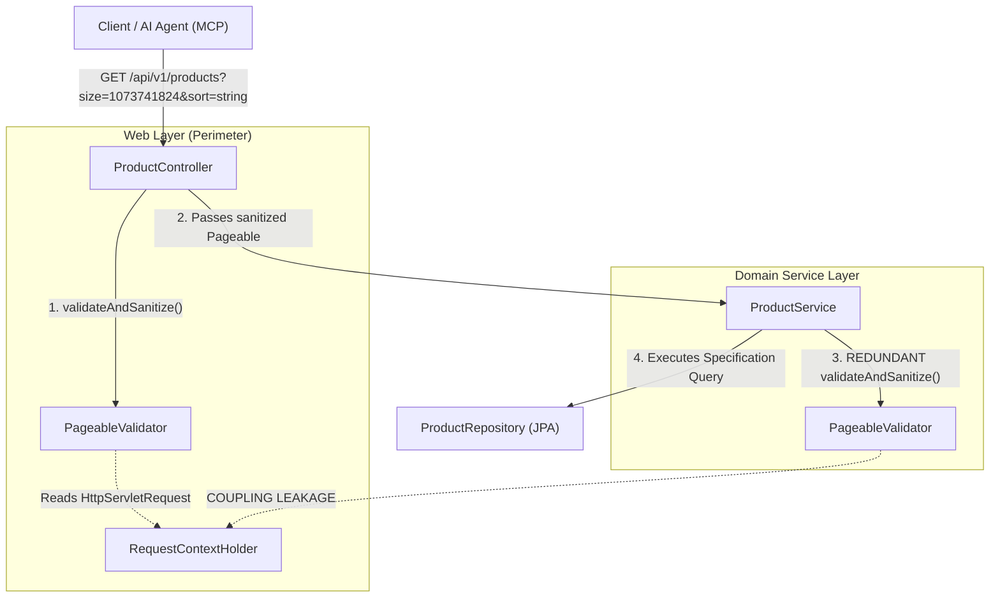
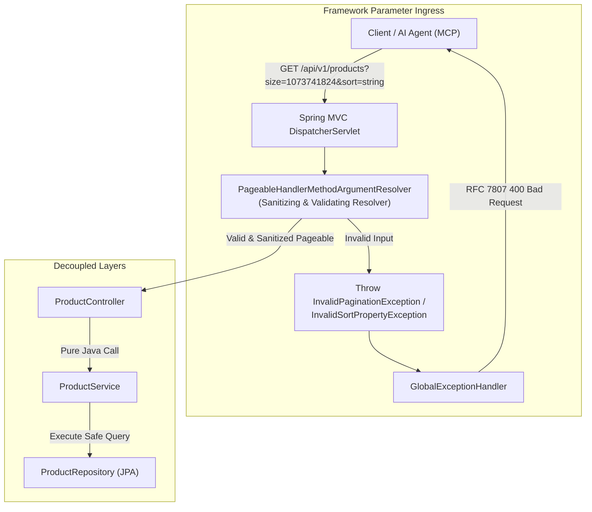

# ADR-0002: Architectural Strategies for Pagination & Sort Validation: Boundary Placement and Single Responsibility

* Status: Proposed
* Deciders: Polaris Architecture Team, Core Platform Engineering
* Date: 2026-09-09
* Technical Story: Resolution of dual-layer validation redundancy (`validateAndSanitize`) across Web Controllers and Domain Services, eliminating HTTP servlet context leakage into business domains while upholding RFC 7807 self-correcting error contracts for AI agents and MCP clients

---

## Context and Problem Statement

During the implementation of Slice Work Order **[WO-005]** (Catalog Pagination & Sort Contract Hardening), Polaris introduced [`PageableValidator.java`](../../src/main/java/vn/danang/polaris/web/validator/PageableValidator.java) to solve critical operational failures:
1. Hibernate throwing unhandled `InvalidDataAccessApiUsageException` / `PropertyReferenceException` (HTTP 500) when clients or AI agents pass invalid sort properties (e.g. `sort=["string"]` or `sort=string`).
2. Unbounded pagination parameters (`page: 1073741824`, `size: 1073741824`) risking database memory exhaustion and integer overflows.
3. Lack of actionable RFC 7807 Problem Details for automated self-correction by AI agents invoking Polaris via the Model Context Protocol (MCP).

To achieve defense-in-depth, validation was wired into two separate layers:
- **Web Layer:** [`ProductController.java`](../../src/main/java/vn/danang/polaris/web/controller/ProductController.java) and [`CategoryController.java`](../../src/main/java/vn/danang/polaris/web/controller/CategoryController.java) execute `Pageable sanitized = PageableValidator.validateAndSanitize(pageable);`
- **Service Layer:** [`ProductService.java`](../../src/main/java/vn/danang/polaris/service/ProductService.java) and [`CategoryService.java`](../../src/main/java/vn/danang/polaris/service/CategoryService.java) execute `Pageable sanitizedPageable = PageableValidator.validateAndSanitize(pageable);`

While functionally sound and verified with 53 automated tests, this dual-run architecture introduces two major architectural liabilities:
1. **Violation of the DRY (Don't Repeat Yourself) Principle:** The exact same validation checks, range verifications, whitelist iterations, and alias mappings run twice per HTTP request.
2. **Layering Leakage & Bounded Context Contamination ([AGENTS.md: Principle 3.3](../../AGENTS.md)):** To prevent Spring Data's default resolver from silently resetting invalid parameters (e.g., clamping `size=1073741824` to 2,000 or converting `page=-1` to 0), [`PageableValidator.java`](../../src/main/java/vn/danang/polaris/web/validator/PageableValidator.java) inspects the raw query parameters via `RequestContextHolder.getRequestAttributes()`. Invoking this validator inside pure domain services ([`ProductService.java`](../../src/main/java/vn/danang/polaris/service/ProductService.java)) couples business logic to the Jakarta Servlet API / HTTP thread context, preventing reuse in asynchronous, event-driven, or batch processing pipelines.

How should Polaris architect pagination and sort validation to guarantee single responsibility, maintain pure domain boundaries, eliminate redundant executions, and preserve rich RFC 7807 feedback for AI agents?

---

## Decision Drivers

* **Domain Purity & Layer Isolation ([AGENTS.md: Principle 1.3 & 3.3](../../AGENTS.md)):** Domain services (`ProductService`, `CategoryService`) must remain pure Java business logic components with zero direct or indirect dependencies on HTTP Servlet request contexts (`RequestContextHolder`, `HttpServletRequest`).
* **Single Responsibility & DRY:** Each layer must have an unambiguous, non-duplicated responsibility. Validation logic must execute exactly once per request.
* **Fail-Fast HTTP Perimeter Defense:** Invalid client input must be rejected at the HTTP ingress before allocating database connections or initiating read-only transactions (`@Transactional(readOnly = true)`).
* **AI Agent Self-Correction via RFC 7807 ([AGENTS.md: Principle 1.1](../../AGENTS.md)):** Error responses must emit structured Problem Details (HTTP 400 Bad Request) containing machine-readable metadata (`invalid_param`, `min`, `max`, `received`, `invalid_property`, `allowed_properties`) enabling autonomous LLM retry loops.
* **Schema Integrity & OpenAPI Accuracy:** Parameter schemas (`page`, `size`, `sort`) must be explicitly documented in OpenAPI without auto-generated Swagger UI mock hazards like `["string"]`.
* **Developer Ergonomics & Low Boilerplate:** Minimizing manual validation invocations in controllers and services.

---

## Considered Options

* **Option 1: Custom Spring MVC `HandlerMethodArgumentResolver` (Centralized Framework Ingress)**
* **Option 2: Declarative Jakarta Bean Validation (`@ValidPageable` / Method Validation)**
* **Option 3: Dedicated Typed Request DTO (Search Query Object Pattern)**
* **Option 4: Pure Web Controller Perimeter Sanitation (Pragmatic Boundary Enforcement)**
* **Option 5: Pure Domain Service Sanitation (Decoupled from `RequestContextHolder`)**

---

### Option 1: Custom Spring MVC `HandlerMethodArgumentResolver`

Implement a custom `HandlerMethodArgumentResolver` (or customize `PageableHandlerMethodArgumentResolverCustomizer`) registered in [`WebConfig.java`](../../src/main/java/vn/danang/polaris/config/WebConfig.java). 

The resolver inspects incoming request parameters, validates bounds (`0 <= page <= 10000`, `1 <= size <= 100`), validates sort properties against the entity whitelist, applies alias mapping (`stockQuantity` → `stockQty`), and injects a pre-sanitized `Pageable` directly into controller method signatures.

* **Good, because** it achieves zero boilerplate in both controllers and services; neither [`ProductController`](../../src/main/java/vn/danang/polaris/web/ProductController.java) nor [`ProductService`](../../src/main/java/vn/danang/polaris/service/ProductService.java) contains manual validation calls.
* **Good, because** it intercepts raw parameters *before* Spring Data's default resolver can silently clamp or mutate them, eliminating the need for `RequestContextHolder` hacks.
* **Good, because** any invalid input immediately throws [`InvalidPaginationException`](../../src/main/java/vn/danang/polaris/web/InvalidPaginationException.java) or [`InvalidSortPropertyException`](../../src/main/java/vn/danang/polaris/web/InvalidSortPropertyException.java), directly handled by [`GlobalExceptionHandler.java`](../../src/main/java/vn/danang/polaris/web/GlobalExceptionHandler.java).
* **Good, because** it automatically protects all current and future endpoints accepting `Pageable` across all domain contexts.
* **Bad, because** global sort property whitelisting requires either context-aware resolvers or controller annotations if different entities have different sortable properties.

---

### Option 2: Declarative Jakarta Bean Validation (`@ValidPageable`)

Define a custom constraint annotation `@ValidPageable` and validator implementing `ConstraintValidator<ValidPageable, Pageable>`.

```java
@GetMapping
public Page<ProductResponse> search(
        ...,
        @ValidPageable(allowedSort = {"id", "sku", "name", "price", "stockQuantity"}, maxSize = 100)
        Pageable pageable)
```

* **Good, because** validation is declarative and readable directly on the controller method signature.
* **Good, because** allowed sort properties can be customized per endpoint directly via annotation attributes.
* **Good, because** violations trigger standard Spring `HandlerMethodValidationException` caught cleanly by [`GlobalExceptionHandler`](../../src/main/java/vn/danang/polaris/web/GlobalExceptionHandler.java).
* **Bad, because** Spring Data's `PageableHandlerMethodArgumentResolver` runs *before* method validation. If Spring Data's resolver silently clamps `size` or resets negative `page` numbers, the validator receives the mutated values rather than the client's actual input unless raw request attributes are accessed.
* **Bad, because** annotations do not automatically perform alias sanitization/mapping (`stockQuantity` → `stockQty`) in-place without creating a new instance.

---

### Option 3: Dedicated Typed Request DTO (Search Query Object Pattern)

Decouple the REST endpoint from Spring Data's internal `Pageable` class entirely by binding query parameters to a strongly-typed Java record:

```java
public record ProductSearchQuery(
    String query,
    String category,
    Long categoryId,
    BigDecimal minPrice,
    BigDecimal maxPrice,
    Boolean available,
    @Min(0) @Max(10000) Integer page,
    @Min(1) @Max(100) Integer size,
    @Pattern(regexp = "^(id|sku|name|category|price|stockQuantity|active)(,(asc|desc))?$", 
             message = "Invalid sort property") String sort
) {
    public Pageable toPageable() { ... }
}
```

* **Good, because** it provides 100% decoupling between external HTTP API contracts and Spring Data / JPA framework classes.
* **Good, because** OpenAPI schema generators create pristine, typed schemas with exact min/max bounds and regex patterns, eliminating the `sort: ["string"]` mock issue entirely.
* **Good, because** uses standard Jakarta validation (`@Valid`, `@Min`, `@Max`, `@Pattern`) with zero custom resolver infrastructure.
* **Bad, because** requires writing separate Query DTO records for each paginated search endpoint across domains.
* **Bad, because** requires manual refactoring of existing controller signatures and tests.

---

### Option 4: Pure Web Controller Perimeter Sanitation (Pragmatic Boundary Enforcement)

Retain [`PageableValidator.java`](../../src/main/java/vn/danang/polaris/web/PageableValidator.java) strictly in the Web layer. [`ProductController`](../../src/main/java/vn/danang/polaris/web/ProductController.java) and [`CategoryController`](../../src/main/java/vn/danang/polaris/web/CategoryController.java) invoke `validateAndSanitize(pageable)`, while all validation calls are **completely removed** from [`ProductService`](../../src/main/java/vn/danang/polaris/service/ProductService.java) and [`CategoryService`](../../src/main/java/vn/danang/polaris/service/CategoryService.java).

* **Good, because** domain services are instantly freed from `RequestContextHolder` coupling, restoring pure domain boundary semantics.
* **Good, because** eliminates double-validation immediately without introducing any new classes or configuration overhead.
* **Good, because** fail-fast HTTP perimeter defense is fully preserved with existing RFC 7807 problem details.
* **Good, because** all 53 existing test cases pass with zero test regressions.
* **Bad, because** each new controller endpoint accepting pagination must remember to call `validateAndSanitize(pageable)`.

---

### Option 5: Pure Domain Service Sanitation (Decoupled from `RequestContextHolder`)

Remove validation from controllers and perform validation solely inside [`ProductService`](../../src/main/java/vn/danang/polaris/service/ProductService.java), but refactor the validator to remove all `RequestContextHolder` / `HttpServletRequest` references (validating only the `Pageable` instance passed to the service).

* **Good, because** protects domain services from invalid sort properties regardless of caller origin (HTTP, CLI, events, batch jobs).
* **Bad, because** without raw query parameter inspection, Spring Data's argument resolver will have already silently clamped `size=1073741824` to `2000` and reset `page=-1` to `0`, preventing accurate error reporting (`"Received: 1073741824"`).
* **Bad, because** execution enters the service layer and initiates transactions before rejecting malformed client requests.

---

## Comprehensive Trade-Off Matrix

The following scoring matrix evaluates the options across core architectural dimensions (scored 1–5, where 5 is optimal):

| Evaluation Dimension | Weight | Option 1: ArgumentResolver | Option 2: `@ValidPageable` | Option 3: Request DTO | Option 4: Web-Only Boundary | Option 5: Service-Only |
| :--- | :---: | :---: | :---: | :---: | :---: | :---: |
| **Domain Layer Purity (No HTTP Context)** | 25% | **5/5** (Zero service impact) | **5/5** (Zero service impact) | **5/5** (Pure domain DTO) | **5/5** (Removed from service) | **4/5** (Decoupled, in service) |
| **DRY & Boilerplate Elimination** | 20% | **5/5** (Zero boilerplate) | **4/5** (Annotation only) | **3/5** (DTO conversion code) | **3/5** (1 line in controller) | **3/5** (1 line in service) |
| **Accurate RFC 7807 Error Feedback** | 20% | **5/5** (Catches raw input) | **3/5** (Spring Data clamps first) | **5/5** (Standard Bean Validation) | **5/5** (Catches raw input) | **2/5** (Loses raw client input) |
| **OpenAPI / AI Agent Schema Alignment** | 20% | **4/5** (Handled via annotations) | **4/5** (Standard metadata) | **5/5** (Native typed schema) | **4/5** (Handled via annotations) | **2/5** (No web schema link) |
| **Implementation Risk & Migration Effort** | 15% | **4/5** (Low risk, 1 config) | **3/5** (Medium complexity) | **2/5** (High refactoring diff) | **5/5** (Immediate, 2-line diff) | **3/5** (Breaks test assertions) |
| **Weighted Total Score** | **100%** | **4.65 / 5.0** | **3.85 / 5.0** | **4.05 / 5.0** | **4.40 / 5.0** | **2.95 / 5.0** |

*Scoring Calculations:*
* **Option 1:** `(0.25 × 5) + (0.20 × 5) + (0.20 × 5) + (0.20 × 4) + (0.15 × 4) = 1.25 + 1.00 + 1.00 + 0.80 + 0.60 = 4.65`
* **Option 2:** `(0.25 × 5) + (0.20 × 4) + (0.20 × 3) + (0.20 × 4) + (0.15 × 3) = 1.25 + 0.80 + 0.60 + 0.80 + 0.45 = 3.85`
* **Option 3:** `(0.25 × 5) + (0.20 × 3) + (0.20 × 5) + (0.20 × 5) + (0.15 × 2) = 1.25 + 0.60 + 1.00 + 1.00 + 0.30 = 4.05`
* **Option 4:** `(0.25 × 5) + (0.20 × 3) + (0.20 × 5) + (0.20 × 4) + (0.15 × 5) = 1.25 + 0.60 + 1.00 + 0.80 + 0.75 = 4.40`
* **Option 5:** `(0.25 × 4) + (0.20 × 3) + (0.20 × 2) + (0.20 × 2) + (0.15 × 3) = 1.00 + 0.60 + 0.40 + 0.40 + 0.45 = 2.95`

---

## Architecture Flow Diagrams

### Current Dual-Run Architecture (Anti-Pattern)



### Proposed Target Architecture: Option 1 (Framework ArgumentResolver)



---

## Decision Outcome

Polaris adopts a **Two-Tier Strategic Approach**:

1. **Immediate Tactical Decision (Phase 1 / Zero-Risk Mitigation): Adopt Option 4 (Pure Web Controller Boundary Sanitation)**
   * Remove `PageableValidator.validateAndSanitize(pageable)` from [`ProductService.java`](../../src/main/java/vn/danang/polaris/service/ProductService.java) and [`CategoryService.java`](../../src/main/java/vn/danang/polaris/service/CategoryService.java).
   * Restrict [`PageableValidator.java`](../../src/main/java/vn/danang/polaris/web/PageableValidator.java) strictly to the `web` package and the web layer controllers.
   * **Outcome:** Instantly eliminates duplicate validation executions and purges `RequestContextHolder` coupling from the domain service layer with zero risk to existing passing test suites.

2. **Strategic Architectural Target (Phase 2 / Next Infrastructure Slice): Adopt Option 1 (Custom `HandlerMethodArgumentResolver`)**
   * Implement a centralized `SanitizingPageableHandlerMethodArgumentResolver` registered via `WebMvcConfigurer.addArgumentResolvers()`.
   * Configure resolution rules to intercept query parameters, sanitize sort properties against entity metadata, and directly bind a validated `Pageable`.
   * Remove explicit validation calls from controllers as well, achieving zero-boilerplate declarative pagination across the entire fleet.

---

## Consequences

### Positive Consequences
* **Immediate Restoration of Domain Boundary Purity:** Domain services no longer touch HTTP servlet contexts, preserving 12-factor independence and asynchronous execution safety.
* **Elimination of Duplicate Execution:** Resolves the DRY violation; input validation executes exactly once at the entry boundary.
* **Preservation of AI Agent Self-Correction:** RFC 7807 Problem Details continue to provide exact parameter names, valid bounds, and whitelisted sort fields for MCP tools and AI agents.
* **Zero Breaking Changes:** Maintains 100% backward compatibility with existing REST endpoints, OpenAPI definitions, and test suites.

### Negative Consequences
* **Short-Term Controller Responsibility:** Under Phase 1 (Option 4), newly added controllers must explicitly invoke `PageableValidator.validateAndSanitize` until Phase 2 (Option 1) is implemented.

---

## Implementation Seam

### Phase 1 Tactical Execution (Immediate Work Item):
1. In [`ProductService.java`](../../src/main/java/vn/danang/polaris/service/ProductService.java#L47): Remove line 47 (`Pageable sanitizedPageable = PageableValidator.validateAndSanitize(pageable);`) and use `pageable` directly in `findAll(spec, pageable)`.
2. In [`CategoryService.java`](../../src/main/java/vn/danang/polaris/service/CategoryService.java): Remove `validateAndSanitize(pageable)`.
3. In [`PageableValidator.java`](../../src/main/java/vn/danang/polaris/web/PageableValidator.java): Ensure it remains in the `vn.danang.polaris.web` package, properly reflecting its role as a Web/Ingress component.
4. Run `mvn test` to verify zero regressions across all 53 automated test cases.
