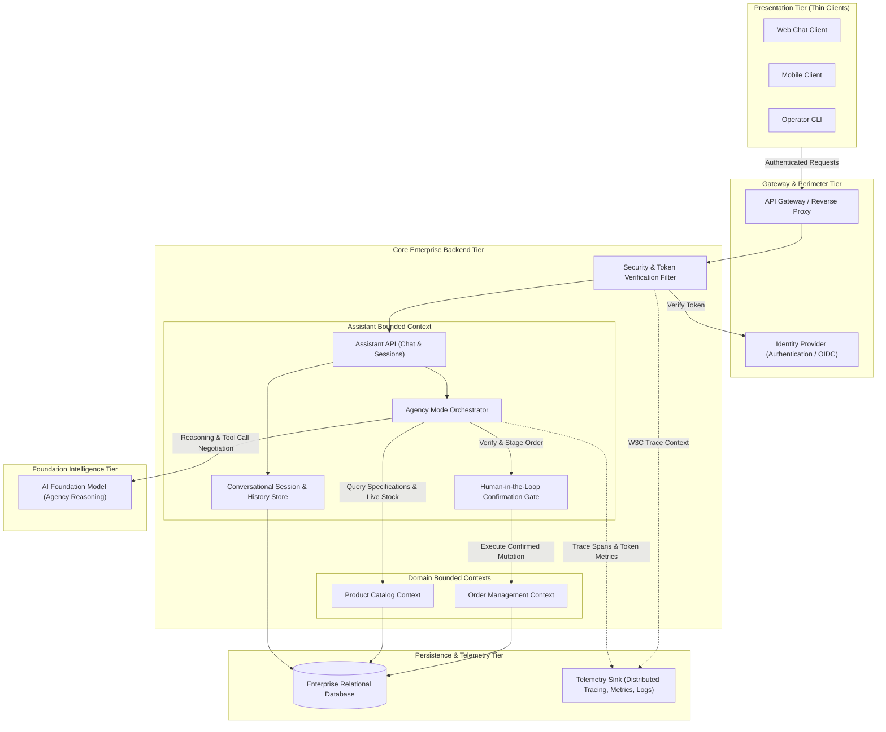
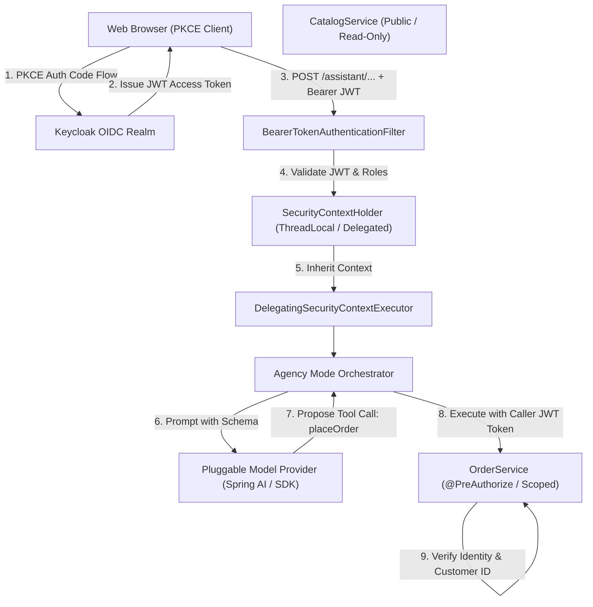
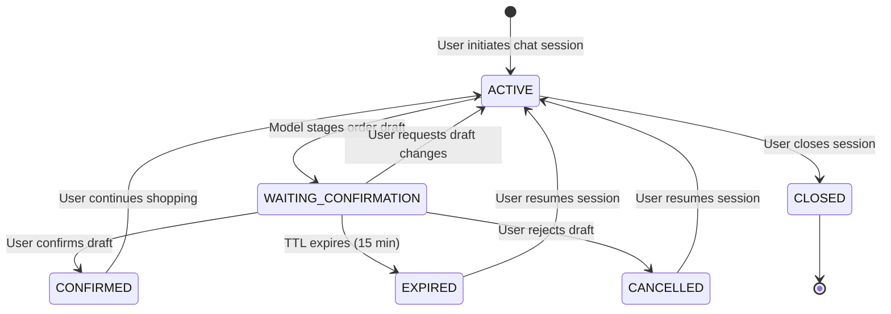
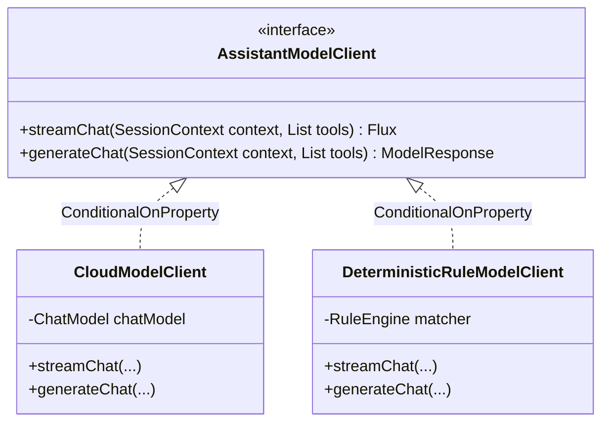
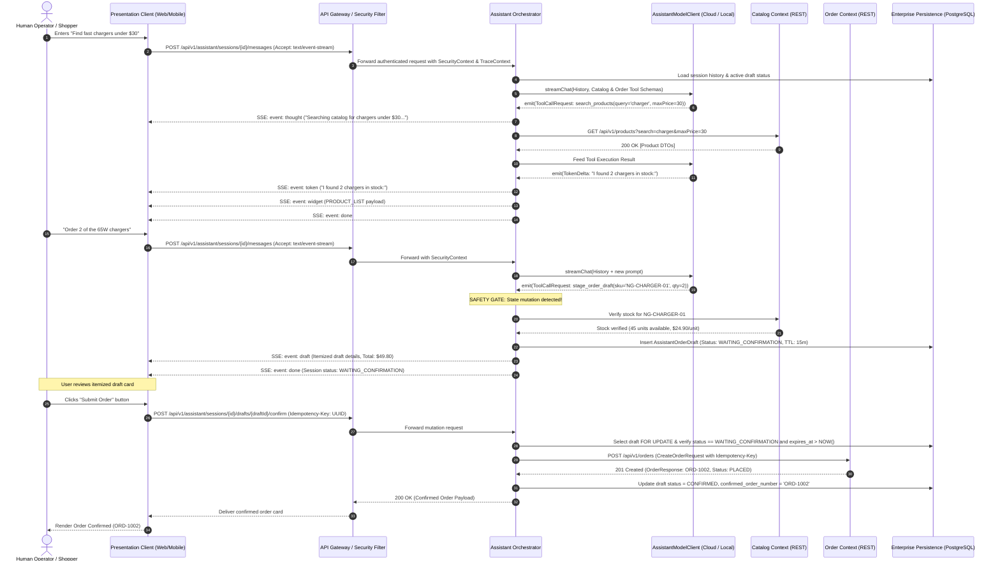

# ADR-0004: Architectural Topology & Placement of Responsibilities for the Polaris AI Assistant

* Status: Accepted
* Deciders: Polaris Architecture Team, Core Platform Engineering, Product Management
* Date: 2026-09-09
* Technical Story: Technology-agnostic architectural topology selection, placement of cognitive agency responsibilities, session lifecycle management, and human-in-the-loop security boundaries for the Polaris conversational assistant.

---

## Context and Problem Statement

Polaris provides core commerce capabilities (multi-criteria catalog exploration, live inventory verification, and transactional order lifecycles). To expose these business capabilities to human operators, sales staff, and shoppers conversationally, the system requires an AI Assistant architecture.

A conversational assistant must fulfill three distinct operational phases:
1. **Perception & Interaction:** Capturing user natural language input, rendering responses, and providing visual interactive widgets (e.g. order review cards, confirmation triggers).
2. **Cognitive Orchestration (Agency Mode):** Maintaining conversational context, planning multi-step actions, invoking domain capabilities via structured tools, parsing machine-actionable problem feedback, and pausing for human confirmation before state mutations.
3. **Domain Execution:** Executing verified domain logic (inventory reservation, atomic order creation, lifecycle state transitions) against persistent storage.

Where should the cognitive orchestration, conversation session state, model communication, and security boundaries reside within the system architecture?

---

## Decision Drivers

* **Credential & Security Perimeter Isolation ([AGENTS.md: Principle 1.2](../../AGENTS.md)):** Foundation model credentials and private service keys must remain protected within trusted network perimeters, never exposed to or managed by client runtimes.
* **Agency Mode Resilience & Execution Lifecycle:** Autonomous multi-step planning and tool-execution loops must execute reliably without vulnerability to client-side network interruptions, browser tab lifecycles, or device sleep states.
* **State Management & Cross-Surface Continuity:** Conversational history, active order drafts, and pending approval states must persist in durable enterprise storage to support multi-device resumption and regulatory compliance auditing.
* **Bounded Context Purity & Architectural Seams ([AGENTS.md: Principle 2.2](../../AGENTS.md)):** Domain services (Catalog, Order) must remain agnostic to conversational LLM logic. The assistant capabilities must integrate strictly through published contracts.
* **Observability & Distributed Trace Continuity ([AGENTS.md: Principle 3.1](../../AGENTS.md)):** End-to-end distributed tracing must span client interaction, cognitive inference, domain tool dispatch, and persistence operations.
* **Extensibility & Client Independence:** The architecture must allow multiple presentation surfaces (web browsers, mobile applications, command-line interfaces, or external AI host protocols) to interact with identical cognitive capabilities without duplicating business logic.

---

## Considered Architectural Topologies

The following five technology-agnostic architectural topologies were evaluated:

```
┌────────────────────────────────────────────────────────────────────────┐
│ Evaluated Architectural Topologies                                     │
├────────────────────────────────────────────────────────────────────────┤
│ Topology A: Pure Client-Side Orchestration (Fat Client)                │
│ Topology B: Backend AI Agent Gateway / Orchestrator (Thin Client / BFF)│
│ Topology C: Protocol-Standardized Tool Bridge (Headless Host)          │
│ Topology D: Event-Driven Asynchronous Pipeline (Choreographed Agents)   │
│ Topology E: Monolithic Server-Rendered Assistant (Coupled UI & Engine) │
└────────────────────────────────────────────────────────────────────────┘
```

---

### Topology A: Pure Client-Side Orchestration (Fat Client)

The client runtime directly manages the conversation state, model prompt construction, direct calls to external Foundation Model APIs, and client-side tool execution by issuing HTTP calls to backend domain APIs.

* **Strengths:**
  - Minimal backend footprint: Backend only exposes standard domain APIs; zero conversational state to scale or persist on the server.
  - Compute offloading: Context formatting and parsing execute on client devices.
* **Weaknesses:**
  - Severe Security Risk: Model API keys must be distributed to or configured in client runtimes, exposing credentials to end users.
  - Fragile Execution: Multi-step tool loops terminate if the client tab is closed, refreshed, or backgrounded during execution.
  - Fragmented Observability: Backend telemetry cannot measure model inference latency, prompt token counts, or reasoning failures.
  - Logic Duplication: Tool schemas, prompts, and disambiguation logic must be reimplemented for every client platform (web, mobile, CLI).

---

### Topology B: Backend AI Agent Gateway / Orchestrator (Dedicated Assistant Context)

A dedicated server-side Assistant Service mediates between client presentation applications, foundation models, and backend domain services. The client is a thin presentation UI that submits messages and renders structured event/card responses. The backend orchestrator owns session persistence, server-side agency execution, tool dispatching, and human-in-the-loop state machines.

* **Strengths:**
  - Strict Security Isolation: Foundation model credentials remain strictly within server-side secure environments; client authentication relies on standard identity tokens.
  - Resilient Agency Mode: Multi-step reasoning and tool loops run reliably in backend worker threads with server-managed timeouts, retries, and transaction boundaries.
  - Unified Enterprise Persistence: Conversational sessions, message logs, and staged drafts persist in enterprise databases, enabling cross-device continuity and audit compliance.
  - Complete Observability: Full distributed tracing spans user ingress, model inference (with token consumption), tool invocations, and database queries.
  - Thin, Multi-Surface Clients: Web, mobile, and CLI clients share the same backend assistant API without duplicating cognitive logic.
* **Weaknesses:**
  - Additional server-side domain context and session storage lifecycle to manage.

---

### Topology C: Protocol-Standardized Tool Bridge (Headless Host Architecture)

The system does not host conversational reasoning or chat UI. Instead, domain contexts expose machine-readable tool schemas and endpoints via a standard protocol (e.g. Model Context Protocol / Tool RPC). External AI clients (desktop assistants, developer IDEs, third-party agent frameworks) connect directly to the protocol server as autonomous hosts.

* **Strengths:**
  - Zero UI or conversational orchestration maintenance on the core platform.
  - Universal interoperability: Any compliant external AI client can discover and invoke platform capabilities.
* **Weaknesses:**
  - No control over presentation: Platform cannot provide a branded, consumer-friendly web experience or enforce interactive confirmation widgets.
  - Requires end-users to install, configure, and operate external AI client environments.

---

### Topology D: Event-Driven Asynchronous Pipeline (Choreographed Agent Workers)

Conversational interactions are modeled as asynchronous domain events on an event bus. User inputs emit query events; background agent workers consume events, invoke domain tool events, and stream completed responses back via asynchronous push channels.

* **Strengths:**
  - Decoupled, non-blocking, and horizontally scalable for complex, multi-minute autonomous background tasks.
* **Weaknesses:**
  - High architectural complexity (event brokers, dead-letter queues, out-of-order event handling).
  - High latency for real-time synchronous conversational shopping.
  - Awkward orchestration for interactive, synchronous human-in-the-loop confirmation gates.

---

### Topology E: Monolithic Server-Rendered Assistant (Coupled UI & Orchestrator)

A single monolithic backend handles presentation rendering (server-rendered HTML/DOM fragments), conversational state, and AI model orchestration.

* **Strengths:**
  - Single deployment boundary; zero API versioning overhead between presentation and orchestration.
* **Weaknesses:**
  - Tightly couples presentation mechanics to backend business services.
  - Inflexible: Cannot support native mobile applications, CLI tools, or external agent integrations without building separate APIs.

---

## Comparative Topology Evaluation Matrix

| Evaluation Dimension | Weight | Topology A: Pure Client-Side | Topology B: Backend Agent Gateway | Topology C: Protocol Tool Bridge | Topology D: Event Asynchronous | Topology E: Monolithic Server-Rendered |
| :--- | :---: | :---: | :---: | :---: | :---: | :---: |
| **Credential Security** | 25% | 1/5 | **5/5** | 4/5 | **5/5** | **5/5** |
| **Agency Mode Resilience** | 20% | 2/5 | **5/5** | 3/5 | 4/5 | 4/5 |
| **Session Continuity & Audit** | 15% | 2/5 | **5/5** | 1/5 | **5/5** | 4/5 |
| **Multi-Surface Flexibility** | 15% | 3/5 | **5/5** | 4/5 | 4/5 | 1/5 |
| **Trace Observability** | 15% | 2/5 | **5/5** | 3/5 | 4/5 | 3/5 |
| **Operational Simplicity** | 10% | 4/5 | **4/5** | 5/5 | 2/5 | 4/5 |
| **Weighted Total** | **100%** | **2.15 / 5.0** | **4.85 / 5.0** | **3.25 / 5.0** | **4.20 / 5.0** | **3.65 / 5.0** |

---

## Decision Outcome

**Selected Architecture: Complementary Dual-Topology Pattern.**

1. **Primary Interactive Architecture &rarr; Topology B (Backend AI Agent Gateway):**
   - Adopted for human-facing web, mobile, and operator chat applications.
   - The platform provides a dedicated server-side **Assistant Bounded Context** exposing standards-compliant conversational endpoints.
   - The Assistant Service maintains persistent conversation sessions, manages foundation model communication securely on the server, executes the autonomous agency loop, and enforces the mandatory human-in-the-loop confirmation state machine.
   - Client applications remain thin, decoupled presentation surfaces rendering structured card models and streaming text.

2. **Secondary Extensibility Architecture &rarr; Topology C (Protocol-Standardized Tool Bridge):**
   - Retained specifically for external developer environments and autonomous headless AI clients (e.g. IDE assistants, external agent swarms).
   - Exposes platform capabilities as standardized protocol tools without coupling external clients to internal presentation layers.

Both topologies share the same underlying Domain Bounded Contexts (Catalog, Order), ensuring zero business logic duplication.

---

## Technology-Agnostic Component Decomposition



---

## Detailed Architectural Specifications

### 1. Dual-Transport Communication Protocol (Streaming vs Mutation)

To deliver real-time conversational responsiveness without compromising transactional integrity or idempotency, Polaris strictly decouples streaming perception from state-mutating transactions across two distinct transports:

```
┌─────────────────────────────────────────────────────────────────────────────┐
│ Decoupled Transport Architecture                                            │
├──────────────────────────────────────┬──────────────────────────────────────┤
│ Read-Only / Reasoning Stream         │ Transactional State Mutation         │
│ (Server-Sent Events: text/event-stream) (Standard REST: application/json)   │
├──────────────────────────────────────┼──────────────────────────────────────┤
│ • Token-by-token text streaming      │ • Human confirmation submission      │
│ • Real-time reasoning / thought logs │ • Draft cancellation / rejection     │
│ • Asynchronous tool execution status │ • Idempotent order placement (UUIDv4)│
│ • Staged draft & widget delivery     │ • Strict HTTP status (200/201/409)   │
│ • Unidirectional, non-mutating       │ • Atomic JPA transaction commit      │
└──────────────────────────────────────┴──────────────────────────────────────┘
```

#### A. Streaming Transport: Server-Sent Events (SSE - RFC 8895 / W3C EventSource)
Conversational interactions (user prompts, LLM token streaming, intermediate thought indicators, and structured UI widget deliveries) flow exclusively over unidirectional Server-Sent Events:
- **Endpoint:** `POST /api/v1/assistant/sessions/{sessionId}/messages`
- **Request Header:** `Accept: text/event-stream`, `Authorization: Bearer <JWT>`
- **Request Body:** `application/json` (User message payload: `{"content": "..."}`)
- **Response Header:** `Content-Type: text/event-stream;charset=UTF-8`, `Cache-Control: no-cache`, `Connection: keep-alive`
- **Wire Event Protocol:** Every SSE frame contains a typed `event` and JSON `data` payload:
  ```http
  event: thought
  data: {"step":"SEARCHING_CATALOG","message":"Querying catalog for fast chargers under $30..."}

  event: token
  data: {"delta":"We have "}

  event: token
  data: {"delta":"2 fast chargers "}

  event: widget
  data: {"type":"PRODUCT_LIST","items":[{"sku":"NG-CHARGER-01","name":"NextGen 65W Fast Charger","price":24.90,"stockQuantity":45,"available":true}]}

  event: draft
  data: {"draftId":"dft-9821a","status":"WAITING_CONFIRMATION","expiresAt":"2026-09-09T15:30:00Z","items":[{"sku":"NG-CHARGER-01","quantity":2,"unitPrice":24.90,"lineTotal":49.80}],"totalAmount":49.80}

  event: done
  data: {"sessionId":"sess-101","status":"WAITING_CONFIRMATION"}
  ```
- **SSE Stream Lifecycle & Resiliency:**
  - **Heartbeats:** The server emits a comment ping (`: keep-alive\n\n`) every 15 seconds to prevent intermediate proxy/load balancer timeouts.
  - **Client Disconnection:** If the client drops the TCP connection, Spring MVC's `ResponseBodyEmitter` / `SseEmitter` triggers `onError` / `onCompletion`, cleanly aborting the active model inference call without orphaned backend threads.
  - **Stream Idempotency:** Streaming endpoints NEVER mutate persistent domain state (never create orders or cancel orders). Streaming is strictly read-only and draft-staging.

#### B. Mutation Transport: Standard REST API (RFC 9110 & RFC 7807)
Any operation that alters domain state (confirming an order draft, cancelling an existing order) MUST execute as an explicit HTTP POST request returning standard HTTP status codes:
- **Confirm Order Draft:**
  - **Endpoint:** `POST /api/v1/assistant/sessions/{sessionId}/drafts/{draftId}/confirm`
  - **Headers:** `Authorization: Bearer <JWT>`, `Idempotency-Key: <UUIDv4>`
  - **Response (`201 Created`):** Returns the confirmed `OrderResponse` with `Location: /api/v1/orders/{orderNumber}`.
  - **Response (`409 Conflict`):** If the draft has expired (`EXPIRED`) or inventory was exhausted in the interim, returns an RFC 7807 `ProblemDetail` with actionable remedies.
- **Reject / Cancel Draft:**
  - **Endpoint:** `POST /api/v1/assistant/sessions/{sessionId}/drafts/{draftId}/cancel`
  - **Response (`200 OK`):** Transitions draft status to `CANCELLED` and releases any staged resources.

---

### 2. Security Context & Identity Propagation Architecture

Polaris enforces a **Zero-Bypass, Zero-Privilege-Escalation Gate** (AGENTS.md: Principle 1.2 & ADR-0001). The AI Assistant is an orchestrator on behalf of a human user; it never possesses autonomous superuser authority.



#### A. In-Process Security Context Propagation
When running within the unified Spring Boot application:
1. The inbound request passes through `BearerTokenAuthenticationFilter`, populating Spring Security's `SecurityContextHolder` with an authenticated `JwtAuthenticationToken`.
2. Because AI agency loops and model inference execute asynchronously to avoid blocking container request threads, the asynchronous execution pool MUST be wrapped with `DelegatingSecurityContextExecutorService` (or `DelegatingSecurityContextAsyncTaskExecutor`).
3. Every internal domain call initiated by the agency engine inherits the exact `SecurityContext` of the human caller.
4. If a prompt attempts to perform an unauthorized action (e.g. prompt injection asking to cancel another user's order), domain service security checks (`OrderService`) reject the action immediately with `AccessDeniedException` (`403 Forbidden`).

#### B. Out-of-Process / Microservice Security Context Propagation
If the Assistant Service is decoupled into an autonomous microservice or BFF container:
1. The client JWT Bearer token is relayed downstream via the `Authorization: Bearer <token>` HTTP header using Spring's `RestClient` or `WebClient` configured with an authorized token interceptor.
2. If token exchange is required for downstream domain scopes, standard OAuth 2.0 Token Exchange (RFC 8693) is utilized, preserving the original actor identity claim (`act`).

#### C. Role Scoping & IDOR Prevention
- **Shoppers (`ROLE_USER`):** The Assistant automatically extracts `customerId` from JWT claims (`preferred_username` / `sub`). The model cannot override this parameter. Any query or mutation is strictly locked to the authenticated user.
- **Store Staff (`ROLE_STAFF`, `ROLE_ADMIN`):** The Assistant permits explicit assignment of `customer_id` on behalf of a customer, enabling assisted sales and support.

---

### 3. Session & Order Draft Persistence State Machines

Conversational continuity and transaction safety require durable state machines in the enterprise database.

#### A. Assistant Session State Machine


- `ACTIVE`: Normal conversational exchange; catalog search, inquiries, and recommendations.
- `WAITING_CONFIRMATION`: The agency loop has staged a mutating order draft. Autonomous execution is suspended until human input.
- `CONFIRMED`: The staged draft has been submitted, verified, and committed to domain storage.
- `EXPIRED`: Confirmation TTL elapsed without action; staged pricing snapshot invalidated.
- `CANCELLED`: User explicitly declined the staged mutation.
- `CLOSED`: Session terminated by client or administrative timeout.

#### B. Order Draft State Machine & Expiration TTL
To protect against inventory hoarding and pricing fluctuation, order drafts are governed by an explicit **Time-to-Live (TTL)**:
- **Default TTL:** 15 minutes (900 seconds) from initial staging.
- **Price Guarantee:** Line item unit prices are snapshotted at staging time. If confirmed within the TTL window, prices are guaranteed.
- **Optimistic Concurrency Control:** Every draft record carries an incremental `@Version` column to prevent double-confirmation race conditions.
- **Expiration Enforcement:** Drafts past `expires_at` cannot be confirmed. Attempted confirmation returns `409 Conflict` (`https://polaris.local/errors/draft-expired`).

#### C. Database Schema Specifications (Flyway `V6__assistant_session_draft_schema.sql`)
```sql
-- Assistant Sessions Table
CREATE TABLE assistant_sessions (
    id VARCHAR(64) PRIMARY KEY,
    user_id VARCHAR(64) NOT NULL,
    customer_id BIGINT,
    status VARCHAR(32) NOT NULL DEFAULT 'ACTIVE',
    created_at TIMESTAMP WITH TIME ZONE NOT NULL DEFAULT CURRENT_TIMESTAMP,
    updated_at TIMESTAMP WITH TIME ZONE NOT NULL DEFAULT CURRENT_TIMESTAMP,
    version BIGINT NOT NULL DEFAULT 0
);
CREATE INDEX idx_assistant_sessions_user ON assistant_sessions(user_id, status);

-- Assistant Conversation Messages Table
CREATE TABLE assistant_messages (
    id BIGSERIAL PRIMARY KEY,
    session_id VARCHAR(64) NOT NULL REFERENCES assistant_sessions(id) ON DELETE CASCADE,
    role VARCHAR(16) NOT NULL, -- 'USER', 'ASSISTANT', 'SYSTEM', 'TOOL'
    content TEXT,
    widget_type VARCHAR(64),
    widget_payload JSONB,
    tool_call_id VARCHAR(64),
    created_at TIMESTAMP WITH TIME ZONE NOT NULL DEFAULT CURRENT_TIMESTAMP
);
CREATE INDEX idx_assistant_messages_session ON assistant_messages(session_id, created_at);

-- Assistant Order Drafts Table
CREATE TABLE assistant_order_drafts (
    id VARCHAR(64) PRIMARY KEY,
    session_id VARCHAR(64) NOT NULL REFERENCES assistant_sessions(id) ON DELETE CASCADE,
    customer_id BIGINT NOT NULL,
    status VARCHAR(32) NOT NULL DEFAULT 'WAITING_CONFIRMATION',
    items JSONB NOT NULL,
    total_amount NUMERIC(12, 2) NOT NULL,
    expires_at TIMESTAMP WITH TIME ZONE NOT NULL,
    confirmed_order_number VARCHAR(64),
    created_at TIMESTAMP WITH TIME ZONE NOT NULL DEFAULT CURRENT_TIMESTAMP,
    updated_at TIMESTAMP WITH TIME ZONE NOT NULL DEFAULT CURRENT_TIMESTAMP,
    version BIGINT NOT NULL DEFAULT 0
);
CREATE INDEX idx_assistant_drafts_session ON assistant_order_drafts(session_id, status);
CREATE INDEX idx_assistant_drafts_expiry ON assistant_order_drafts(status, expires_at);
```

---

### 4. Pluggable Model Provider Architecture & Zero-Config Local Development

To support enterprise deployment across heterogeneous LLM infrastructures while guaranteeing seamless local development and CI testing, Polaris defines a pluggable model interface:



#### A. Provider Abstraction Contract
The `AssistantModelClient` cleanly isolates model invocation details from the conversation orchestrator:
- Accepts conversation history and domain tool definitions (`search_catalog`, `verify_stock`, `stage_order`, `get_order_status`, `cancel_order`).
- Emits a reactive stream of `ModelEvent` objects (`ThoughtEvent`, `TokenDeltaEvent`, `ToolCallRequestEvent`, `TextCompletionEvent`).

#### B. Implementations
1. **Cloud Model Client (`CloudModelClient`):**
   - Integrates with foundation model APIs via Spring AI / Google GenAI SDK (supporting Gemini 2.0 Flash / Pro, OpenAI GPT-4o, Anthropic Claude 3.5 Sonnet).
   - Activated when `polaris.ai.provider=gemini|openai|anthropic` and corresponding API keys are provided via environment variables (`POLARIS_AI_API_KEY`).
2. **Deterministic Rule Model Client (`DeterministicRuleModelClient`):**
   - **Default Zero-Config Fallback:** Automatically activated when `polaris.ai.provider=local` or when cloud API keys are absent.
   - Operates with zero network calls, zero cloud dependencies, and zero latency.
   - Employs deterministic regex and keyword intent matching to drive the exact same tool execution, order staging, and widget rendering flows.
   - Guarantees 100% reproducible integration tests and enables any developer to run the web chat assistant locally immediately after cloning the repository.

---

### 5. Technology-Agnostic Execution Sequence



---

## Consequences and Trade-offs

### Positive Consequences
- **Absolute Credential Isolation:** Zero third-party model credentials or API keys ever reach client runtimes or browser environments ([AGENTS.md: Principle 1.2](../../AGENTS.md)).
- **Resilient Agency Execution:** Multi-step tool loops execute reliably on managed backend threads, unaffected by browser tab closures, network hiccups, or mobile lifecycle suspensions.
- **Guaranteed Human-in-the-Loop Safety:** Destructive or transactional mutations cannot execute autonomously; staging drafts with deterministic TTLs enforces human review and eliminates phantom reservations.
- **Zero-Config Developer Experience:** The `DeterministicRuleModelClient` allows instantaneous local startup (`./mvnw spring-boot:run`) without requiring cloud API keys or external billing accounts.
- **Unbroken Observability:** W3C `traceparent` and OpenTelemetry spans seamlessly connect user HTTP ingress, SSE event emissions, model inference tokens, domain tool calls, and SQL queries ([AGENTS.md: Principle 3.1](../../AGENTS.md)).
- **Multi-Surface Adaptability:** The decoupled Assistant REST + SSE API powers the Web Chat interface, mobile applications, operator CLI bridges, and external AI agents identically without backend duplication.

### Negative Consequences & Trade-offs
- **Server Memory & Connection Footprint:** Long-lived SSE connections consume server connection handles. *Mitigation:* Bounded client timeouts, keep-alive heartbeats, and non-blocking asynchronous servlet processing via Spring MVC.
- **State Management Overhead:** Maintaining conversation turns, tool messages, and draft state requires additional Flyway migrations and database storage. *Mitigation:* Explicit session indexing, cascading deletes on expired sessions, and automated background TTL cleanup jobs.
- **Eventual Consistency Window during Draft Review:** Staged drafts hold pricing snapshots but do not take hard locks on catalog inventory until confirmation. *Mitigation:* Live stock verification at confirmation time, returning an actionable RFC 7807 `InsufficientStockException` if stock depletes during user review.

---

## Compliance & AGENTS.md Principle Mapping

| AGENTS.md Principle | Architectural Alignment in ADR-0004 |
| :--- | :--- |
| **1.1 Strict Protocol Conformance (RFC 9110 & RFC 7807)** | Decouples read-only streaming (SSE RFC 8895) from mutations (HTTP POST RFC 9110). Emits standard HTTP status codes (`200`, `201`, `400`, `401`, `403`, `409`) and rich self-correcting RFC 7807 Problem Details. |
| **1.2 Industry-Standard Security (OAuth 2.0 / OIDC / PKCE)** | Web client uses Keycloak OIDC Authorization Code Flow with PKCE (RFC 7636). Assistant runs strictly under caller's `SecurityContext` with zero privilege escalation. |
| **1.3 Walkable Architecture & Domain Boundaries** | Requests follow clear walkable paths (Client &rarr; Assistant Controller &rarr; Engine &rarr; Domain REST &rarr; DB) with no unexplained indirection. |
| **1.4 Schema Migrations & Dev-Prod Parity** | Database tables for sessions, messages, and drafts are managed exclusively via forward-only Flyway migrations (`V6__assistant_session_draft_schema.sql`). |
| **2.1 Vertical Completeness** | Assistant implementation slices span DB migration &rarr; JPA entities &rarr; Domain service &rarr; REST/SSE controllers &rarr; Integration tests. |
| **2.2 Strict Context Containment** | Assistant context interacts with Catalog and Order contexts strictly through published domain interfaces or REST contracts; zero cross-context SQL joins or entity coupling. |
| **3.1 Observability by Default** | W3C `traceparent` distributed tracing propagated across SSE streams, asynchronous agency threads, model inference spans, and domain tool dispatches. |
| **3.2 Automated Verification Floor** | Automated test suite verifies streaming protocol conformance, security token validation, negative authentication guards (401), and draft TTL state transitions. |
| **3.3 Anti-God Class Architecture** | Separates concerns into dedicated modules: `controller`, `service`, `model`, `engine`, `safety`, and `repository`. |

