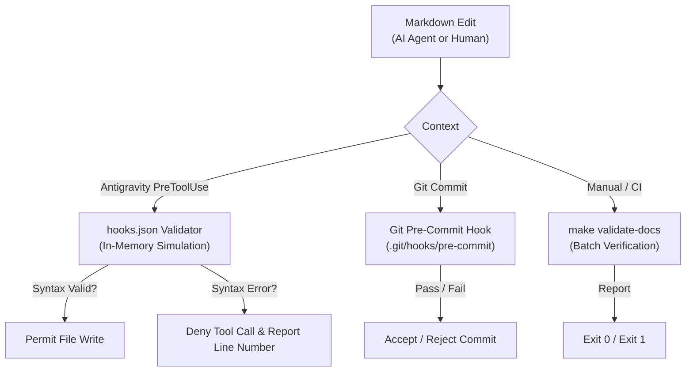

# AI Assistant Integration & Development Workflows

Polaris provides first-class support for AI assistants via the [Model Context Protocol (MCP)](https://modelcontextprotocol.io/) and specialized agent workflows.

Because developer workflows and tool preferences vary across teams (e.g., **Claude Code**, **Antigravity**, **Cursor**, or custom LLM clients), this guide centralizes all AI-specific configurations, integrations, and automated quality guards so the core project documentation remains clean and business-focused.

---

## 1. Polaris MCP Server

The Polaris MCP server allows AI assistants to safely query the product catalog, check live inventory, and inspect SKU details over standard stdio JSON-RPC.

- **Implementation**: [`mcp/mcp_polaris_products.py`](../mcp/mcp_polaris_products.py) (backed by modular [`mcp/polaris_mcp`](../mcp/polaris_mcp)).
- **Published Capabilities**:
  - `search_available_products`: Filter catalog items by query, category, price bounds, and in-stock availability.
  - `get_product_by_sku`: Retrieve detailed inventory and pricing for a specific product SKU.
- **Detailed Specifications & System Prompts**: See [`docs/ai-product-search-agent.md`](ai-product-search-agent.md).
- **Architecture Strategy & Roadmap**: See [`docs/adr/0001-mcp-server-alternatives.md`](adr/0001-mcp-server-alternatives.md).

---

## 2. Setting Up Your Preferred AI Assistant

You can connect any standard MCP-compliant assistant to Polaris. Choose the setup corresponding to your environment:

### Option A: Claude Code / Claude Desktop
Add Polaris to your `claude_desktop_config.json`:

```json
{
  "mcpServers": {
    "polaris-products": {
      "command": "python3",
      "args": [
        "/absolute/path/to/03-Polaris/mcp/mcp_polaris_products.py"
      ],
      "env": {
        "POLARIS_API_URL": "https://polaris.local",
        "POLARIS_INSECURE_TLS": "true",
        "OTEL_EXPORTER_OTLP_ENDPOINT": "http://localhost:4318",
        "OTEL_SERVICE_NAME": "polaris-mcp-server"
      }
    }
  }
}
```

### Option B: Google Antigravity
Polaris is configured with Antigravity multi-agent roles and real-time lifecycle hooks:
- **Subagent Fleet**:
  - `arch-agent`: Governs system architecture, maintains bounded contexts, authors OpenAPI/DDL contracts, and updates [`docs/fleet/arch-state.md`](fleet/arch-state.md).
  - `domain-dev-agent`: Implements bounded context vertical slices (Flyway &rarr; JPA &rarr; Service &rarr; Controller &rarr; Tests) and updates [`docs/fleet/dev-state.md`](fleet/dev-state.md).
- **Real-Time PreToolUse Hook**: Automatically active via [`.agents/hooks.json`](../.agents/hooks.json) to validate Mermaid diagrams in memory before any edit is written to disk.

### Option C: Cursor / VS Code MCP
Configure an stdio MCP server in your workspace `.cursor/mcp.json` or equivalent client configuration pointing to `mcp/mcp_polaris_products.py` with standard python3 execution.

---

## 3. Local CLI Testing for Tools

You can verify the MCP tool handlers directly from the command line without launching an AI client:

```bash
# Test searching for available earbuds
python3 mcp/mcp_polaris_products.py --test-search "earbuds"

# Test category filtering
python3 mcp/mcp_polaris_products.py --test-search "charger" --category "Accessories"

# Test SKU lookup
python3 mcp/mcp_polaris_products.py --test-sku "NG-WATCH-01"
```

---

## 4. Documentation & Diagram Validation Guard

Polaris uses embedded Mermaid diagrams across its architectural design records and guides. To ensure diagrams remain valid regardless of which AI assistant or developer edits them, a dual-layer guard is available:



### 1. Antigravity Agent Lifecycle Guard
Configured in [`.agents/hooks.json`](../.agents/hooks.json). Intercepts file write and replace calls, validating diagrams in memory before writing to disk.

### 2. Git Pre-Commit Hook (For all developers)
Install the hook on any development machine to catch diagram errors prior to committing:
```bash
make setup-hooks
# or: node scripts/validate-mermaid.mjs --install-git-hook
```

### 3. Manual / CI Validation
Run validation across all markdown files in the repository:
```bash
make validate-docs
# or test a specific file:
node scripts/validate-mermaid.mjs docs/adr/0001-mcp-server-alternatives.md
```
