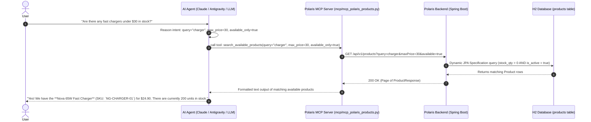

# AI Agent for Available Product Search

This guide provides the complete blueprint and operational manual for configuring and running the **Polaris Product Discovery AI Agent**.

---

## 1. Overview & Architecture

The Product Discovery AI Agent allows organizational users and customers to interactively search, filter, and inspect available products using natural language.



---

## 2. MCP Server Configuration

The MCP server is located at `mcp/mcp_polaris_products.py` (backed by the modular `polaris_mcp` package).

### Claude Desktop / Antigravity / Cursor MCP Configuration
Add the server to your MCP configuration file (e.g. `claude_desktop_config.json`):

```json
{
  "mcpServers": {
    "polaris-products": {
      "command": "python3",
      "args": [
        "/Users/vung.do/projects/hometask1/src/java/03-Polaris/mcp/mcp_polaris_products.py"
      ],
      "env": {
        "POLARIS_API_URL": "https://polaris.local",
        "POLARIS_INSECURE_TLS": "true",
        "OTEL_EXPORTER_OTLP_ENDPOINT": "http://localhost:4318",
        "OTEL_SERVICE_NAME": "polaris-mcp-server"
      }
    }
  }
}
```

---

## 3. Agent Tools Specification

### Tool 1: `search_available_products`
- **Description**: Searches the product catalog for available products matching keywords, categories, or price ranges. Automatically filters for in-stock items by default.
- **Parameters**:
  - `query` (*string*, optional): Search keyword matching product name, SKU, or description.
  - `category` (*string*, optional): Filter by category (`Audio`, `Wearables`, `Accessories`).
  - `min_price` (*number*, optional): Minimum unit price in USD.
  - `max_price` (*number*, optional): Maximum unit price in USD.
  - `available_only` (*boolean*, optional, default `true`): If `true`, only returns products with `stockQuantity > 0` and `isActive = true`.

### Tool 2: `get_product_by_sku`
- **Description**: Retrieves comprehensive details and live inventory status for a specific product by its business SKU code.
- **Parameters**:
  - `sku` (*string*, required): The unique product SKU code (e.g., `NG-EARBUD-01`).

---

## 4. Recommended AI Agent System Prompt

To configure an autonomous agent using these tools, use the following system prompt:

```text
You are the Polaris Product Discovery Assistant. Your mission is to help users find, evaluate, and check the availability of products in our catalog.

### Guidelines:
1. Grounding & Anti-Hallucination:
   - Always query `search_available_products` or `get_product_by_sku` before answering questions about product offerings, pricing, or stock.
   - Never invent product names, SKUs, or prices. Always quote the exact SKU and price returned by the tool.

2. Stock & Availability Awareness:
   - By default, users want items that are currently in stock. Ensure `available_only=true` is used unless the user explicitly asks about discontinued or out-of-stock items.
   - If an item searched by the user is out of stock, state this clearly and proactively offer in-stock alternatives in the same category.

3. Tone & Formatting:
   - Present results in clean, readable markdown (bullet points, bold product titles, clear prices, and stock indicators).
   - If multiple products match, summarize the top matches and ask if they would like to know more about a specific one.
```

---

## 5. Local CLI Testing

Developers can test the integration directly using the CLI flags on [`mcp/mcp_polaris_products.py`](file:///Users/vung.do/projects/hometask1/src/java/03-Polaris/mcp/mcp_polaris_products.py):

```bash
# Test searching for available earbuds
python3 mcp/mcp_polaris_products.py --test-search "earbuds"

# Test searching for accessories in stock
python3 mcp/mcp_polaris_products.py --test-search "charger" --category "Accessories"

# Test lookup by SKU
python3 mcp/mcp_polaris_products.py --test-sku "NG-WATCH-01"
```
