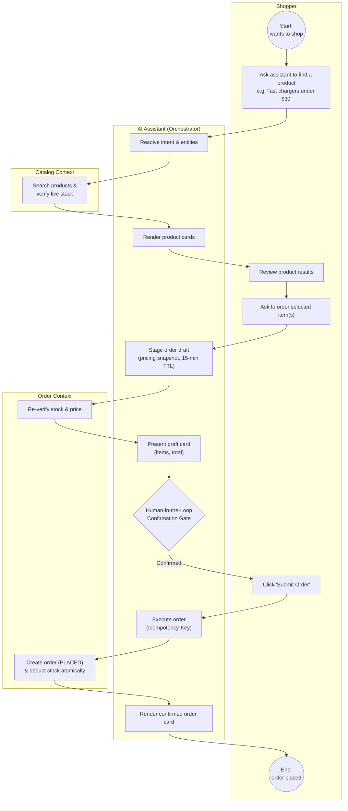
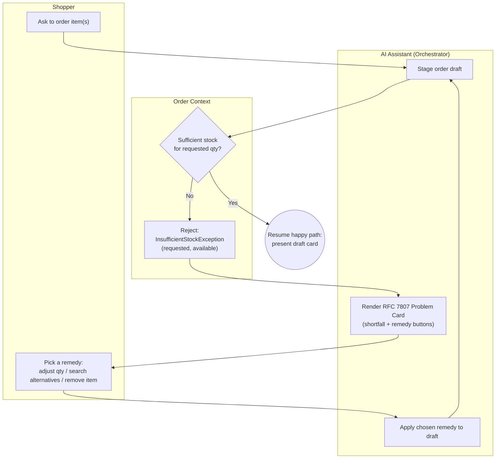
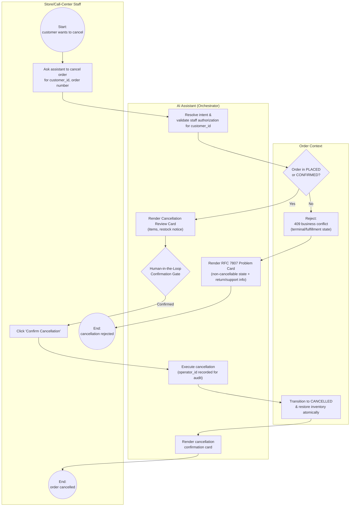

# Front half of Order-to-Cash
A consumer-electronics retailer puts one AI agent in front of two groups of people:
- Shoppers (ROLE_USER) who chat on the web to find products, buy them, check order status and cancel orders.
- Store and call-center staff (ROLE_STAFF) who use the same agent to order and cancel on behalf of a customer, with their operator_id recorded for audit.

See [`prds/`](prds/) for the detailed product requirements (personas, use cases, acceptance criteria) behind each capability referenced below.

## Business Process: Shopper Search & Order Placement (BPMN)

Happy-path flow for a shopper who chats with the AI Assistant to search the catalog and place an order. 

1. **Search:** Shopper asks the assistant to find a product; the assistant resolves intent/entities and queries the Catalog Context for matching products with live stock, then renders product cards.
2. **Order request:** Shopper asks to order one or more of the returned items. The assistant stages an order draft, having the Order Context re-verify stock and price, then presents an itemized draft with a total.
3. **Confirmation gate:** Per [PRD-003](prds/PRD-003-web-chat-ai-assistant.md) FR-3, the assistant never places an order automatically. It waits for the shopper to explicitly confirm (button click or affirmative message).
4. **Placement:** On confirmation, the assistant executes the order with an idempotency key; the Order Context creates the order in `PLACED` status and atomically deducts stock; the assistant renders the confirmed order card back to the shopper.

## Exception Path: Out-of-Stock at Order Staging

Branches off step 2 above (order request), when the requested quantity exceeds available stock. See [PRD-003](prds/PRD-003-web-chat-ai-assistant.md) §3.5 and [PRD-002](prds/PRD-002-comprehensive-order-apis.md) Scenario 2.

1. **Detect shortfall:** While staging the draft, the Order Context checks requested quantity against live stock and rejects with a structured `InsufficientStockException` (requested vs. available units) instead of a generic error.
2. **Remediate:** The assistant renders a Problem Card with one-click remedies: adjust quantity to what's available, search for alternatives, or remove the item.
3. **Retry:** Whichever remedy the shopper picks, the assistant re-applies it to the draft and re-stages it, looping back into the same stock check. Once stock is sufficient, the flow rejoins the happy path at the draft card / confirmation gate.

## Business Process: Staff Cancellation on a Shopper's Behalf (BPMN)

Store/call-center staff (`ROLE_STAFF`) cancel an order for a customer they're assisting. The same Human-in-the-Loop Confirmation Gate applies as for self-service — staff get *broader authorization* (any assigned `customer_id`), not an exemption from confirmation — and every mutation is tagged with the staff member's `operator_id` for audit. See [PRD-003](prds/PRD-003-web-chat-ai-assistant.md) §3.6, §4 FR-6 and [PRD-002](prds/PRD-002-comprehensive-order-apis.md) FR-6.

1. **Request & authorize:** Staff asks the assistant to cancel an order, specifying the `customer_id` they're assisting. The assistant validates the staff member is authorized to act on that customer (never the shopper's own identity check used for `ROLE_USER`), closing the IDOR gap between staff acting on behalf of others and shoppers acting for themselves.
2. **Eligibility check:** The Order Context checks the order's lifecycle state. Orders in `PROCESSING`, `SHIPPED`, `DELIVERING`, `DELIVERED`, or already `CANCELLED` are rejected with an RFC 7807 business conflict; the assistant surfaces this as a Problem Card with return/support guidance and the flow ends there — no gate, no audit entry, because no mutation occurred.
3. **Review & confirmation gate:** For eligible (`PLACED`/`CONFIRMED`) orders, the assistant renders a Cancellation Review Card (items, restock notice) and — exactly as for shopper self-service — waits for the staff member to explicitly click "Confirm Cancellation." Staff privilege widens *whose* order can be cancelled, not *whether* confirmation is required.
4. **Execute & audit:** On confirmation, the assistant executes the cancellation with the staff member's `operator_id` recorded in the order's audit metadata; the Order Context transitions the order to `CANCELLED` and atomically restores inventory; the assistant renders the confirmation back to staff.
