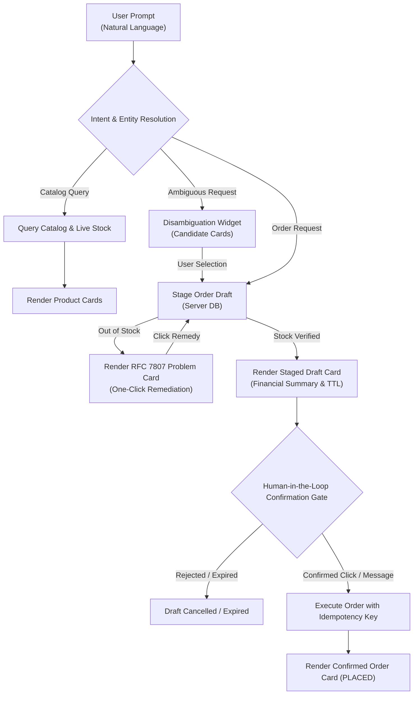

# PRD-006: Internal Staff & Shopper AI Chat Web Assistant

- **Target Context/Theme:** Web Client / Catalog / Order / Gateway (Theme 3: Autonomous AI Agent & Conversational Commerce)
- **Target Persona:** Internal Store Staff / Sales Operator (`ROLE_STAFF`, `ROLE_ADMIN`), Conversational Retail Shopper (`ROLE_USER`)
- **Status:** PRD Approved (Ready for Architecture)
- **Document Owner:** Polaris Product Manager
- **Last Updated:** 2026-09-09

---

## 1. Problem Statement & Value Proposition

Polaris provides comprehensive e-commerce capabilities—such as multi-criteria catalog search, live inventory verification, transactional order placement, and cancellation lifecycles—via secured REST endpoints and native MCP tools. However, end users (store staff, sales representatives, and shoppers) currently have no intuitive graphical surface to interact with Polaris conversationally.

Operating directly with raw Swagger UI or terminal tools requires technical knowledge of JSON payloads, endpoint semantics, and manual parameter assembly.

Delivering the **Web Chat AI Assistant** solves this by providing an intelligent, responsive web interface that:
1. Translates natural language inquiries into real-time catalog discovery and stock checks grounded in live data.
2. Interactively formulates structured **Order Drafts** with pricing snapshots and live stock reservations.
3. Enforces a **Mandatory Human-in-the-Loop Confirmation Gate** before any order placement or cancellation mutation occurs.
4. Renders self-correcting, machine-actionable RFC 7807 problem diagnostics (e.g. out-of-stock remedies) directly in clean visual cards with one-click user actions.
5. Operates seamlessly in standard web browsers using Keycloak OAuth 2.0 / OIDC PKCE authentication without requiring local CLI bridges or client secrets.
6. Enforces strict authorization boundaries distinguishing store staff (ordering on behalf of customers) from retail shoppers (ordering for their own authenticated account), eliminating Insecure Direct Object Reference (IDOR) vulnerabilities.
7. Guarantees cross-device session continuity and audit compliance via server-side session persistence in the enterprise database, while maintaining lightweight client state.

---

## 2. User Personas & Authorization Boundaries

### Persona A: Internal Store Staff / Sales Representative
- **Role Privileges:** Authenticated with staff credentials (`ROLE_STAFF` or `ROLE_ADMIN`).
- **Context:** Sales or customer support operator assisting shoppers in-store or over telephone support.
- **Capabilities & Scope:**
  - Fast catalog search and live multi-warehouse inventory inspection.
  - Prepare multi-item purchase orders on behalf of designated customers (specifying `customer_id`).
  - Inspect any customer's order history and single order details.
  - Process order cancellations on behalf of customers when requested.
- **Audit Requirement:** All staff-initiated draft staging, order placement, and cancellations must record the operator's authenticated identity (`operator_id`) in order metadata for audit traceability.

### Persona B: Conversational Retail Shopper
- **Role Privileges:** Authenticated as a standard retail user (`ROLE_USER`).
- **Context:** Online consumer shopping via desktop or mobile web chat.
- **Capabilities & Scope:**
  - Ask natural language questions for product recommendations and stock availability.
  - Stage multi-item purchases for themselves.
  - Review order drafts and execute idempotent checkout.
  - Track their own order history and cancel eligible orders.
- **Strict Authorization Boundary (Anti-IDOR Guard):**
  - The shopper's customer identity is strictly resolved server-side from JWT claims (`sub` / `preferred_username`).
  - Retail shoppers **CANNOT** supply or override `customer_id`.
  - The assistant must strictly reject any attempt by a shopper to view, stage, or cancel orders belonging to any other customer with an RFC 7807 `403 Forbidden` response.

---

## 3. Conversational User Journeys & UX Mechanics

### 1. Natural Language Catalog Discovery & Stock Grounding
- User enters natural language inquiries: *"Do we have fast chargers under $30 in stock?"*
- Assistant executes backend catalog search with active inventory filters.
- UI renders interactive product cards showing SKU, name, category, unit price, and live available stock count.

### 2. Ambiguous Product Disambiguation
- User makes an underspecified request: *"Order 2 chargers."*
- Assistant identifies multiple matching catalog items (`NG-CHARGER-01`, `OR-CHARGER-02`).
- Rather than hallucinating or picking arbitrarily, the assistant displays an interactive **Product Disambiguation Card** listing matching candidates with thumbnail, specs, price, and stock.
- The user clicks their desired model (or replies *"the 65W fast charger"*), and the assistant binds the confirmed SKU to the conversation context.

### 3. Conversational Multi-Item Staging (Conversational Cart)
- Assistant supports multi-turn, multi-item staging before purchase commitment:
  - Add items: *"Add 1 wireless earbuds and 2 fast chargers for Alice Tran."*
  - Update quantities: *"Change the chargers to 3."*
  - Remove items: *"Remove the earbuds."*
- The assistant recalculates line subtotals, verifies real-time stock for every line item, and renders an updated **Staged Order Draft Card** with the live financial grand total.

### 4. Mandatory Human-in-the-Loop Confirmation Gate
- The assistant strictly intercepts all state-mutating actions (`place_order`, `cancel_order`).
- The UI displays an interactive **Order Review Card** requiring explicit human confirmation.
- The card displays: customer name/ID, itemized lines, unit prices, financial total, shipping address (if applicable), and an active **"Submit Order"** button.
- Automatic or silent order execution is strictly prohibited. The order is placed only when the user clicks **"Submit Order"** or sends an unambiguous affirmative message (*"Yes, submit this order"*).

### 5. Out-of-Stock Remediation via RFC 7807 Problem Cards
- When a requested quantity exceeds available stock (e.g. requested 10 units, 5 available):
- The backend returns an RFC 7807 `InsufficientStockException`.
- The assistant renders a specialized **Problem Card** containing:
  - Clear diagnosis: *"Insufficient stock for NG-WATCH-01. Requested: 10, Available: 5."*
  - One-click remedy actions:
    - `[Adjust to 5 units]` &rarr; Automatically updates the staged draft quantity to 5 and refreshes totals.
    - `[Search Alternatives]` &rarr; Launches catalog search for similar available items.
    - `[Remove Item]` &rarr; Removes the out-of-stock item from the staged draft.

### 6. Two-Step Conversational Order Cancellation with Restock Notice
- User requests order cancellation: *"Cancel order ORD-1001."*
- Assistant inspects the order lifecycle state:
  - If cancellable (`PLACED` or `CONFIRMED`), the assistant renders a **Cancellation Review Card**:
    - Itemized breakdown of products and quantities to be cancelled.
    - Explicit restock notice: *"Inventory for 1x NG-EARBUD-01 will be restored to available stock."*
    - Requires clicking **"Confirm Cancellation"**.
  - If in non-cancellable fulfillment state (`PROCESSING`, `SHIPPED`, `DELIVERED`, `CANCELLED`), the assistant returns an RFC 7807 Problem Card explaining why cancellation is prohibited and detailing return/support procedures.

---

## 4. Business Rules & Functional Requirements

### FR-1: Real-Time Catalog Grounding & Zero Hallucination
- All product details, SKUs, descriptions, pricing snapshots, and stock quantities must be fetched dynamically from live Polaris domain APIs.
- The assistant is forbidden from assuming or hallucinating stock availability, discounts, or specifications.

### FR-2: Conversational Multi-Item Staging & Cart Management
- The assistant must support iterative conversational modification of active drafts (add, modify quantity, delete line items).
- The draft must validate that each item exists, is active, and has sufficient in-stock inventory for the requested quantity.
- Line subtotals and grand totals must be computed using live pricing snapshots.

### FR-3: Mandatory Human-in-the-Loop Confirmation Gate
- Under no circumstances may the assistant execute order creation (`POST /api/v1/orders`) or order cancellation (`POST /api/v1/orders/{orderNumber}/cancel`) without explicit human approval.
- The UI must display an interactive card summarizing exact parameters, financial total, and inventory impact, requiring an explicit button click or affirmative message.

### FR-4: Idempotent Atomic Order Submission
- Every order placement request must generate and include a unique client-side or orchestrator-managed UUIDv4 `Idempotency-Key` header.
- Resubmitting an order draft or retrying upon network drop must return the existing created order without creating duplicate orders or double-deducting inventory.

### FR-5: Conversational Order Lifecycle & Tracking
- Support conversational lookup for customer order history and single-order status tracking.
- Order cards must render visual status badges: `PLACED`, `CONFIRMED`, `SHIPPED`, and `CANCELLED`.

### FR-6: Safe Order Cancellation, Restoral Notice & Terminal State Guards
- Cancellation is permitted only for orders in `PLACED` or `CONFIRMED` status.
- Successful cancellation must restore inventory atomically and notify the user of stock replenishment.
- Attempts to cancel orders in `PROCESSING`, `SHIPPED`, `DELIVERING`, `DELIVERED`, or `CANCELLED` must return an RFC 7807 business conflict (`409 Conflict`) with actionable return instructions.

### FR-7: Machine-Actionable Error Diagnostics (RFC 7807) & Interactive Problem Cards
- All backend error responses adhering to RFC 7807 Problem Details must be parsed and visually rendered as interactive **Problem Cards**.
- Problem Cards must display title, detail, invalid parameter, and clickable remedy buttons corresponding to the error payload's `remedy` and `allowed_values`.

### FR-8: Backend Agency Mode Engine & Zero-Client Credential Management
- The assistant operates via a backend orchestrator supporting modern LLM models in Agency Mode (multi-turn reasoning, planning, and autonomous tool calling).
- Foundation model API keys are stored strictly in server-side configuration; client browsers never receive, store, or transmit third-party LLM credentials.

### FR-9: Enterprise OIDC PKCE Security
- The web application authenticates against Keycloak using standard OAuth 2.0 Authorization Code flow with PKCE (RFC 7636, S256).
- No client secrets may be bundled in the browser.
- All backend API and assistant requests must transmit a valid `Authorization: Bearer <token>` header.

### FR-10: Identity Scoping & Role-Based Customer Assignment (Strict Anti-IDOR Boundary)
- For retail shoppers (`ROLE_USER`), the assistant automatically binds all operations to the authenticated customer ID extracted server-side from JWT token claims (`sub` / `preferred_username`). Shoppers cannot access, stage, or cancel orders for other customer IDs.
- For store staff (`ROLE_STAFF` or `ROLE_ADMIN`), the assistant permits explicit customer assignment (`customer_id`), validating customer existence and recording `operator_id` in audit metadata.

### FR-11: Ambiguous Product Disambiguation
- When a user query matches multiple catalog products, the assistant must present interactive candidate cards with pricing and stock, requiring user selection before staging a draft order.

### FR-12: Server-Side Enterprise Session & Draft Persistence (ADR-0004 Aligned)
- Active conversation sessions, message turns, tool execution history, and staged order drafts must be persisted in durable server-side storage (Enterprise Relational DB via Assistant Bounded Context).
- Browser runtimes store only the active `session_id` (in `sessionStorage`) to reconnect to the server session upon page refresh, tab reopening, or multi-device handover.
- Session state must be fully auditable and compliant with enterprise data governance.

### FR-13: Asynchronous Visual Progress & State Feedback
- The UI must render non-blocking visual progress indicators (e.g., *"Searching catalog..."*, *"Verifying live stock..."*, *"Drafting order..."*) during backend REST or LLM tool invocations.

### FR-14: Draft Lifecycle, TTL, and Pre-Commit Stock/Price Re-Verification
- Staged order drafts have a Time-To-Live (TTL) of 15 minutes from creation.
- When the user confirms an order draft, the orchestrator must perform an atomic pre-commit validation verifying that catalog prices have not changed and inventory stock is still available.
- If stock was depleted by a concurrent transaction or the draft expired, the draft transitions to `INVALIDATED` or `EXPIRED`, and the assistant renders an RFC 7807 Problem Card with refreshed options.

### FR-15: Deterministic Rule Engine Fallback Mode
- If external LLM provider API keys are unconfigured or the external AI service suffers an outage, the backend orchestrator must automatically fall back to a deterministic rule/intent engine.
- Fallback mode supports core commands: catalog search (`search <query>`), stock check (`stock <sku>`), order placement (`order <sku> <qty>`), and cancellation (`cancel <orderNumber>`), ensuring business continuity without configuration dependencies.
- The UI displays a subtle indicator: *"Standard Assistant Mode active"*.

### FR-16: Server-Sent Events (SSE) Wire Streaming Protocol & Decoupled Mutation
- Conversational perception, reasoning steps, token streams, and structured UI widget deliveries must flow over unidirectional Server-Sent Events (`Accept: text/event-stream`).
- The SSE stream must emit typed events: `thought` (reasoning indicators), `token` (incremental text deltas), `widget` (structured card payloads), `draft` (staged draft payload), and `done` (stream termination).
- The stream must support keep-alive ping frames every 15 seconds to prevent network timeout.
- State-mutating actions (draft confirmation, cancellation) must execute via discrete, idempotent HTTP POST requests returning standard HTTP status codes (`201 Created`, `409 Conflict`) rather than in-stream mutations.

---

## 5. Business Acceptance Criteria (Given / When / Then)

### Scenario 1: Natural Language Catalog Search with Real-Time Stock
- **Given** an authenticated user on the Web Chat interface.
- **When** the user types: *"Find fast chargers under $30 in stock"*.
- **Then** the chat displays matching active products as visual product cards with SKU, name, price, category, and real-time available stock count.

### Scenario 2: Conversational Ambiguous Product Disambiguation
- **Given** multiple charger products exist in the catalog (`NG-CHARGER-01` at $24.90, `OR-CHARGER-02` at $29.90).
- **When** the user enters: *"Order 2 chargers"*.
- **Then** the assistant displays a **Product Disambiguation Card** listing both candidate models with specs and stock.
- **And** the assistant prompts: *"We have two chargers available. Which model would you prefer?"*
- **When** the user clicks `NG-CHARGER-01`.
- **Then** the assistant locks the selected SKU and transitions to order staging.

### Scenario 3: Conversational Multi-Item Staging & Incremental Modification
- **Given** customer Alice Tran (ID: 1) and available products `NG-EARBUD-01` ($49.90) and `NG-CHARGER-01` ($24.90).
- **When** store staff types: *"Stage an order for 1 NG-EARBUD-01 and 1 NG-CHARGER-01 for customer 1"*.
- **Then** the assistant stages the draft in the server-side database and displays an itemized draft card totaling $74.80.
- **When** staff types: *"Change chargers to 2 and add 1 NG-WATCH-01 ($199.00)"*.
- **Then** the assistant updates the server-side draft, verifies stock for all items, and renders an updated draft card totaling $298.70.

### Scenario 4: Human-in-the-Loop Order Submission with Idempotency
- **Given** a staged order draft totaling $99.70 with verified inventory.
- **When** the user views the draft card.
- **Then** the assistant disables automatic submission and renders an explicit **"Submit Order"** confirmation button.
- **When** the user clicks **"Submit Order"**.
- **Then** the backend processes the order with a unique UUIDv4 `Idempotency-Key`, deducts inventory atomically, and renders a confirmed **Order Card** showing order number `ORD-XXXXX` in `PLACED` status.
- **When** the user accidentally double-clicks the submit button or resends the confirmation.
- **Then** the idempotency gate returns the original order confirmation without duplicate charges or stock deduction.

### Scenario 5: Out-of-Stock Remediation via RFC 7807 Problem Card & One-Click Remedy
- **Given** product `NG-WATCH-01` has only 5 units in stock.
- **When** the user requests: *"Order 10 units of NG-WATCH-01"*.
- **Then** the backend returns an RFC 7807 `InsufficientStockException` (`status: 422`, `available: 5`, `requested: 10`).
- **And** the assistant displays an interactive **Problem Card** explaining the shortage and rendering a button: `[Adjust Quantity to 5]`.
- **When** the user clicks `[Adjust Quantity to 5]`.
- **Then** the assistant updates the staged draft to 5 units and presents the updated draft card for confirmation.

### Scenario 6: Customer Order History Inspection & Scoping
- **Given** customer Alice Tran (ID: 1) has 3 historical orders.
- **When** Alice (authenticated as retail shopper) types: *"Show my recent orders"*.
- **Then** the assistant queries orders scoped strictly to Alice's authenticated customer ID and displays her 3 order cards with status badges and totals.

### Scenario 7: Two-Step Safe Order Cancellation with Restock Notice
- **Given** order `ORD-1001` in `PLACED` status containing 2 units of `NG-CHARGER-01`.
- **When** the user types: *"Cancel order ORD-1001"*.
- **Then** the assistant displays a **Cancellation Review Card** stating: *"Cancelling ORD-1001 will return 2 units of NG-CHARGER-01 to inventory. Are you sure you want to cancel?"* with an explicit **"Confirm Cancellation"** trigger.
- **When** the user clicks **"Confirm Cancellation"**.
- **Then** the backend transitions `ORD-1001` to `CANCELLED`, restores 2 units to inventory, and displays a cancellation confirmation badge.

### Scenario 8: Terminal Fulfillment State Cancellation Rejection
- **Given** order `ORD-1005` is in `SHIPPED` or `DELIVERED` status.
- **When** the user attempts to cancel `ORD-1005`.
- **Then** the backend rejects the request with an RFC 7807 `409 Conflict` error.
- **And** the assistant renders a Problem Card explaining that shipped orders cannot be cancelled and provides a link to return guidelines.

### Scenario 9: Staged Draft Expiration & Price/Stock Invalidation (Edge Case)
- **Given** an order draft staged 20 minutes ago (exceeding 15-minute TTL).
- **When** the user attempts to confirm the expired draft.
- **Then** the pre-commit validation rejects execution with an RFC 7807 `DraftExpiredException`.
- **And** the assistant refreshes live prices and inventory, informs the user: *"Your draft has expired. We refreshed prices and stock. Please review the updated draft."*, and prompts re-confirmation.

### Scenario 10: Token Expiration & Seamless Session Resumption with PKCE Refresh (Edge Case)
- **Given** an active chat session with a staged draft where the user's Keycloak access token expires.
- **When** the user clicks "Submit Order".
- **Then** the client application transparently performs an OIDC PKCE silent token refresh.
- **And** resumes the pending submission without dropping conversation history or resetting the staged draft.
- **When** the refresh token is also expired.
- **Then** the application preserves `session_id` in `sessionStorage`, redirects to Keycloak login, and upon return automatically reconnects to the active server session and staged draft.

### Scenario 11: Concurrent Stock Depletion Race Condition during Confirmation (Edge Case)
- **Given** product `NG-EARBUD-01` has 1 unit remaining in stock.
- **And** User A stages a draft for 1 unit of `NG-EARBUD-01`.
- **And** User B purchases the last unit before User A confirms.
- **When** User A clicks "Submit Order".
- **Then** the atomic backend reservation detects zero available stock and returns an RFC 7807 `InsufficientStockException`.
- **And** User A's draft is invalidated with an interactive Problem Card explaining the item sold out and offering to search for alternative earbuds.

### Scenario 12: Insecure Direct Object Reference (IDOR) Access Guard (Edge Case)
- **Given** Retail Shopper Bob (`ROLE_USER`, customer ID: 2).
- **When** Bob types: *"Show orders for customer 1"* or *"Cancel order ORD-1001"* (belonging to Alice Tran, customer 1).
- **Then** the assistant enforces server-side identity scoping and rejects the request with an RFC 7807 `403 Forbidden` Problem Card.
- **And** zero details or records belonging to customer 1 are exposed.

### Scenario 13: Deterministic Rule Engine Fallback Mode (Edge Case)
- **Given** the Polaris backend is started with no external LLM API keys configured (`POLARIS_AI_API_KEY` empty).
- **When** a user interacts with the chat assistant.
- **Then** the backend activates the built-in deterministic intent engine.
- **And** successfully processes catalog search, stock lookup, multi-item order staging, and cancellation using structured conversational patterns without throwing 500 errors.

### Scenario 14: Unauthenticated Access Guard & PKCE Login Flow
- **Given** an unauthenticated browser session.
- **When** the user navigates to the Web Chat interface URL.
- **Then** the application immediately redirects the browser to Keycloak Authorization endpoint with PKCE parameters (`code_challenge`, `code_challenge_method=S256`).
- **And** only initializes the chat interface after exchanging the authorization code for a valid JWT Bearer token.

### Scenario 15: Real-Time Token and UI Widget Streaming via Server-Sent Events (SSE)
- **Given** an active chat session and an authenticated user.
- **When** the user enters: *"Find chargers under $30 in stock"*.
- **Then** the assistant initiates an SSE stream (`Accept: text/event-stream`).
- **And** emits progressive `thought` events indicating query execution.
- **And** emits incremental `token` events assembling the conversational text.
- **And** emits a structured `widget` event containing matching product items.
- **And** concludes with a `done` event, while keeping the connection clean and non-blocking.

---

## 6. Out of Scope

1. **Direct Credit Card / Stripe Integration:** Payments default to internal store authorization.
2. **Direct Backend Database Manipulation:** All queries and mutations must pass through Polaris REST controllers and Assistant Bounded Context services.
3. **Third-Party Carrier Shipping Tracking:** Tracking remains within internal Polaris state machine progression (`PLACED` &rarr; `CONFIRMED` &rarr; `SHIPPED`).
4. **Autonomous Non-Interactive Purchase Execution:** Fully autonomous purchasing without human confirmation is strictly out of scope for safety and regulatory compliance.
