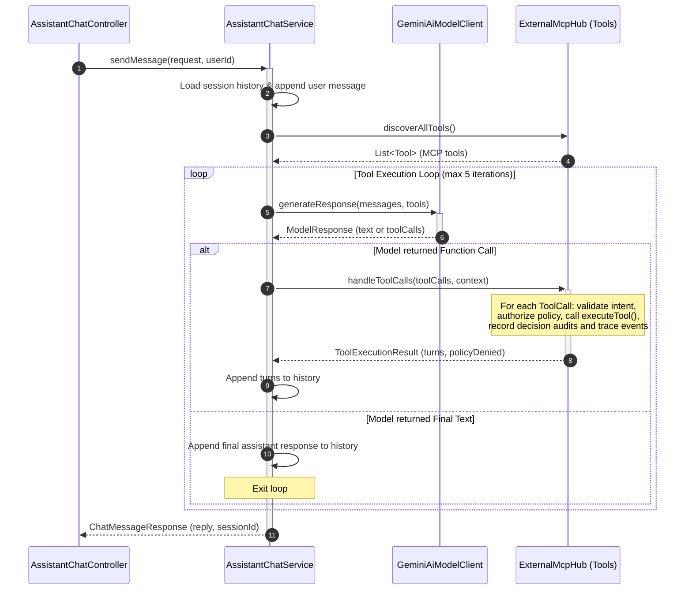

# Assistant Orchestrator

## 1. Sequence Diagram
The diagram below demonstrates the complete sequence flow of a conversation turn with Gemini and MCP tools:

```mermaid
sequenceDiagram
    autonumber
    participant Controller as AssistantChatController
    participant Service as AssistantChatService
    participant ModelHandler as GeminiAiModelClient
    participant McpHub as ExternalMcpHub (Tools)

    Controller->>+Service: sendMessage(request, userId)
    Service->>Service: Load session history & append user message
    Service->>McpHub: discoverAllTools()
    McpHub-->>Service: List<Tool> (MCP tools)

    loop Tool Execution Loop (max 5 iterations)
        Service->>+ModelHandler: generateResponse(messages, tools)
        ModelHandler-->>-Service: ModelResponse (text or toolCalls)

        alt Model returned Function Call
            Service->>+McpHub: handleToolCalls(toolCalls, context)
            Note over McpHub: For each ToolCall: validate intent,<br/>authorize policy, call executeTool(),<br/>record decision audits and trace events
            McpHub-->>-Service: ToolExecutionResult (turns, policyDenied)
            Service->>Service: Append turns to history
        else Model returned Final Text
            Service->>Service: Append final assistant response to history
            Note over Service: Exit loop
        end
    end

    Service-->>-Controller: ChatMessageResponse (reply, sessionId)
```