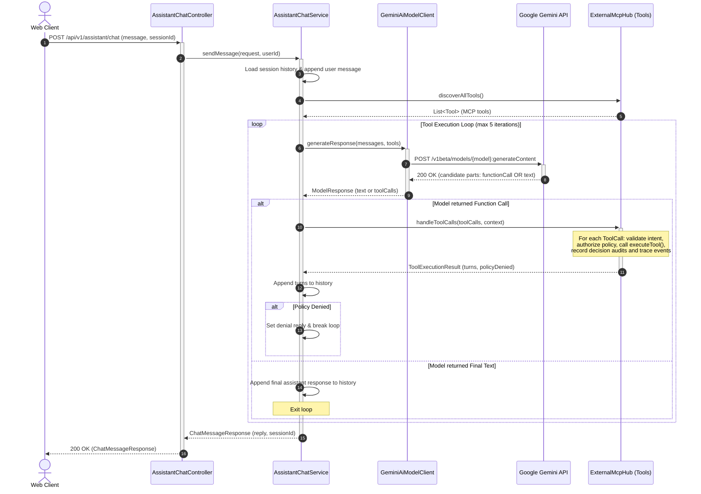

# Simple AI Assistant with Gemini

## 1. Overview & Educational Purpose
This document specifies an **intuitive, minimal-complexity design** for an AI Assistant that executes a conversational tool-calling loop (ReAct pattern) using Google Gemini and Model Context Protocol (MCP) tools.

The goal of this initiative is to demonstrate the simplest possible end-to-end sequence flow for learning purposes, showing how:
1. A client submits a natural language message over REST.
2. The assistant retrieves conversational session history.
3. The assistant presents both the conversation and available MCP tools to Google Gemini.
4. Gemini autonomously decides whether to answer directly or request tool execution (e.g. querying products or inventory).
5. The assistant dispatches tool calls to the MCP provider, feeds the results back to the model, and repeats the loop.
6. Once the model produces a final textual answer, the assistant saves the state and replies to the web client.

---

## 2. Sequence Diagram
The diagram below demonstrates the complete sequence flow of a conversation turn with Gemini and MCP tools:



---

## 3. Core Component Responsibilities

| Component | Class | Responsibility |
| :--- | :--- | :--- |
| **Web REST API** | [`AssistantChatController`](file:///Users/vung.do/projects/hometask1/src/java/03-Polaris/apps/polaris-assistant/src/main/java/vn/danang/polaris/assistant/web/AssistantChatController.java) | Ingress controller exposing `POST /api/v1/assistant/chat`, extracting authentication principal and validating request bodies. |
| **Assistant Orchestrator** | [`AssistantChatService`](file:///Users/vung.do/projects/hometask1/src/java/03-Polaris/apps/polaris-assistant/src/main/java/vn/danang/polaris/assistant/service/AssistantChatService.java) | Coordinates the conversation turn: maintains session history, resolves intent, discovers tools from `ToolManager`, drives the high-level `while` execution loop, and delegates tool execution to `ToolManager`. |
| **Model Handler** | [`GeminiAiModelClient`](file:///Users/vung.do/projects/hometask1/src/java/03-Polaris/apps/polaris-assistant/src/main/java/vn/danang/polaris/assistant/model/GeminiAiModelClient.java) | Implements `AssistantModelClient`. Translates domain messages and MCP tools into Gemini REST format (`contents`, `tools`), calls Gemini API, and parses candidate parts into `ModelResponse`. |
| **Tools Gateway & Hub** | [`PolicyToolManager`](file:///Users/vung.do/projects/hometask1/src/java/03-Polaris/apps/polaris-assistant/src/main/java/vn/danang/polaris/assistant/mcp/ExternalMcpHub.java) | Implements [`ToolManager`](file:///Users/vung.do/projects/hometask1/src/java/03-Polaris/apps/polaris-assistant/src/main/java/vn/danang/polaris/assistant/mcp/McpHub.java). Aggregates tools from Polaris Core and external MCP providers, and encapsulates the entire tool call execution loop (`handleToolCalls`): intent validation, policy authorization, MCP dispatching, decision auditing, and turns construction. |

---

## 4. Gemini Tool Calling Protocol & Payloads

### 4.1. Request with Tool Declarations
When invoking Gemini with available MCP tools, tools are formatted as `functionDeclarations` mapped directly from MCP `Tool.inputSchema()`:

```json
{
  "contents": [
    {
      "role": "user",
      "parts": [{ "text": "What is the price of SKU NG-CHARGER-01?" }]
    }
  ],
  "tools": [
    {
      "functionDeclarations": [
        {
          "name": "get_product_by_sku",
          "description": "Retrieve detailed product specifications and live inventory by SKU code",
          "parameters": {
            "type": "object",
            "properties": {
              "sku": {
                "type": "string",
                "description": "Unique product SKU code"
              }
            },
            "required": ["sku"]
          }
        }
      ]
    }
  ]
}
```

### 4.2. Gemini Response Proposing a Tool Call
When the model determines it needs external data to fulfill the query, it returns candidate content with a `functionCall` part instead of final text:

```json
{
  "candidates": [
    {
      "content": {
        "role": "model",
        "parts": [
          {
            "functionCall": {
              "name": "get_product_by_sku",
              "args": {
                "sku": "NG-CHARGER-01"
              }
            }
          }
        ]
      },
      "finishReason": "STOP"
    }
  ]
}
```

### 4.3. Assistant Feedback with Tool Response
After executing `get_product_by_sku` via `PolicyToolManager`, the Assistant appends the function result as a `user` turn with a `functionResponse` part:

```json
{
  "role": "user",
  "parts": [
    {
      "functionResponse": {
        "name": "get_product_by_sku",
        "response": {
          "result": "{\"sku\":\"NG-CHARGER-01\",\"name\":\"NextGen 65W Fast Charger\",\"price\":24.90,\"stockQuantity\":45}"
        }
      }
    }
  ]
}
```

### 4.4. Final Gemini Text Response
With the tool result in the conversation context, Gemini processes the data and returns the final human-readable answer:

```json
{
  "candidates": [
    {
      "content": {
        "role": "model",
        "parts": [
          {
            "text": "The NextGen 65W Fast Charger (SKU: NG-CHARGER-01) is currently in stock with 45 units available at $24.90."
          }
        ]
      },
      "finishReason": "STOP"
    }
  ]
}
```

---

## 5. Loop Safety & Error Handling
1. **Loop Termination Guard:** The assistant loop enforces a strict maximum iteration count (default: 5 iterations). If a model triggers continuous tool calls exceeding this limit, the loop safely breaks and returns a graceful message.
2. **Missing API Key Fallback:** When `GEMINI_API_KEY` is omitted or unconfigured during local development, `GeminiAiModelClient` returns an echo/fallback response without throwing connection errors, ensuring seamless zero-config local testing.
3. **MCP Fault Isolation:** If an MCP tool execution returns an error or is unreachable, the error message is fed back to the model in `functionResponse` so Gemini can explain the error politely to the user rather than crashing the chat turn.

---

## 6. Implementation Tasks
- [x] Author clear, intuitive architectural design document (`docs/design/simple-loop.md`).
- [x] Define `ModelResponse` and `ToolCall` domain records in `vn.danang.polaris.assistant.model`.
- [x] Extend `AssistantModelClient` with `generateResponse(messages, tools)` providing default backwards compatibility.
- [x] Implement Gemini function declaration mapping, request construction, and functionCall parsing in `GeminiAiModelClient`.
- [x] Implement session history loading, tool discovery, and execution `while` loop in `AssistantChatService`.
- [x] Validate end-to-end via comprehensive unit and integration test suites (`mvn test -pl apps/polaris-assistant`).