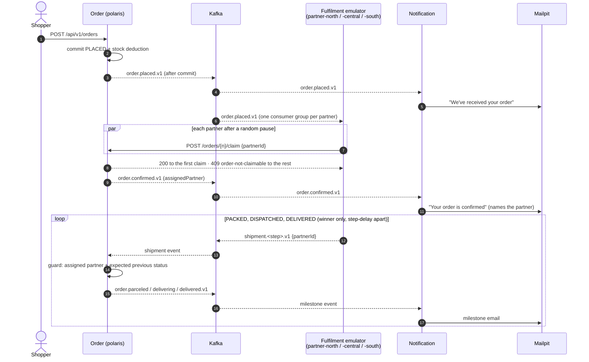
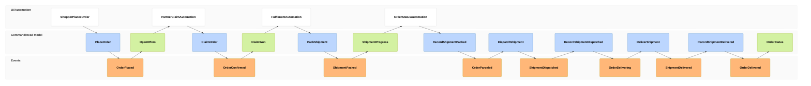
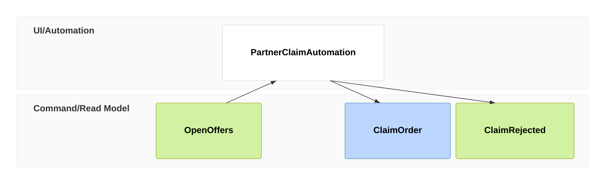
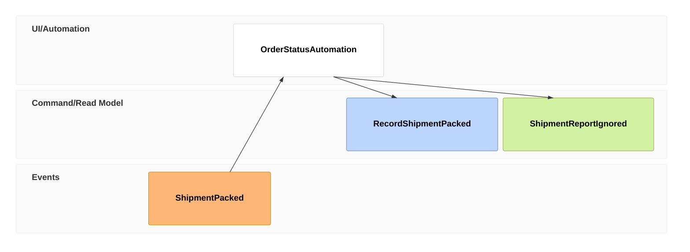

# Plan: Implement Order Notifications & Multi-Partner Fulfilment Emulator

- **Requirement:** [PRD-007](../../business/prds/PRD-007-order-notifications-and-fulfilment-emulator.md): *"Follow my order"*, from placement to delivery, with one shopper email per milestone and orders claimed first-wins by one of several fulfilment partners
- **Design baseline:** [EM-002](../../technical/event-models/EM-002-order-lifecycle-notifications-and-fulfilment.md) (topics, CloudEvents contracts, app layout). **§2 lists where EM-002 no longer matches PRD-007.**
- **Runs alongside:** [`shopper-search-and-order-placement-gaps.md`](shopper-search-and-order-placement-gaps.md), which another session is implementing. See §7 for shared files and ordering.
- **Code verified against:** `main` @ `faf4410` (2026-09-28)
- **Status:** Draft for review

---

## 1. Requirement → Implementation Traceability

| PRD-007 | What it needs | Today | Slice |
|:--|:--|:--:|:--|
| FR-1 Offer to all partners | `order.placed.v1` published after commit; every partner receives it | ❌ No Kafka, no events | F0, F1, F4 |
| FR-2 First partner to accept wins | Atomic claim `PLACED → CONFIRMED` + assigned partner; later claims → business conflict | ❌ Nothing sets `CONFIRMED`; `orders` has no partner column | F2 |
| FR-3 Milestones announced once, after save | 5 `order.*.v1` events carrying customer, items, total, partner | ❌ | F1, F2, F3 |
| FR-4 Multi-partner emulator | New `apps/polaris-fulfilment`: N partners, random claim pause, pack → dispatch → deliver | ❌ | F4 |
| FR-5 Status follows the assigned partner | Guarded transitions; wrong-partner, duplicate and late reports are no-ops | ❌ No transition beyond `PLACED`/`CANCELLED` | F3 |
| FR-6 Email per milestone via Mailpit | New `apps/polaris-notification` with a `NotificationChannel` port and `EmailChannel` | ❌ No mail, no Mailpit | F0, F5 |
| FR-7 One journey, one trace | Kafka observation + trace-preserving delays + traced claim calls | ⚠️ HTTP/MCP tracing exists (ADR-0011/0012); Kafka doesn't | F1–F5, F6 |
| Scenarios 1–8 | Automated tests | — | Per slice + F6 |

What exists and is reused: statuses `PLACED…DELIVERED` (`OrderStatus.java:5`, DB `CHECK` in V1), `Customer.email`, `OrderService.placeOrder` with row locks, OTLP export via `otel-collector` → Tempo/Loki/Prometheus/Grafana (`docker-compose.override.yml`), Keycloak JWT → `PERM_*` mapping (`SecurityConfig.java`).

---

## 2. Design Deltas: EM-002 vs PRD-007 and the Code

EM-002 was written when **staff** confirmed orders. PRD-007 now has **partners** claim them. These are the changes this plan makes on top of EM-002. F6 updates EM-002 to match.

| # | EM-002 says | Needed instead | Why |
|:--|:--|:--|:--|
| Δ1 | Staff confirm via `POST /orders/{n}/confirm` (`ROLE_STAFF`), frames 05–07 | Partner **claim** via `POST /api/v1/orders/{n}/claim`; staff no longer confirm | PRD-007 FR-2, Q1 |
| Δ2 | Fulfilment consumes `order.confirmed.v1` only | Fulfilment consumes **`order.placed.v1`** (the offer). The winner learns it won from the claim response | FR-1, FR-4 |
| Δ3 | "No migration needed" (§1) | `orders.assigned_partner` + `claimed_at` columns (V15) | FR-2 "recorded on the order", Q4 |
| Δ4 | `ShipmentEvent` has no partner | Add `partnerId`. Order ignores reports from anyone but the assigned partner | FR-5, Scenario 5 |
| Δ5 | `OrderLifecycleEvent` has no partner | Add `assignedPartner` (null on `placed`) | FR-3, FR-6 "confirmed email names the partner" |
| Δ6 | Contract records go in `libs/polaris-common` | New dependency-free **`libs/polaris-events`** | `polaris-common` pulls in JPA, Flyway, Postgres, Security and Web MVC. The two new stateless apps would fail to start without a datasource |
| Δ7 | Invalid transition → `409` via the existing handler | Dedicated `OrderNotClaimableException` → `409 order-not-claimable` | The shared `IllegalStateException` handler (`GlobalExceptionHandler.java:236`) hard-codes *cancellation* remedies ("Return Guidelines") |
| Δ8 | — | Emulator needs a Keycloak service account to call the claim endpoint | `/api/**` requires a JWT (`SecurityConfig.java:53`); no confidential client exists in `realm-export.json` |
| Δ9 | — | `cancelOrder` must lock the order row | Today it reads without a lock. A claim and a cancel racing on a `PLACED` order both commit → lost update (`CANCELLED` order with a partner, or a `CONFIRMED` order with restored stock) |
| Δ10 | — | Both existing Dockerfiles must `COPY` the new module POMs | The root reactor lists all modules; `mvn -pl apps/polaris -am` fails if a listed module directory is missing |

---

## 3. Target Flow



### 3.1 Event Model: Happy Path (target)

Notation follows [`event-models/README.md`](../../technical/event-models/README.md#notation) and the EM-002 conventions: an `evt` is published to Kafka after its owner commits, and an automated application is a `ui` frame named `…Automation`.



| Frames | What it is | Owner | Slice |
|:--|:--|:--|:--|
| 01–03 | Existing `PlaceOrder`; **new:** `order.placed.v1` after commit. An idempotent replay publishes nothing | Order | F1 |
| 04–05 | Each partner's own consumer group reads the offer and waits a random `claim-delay` | Fulfilment | F4 |
| 06–07 | `ClaimOrder` under a row lock: `PLACED` → `CONFIRMED`, `assigned_partner = partnerId`, then `order.confirmed.v1` | Order | F2 |
| 08 | The winner's `200` response. That's how it knows to continue | Fulfilment | F4 |
| 09–23 | Winner schedules three steps `step-delay` apart. Order maps each report to a milestone, guarded by assigned partner and previous status | Fulfilment → Order | F3, F4 |
| 24 | Existing `GET /api/v1/orders/{n}` and MCP `get_order_details`, now also showing `assignedPartner` | Order | F2 |

Notification (EM-002 §3.2) is unchanged: every `order.*.v1` → one email per enabled channel (F5).

### 3.2 Event Model: Rejected Commands (target)

**A. Losing claim** (Scenarios 2, 4):



The order is no longer `PLACED` (already claimed, or cancelled) → `409 https://polaris.local/errors/order-not-claimable`, with property `status`. No state change, no event, no email. The partner logs and drops the offer.

**B. Ignored shipment report** (Scenarios 5, 6):



Report from a partner other than `assigned_partner`, or the order isn't in the expected previous status (duplicate, late, or `CANCELLED`). Logged at `INFO` with `reason=wrong_partner|stale`, counted in a metric. No event.

---

## 4. Contracts

### 4.1 REST: claim (Order Context, OpenAPI)

`POST /api/v1/orders/{orderNumber}/claim`, `@PreAuthorize("hasAuthority('PERM_order.fulfil')")`

```json
{ "partnerId": "partner-central" }
```

| Outcome | Response |
|:--|:--|
| Order `PLACED` → claimed | `200 OrderResponse` (now with `assignedPartner`) |
| Already claimed (any partner, **including the winner again**, FR-2) or not `PLACED` | `409 application/problem+json`, type `…/errors/order-not-claimable`, `status` = current status. The winner's identity is **not** disclosed to other partners |
| Unknown order | `404` (existing `ResourceNotFoundException`) |
| `partnerId` blank / > 64 chars | `400` (bean validation) |

`POST` rather than `PATCH`: this is a conditional state-transition command, not a partial update of the resource (RFC 9110 §9.3.3).

### 4.2 Events (CloudEvents 1.0, Kafka binary mode)

As EM-002 §4, with these additive fields (still `.v1`, since the types haven't shipped yet):

- `OrderLifecycleEvent.assignedPartner`: `string | null`
- `ShipmentEvent.partnerId`: `string`, required

Records live in **`libs/polaris-events`** (`vn.danang.polaris.events.order`, `…events.fulfilment`, `CloudEventHeaders`, `EventTypes`). Its only dependency is `jackson-annotations`. No Spring, no behaviour.

### 4.3 Security

- New `polaris-api` client role `order.fulfil` → `PolarisPermissions.ORDER_FULFIL`.
- New confidential Keycloak client `polaris-fulfilment` (service account on, `client_credentials` only), granted `order.fulfil` + `order.read`. The secret comes from env `POLARIS_FULFILMENT_CLIENT_SECRET`. The realm export holds a dev-only value, as it does for `polaris-api`.
- One client for all emulated partners. `partnerId` is a body field (PRD-007 §6.4: no per-partner credentials).
- Kafka is PLAINTEXT in dev; `ShipmentEvent.partnerId` is trusted. That's acceptable only because partners are an internal emulator (§8).

---

## 5. Implementation Slices

Each slice is one vertical change in one bounded context (AGENTS.md Principle 2) and can be tested against real Kafka on its own.

```
F0 (platform + contract) ──┬──► F1 (Order: publish) ──► F2 (Order: claim) ──► F3 (Order: progress) ──┐
                           ├──► F4 (Fulfilment app; WireMock for claim) ─────────────────────────────┼──► F6 (e2e + docs)
                           └──► F5 (Notification app) ───────────────────────────────────────────────┘
```

F0, F4 and F5 don't touch `apps/polaris` and can start now, in parallel with the other session. F1–F3 edit `OrderService` and should follow the rules in §7.

### F0: Platform & event contract *(Platform)*
**Files:** `docker-compose.yml`, root `pom.xml`, new `libs/polaris-events/**`, `apps/polaris/Dockerfile`, `apps/polaris-assistant/Dockerfile`, `Makefile`
1. Compose: `kafka` (`apache/kafka:<pinned>`, single-node KRaft, `kafka:9092` on `polaris-net`, `KAFKA_AUTO_CREATE_TOPICS_ENABLE=false`, healthcheck) and `mailpit` (`axllent/mailpit:<pinned>`, SMTP 1025 internal, UI `8025:8025`).
2. `libs/polaris-events` module: `OrderLifecycleEvent`, `ShipmentEvent`, `CustomerRef`, `LineItem`, `ShipmentStep`, `EventTypes` (the 8 `ce_type` strings), `Topics`, `CloudEventHeaders`. Money is `String`.
3. Add `<module>` entries (events lib now; the two apps in F4/F5). Update both existing Dockerfiles to `COPY` every module POM (Δ10).
4. Makefile: `run-fulfilment`, `run-notification`, `mailpit` (opens `http://localhost:8025`).

**Tests:** JSON round-trip per record (money stays a string, unknown fields ignored, null `assignedPartner` allowed). `docker compose up kafka mailpit` is healthy.

### F1: Publish order lifecycle events *(Order; FR-1, FR-3 for `placed`)*
**Files:** `apps/polaris/pom.xml` (+`spring-kafka`, `testcontainers-kafka`), new `order/messaging/{OrderStatusChanged, OrderEventPublisher, OrderEventMapper, KafkaTopicsConfig}.java`, `order/service/OrderService.java`, `application.yml`, compose `polaris` env
1. `OrderService.placeOrder` publishes a Spring `OrderStatusChanged` **inside** the transaction, only for a newly created order (never on the idempotent-replay return path). The event carries a fully built `OrderLifecycleEvent` snapshot, so nothing lazy-loads after commit.
2. `OrderEventPublisher`: `@TransactionalEventListener(phase = AFTER_COMMIT)` → `KafkaTemplate.send(ProducerRecord)`, with key = `orderNumber` and `ce_*` headers set explicitly. A send failure is logged at `ERROR` with `orderNumber`/`ce_id` and counted, and never propagates to the HTTP caller (EM-002 §6).
3. `NewTopic polaris.order.lifecycle` (3 partitions). `spring.kafka.template.observation-enabled=true`. JSON serializer with no type headers.
4. Env: `SPRING_KAFKA_BOOTSTRAP_SERVERS=kafka:9092`, and `depends_on: kafka`.

**Tests (`@SpringBootTest` + Testcontainers Kafka + Postgres):** placed order → one record with the correct key, headers and payload. Rollback (insufficient stock) → no record. Idempotent replay → no second record. `traceparent` header present.

### F2: First-wins claim *(Order; FR-2, Scenarios 2, 4; Δ1, Δ3, Δ7, Δ8, Δ9)*
**Files:** new `V15__add_order_assigned_partner.sql` (number: see §7), `order/entity/Order.java`, `order/repository/OrderRepository.java` (`findByOrderNumberForUpdate`, `PESSIMISTIC_WRITE`), `order/service/OrderService.java`, `order/dto/{ClaimOrderRequest, OrderResponse}.java`, `order/web/controller/OrderController.java`, `web/exception/OrderNotClaimableException.java` + handler, `config/PolarisPermissions.java`, `docker/keycloak/realm-export.json`, `mcp/OrderMcpTools.java` (show partner in `get_order_details`)
1. Migration: `orders.assigned_partner VARCHAR(64) NULL`, `orders.claimed_at TIMESTAMPTZ NULL`, and `CHECK (status IN ('PLACED','CANCELLED') OR assigned_partner IS NOT NULL)` so no fulfilled order can exist without a partner. Existing rows are `PLACED`/`CANCELLED` only, so the check holds (verify on the seeded DB before merging).
2. `OrderService.claimOrder(orderNumber, partnerId)`: lock the row → if `status != PLACED` throw `OrderNotClaimableException(status)` → set `CONFIRMED`, `assignedPartner`, `claimedAt`, `updatedAt` → publish `OrderStatusChanged` (F1 path).
3. `cancelOrder` switches to the same locking read (Δ9). Its behaviour is otherwise unchanged.
4. Endpoint per §4.1. `OrderResponse.assignedPartner` is additive.
5. Keycloak: `order.fulfil` client role and the `polaris-fulfilment` service client (§4.3).
6. Span attributes on the claim: `polaris.partner.id`, `polaris.claim.outcome=won|rejected`. Counter `polaris.order.claims{outcome}`.

**Tests:** service unit tests (PLACED → won; CONFIRMED / CANCELLED / repeat by winner → rejected). `OrderClaimConcurrencyTest`: 3–10 parallel claims → exactly one `200`, the rest `409`, one `order.confirmed.v1` record. Claim vs cancel race → one of them wins cleanly and the other gets `409`. Security test: token without `PERM_order.fulfil` → `403`. Problem body has no winner identity.

### F3: Shipment progress drives the order *(Order; FR-3, FR-5, Scenarios 3, 5, 6)*
**Files:** `order/entity/OrderStatus.java` (`Optional<OrderStatus> after(ShipmentStep)`), `order/service/OrderService.java` (`recordShipmentProgress`), new `order/messaging/{FulfilmentEventListener, KafkaConsumerConfig}.java`, `application.yml`
1. `@KafkaListener(topics = "polaris.fulfilment.shipments", groupId = "polaris-order")`. Dispatch on `ce_type`; ignore unknown types (forward-compatible).
2. `recordShipmentProgress(orderNumber, partnerId, step)` under the row lock: if `partnerId` isn't the assigned partner → ignore (`wrong_partner`). If `status.after(step)` is empty → ignore (`stale`). Otherwise transition and publish the milestone. Unknown order → log and skip (never retry forever).
3. `spring.kafka.listener.observation-enabled=true`. Default `DefaultErrorHandler` (EM-002 §5.4). Counter `polaris.order.shipment_reports{outcome=applied|wrong_partner|stale}`.

**Tests:** `OrderStatus.after` full matrix. Testcontainers: hand-produced `PACKED → DISPATCHED → DELIVERED` → order `DELIVERED` with 3 milestone records in order. Wrong partner → no change. Duplicate `PACKED` while `DELIVERING` → no change and no record. Report for a `CANCELLED` order → no change.

### F4: `apps/polaris-fulfilment` emulator *(Fulfilment; FR-1, FR-2 partner side, FR-4, Scenarios 2, 7)*
**Files:** new module: `config/{FulfilmentProperties, KafkaConfig, ClaimClientConfig}`, `messaging/{OfferListenerRegistrar, ShipmentEventPublisher}`, `client/OrderClaimClient`, `domain/{Partner, ClaimDelayStrategy, FulfilmentSimulator}`, `logback-spring.xml`, `Dockerfile`, compose service
1. `polaris.fulfilment.partners=partner-north,partner-central,partner-south`, `claim-delay-min=PT0.2S`, `claim-delay-max=PT2S`, `step-delay=PT5S`, `order-api-url`.
2. `OfferListenerRegistrar` creates **one listener container per partner**, each with its own consumer group `polaris-fulfilment.<partnerId>`. Every partner independently receives every offer, exactly as separate partner deployments would. Records other than `order.placed.v1` are skipped.
3. On an offer: schedule a claim after `ClaimDelayStrategy.next()` (random in [min, max]; injectable for tests) on a `ThreadPoolTaskScheduler` decorated with `ContextPropagatingTaskDecorator`, so the trace survives the pause.
4. `OrderClaimClient`: `RestClient` + `OAuth2ClientHttpRequestInterceptor` (`client_credentials`, registration `polaris-fulfilment`). `200` → hand to `FulfilmentSimulator`; `409` → log `claim lost` and drop. Other errors → log, no retry (happy-path scope).
5. `FulfilmentSimulator` (winner only): `PACKED` at +d, `DISPATCHED` at +2d, `DELIVERED` at +3d → `ShipmentEventPublisher` (key `orderNumber`, `partnerId` set, `NewTopic polaris.fulfilment.shipments`).
6. No DB and no REST API besides `/actuator`. Depends on `polaris-events`, **not** `polaris-common` (Δ6), so it provides its own minimal logback/OTLP config.

**Tests:** Testcontainers Kafka + **WireMock** for the claim endpoint (WireMock is already version-managed in the root POM). One offer → 3 claim calls with 3 distinct `partnerId`s. The WireMock winner → 3 shipment records in order with that `partnerId`. `409` → no shipment records. Scenario 7 with a seeded delay strategy → more than one distinct winner over 10 offers.

### F5: `apps/polaris-notification` *(Notification; FR-6, Scenarios 1–3 emails)*
**Files:** new module: `messaging/OrderEventListener`, `domain/{Notification, NotificationService, NotificationChannel, ChannelType, MilestoneTemplates}`, `channel/email/EmailChannel`, `config/NotificationProperties`, `templates/order-{placed,confirmed,parceled,delivering,delivered}.txt`, `Dockerfile`, compose service
1. Consumer group `polaris-notification` on `polaris.order.lifecycle`; all 5 `order.*.v1` types. The event is the only input; no call back into Order.
2. `placed` template lists items and total. `confirmed` names `assignedPartner`. The others state order number and milestone.
3. `polaris.notification.channels=email` (default), `from=no-reply@polaris.local`. Channels are selected by `ChannelType`, so SMS/push later is one new bean.
4. Counter `polaris.notifications.sent{channel,milestone,outcome}`. Log line per send with `orderNumber`, `ce_id`, `trace_id`.

**Tests:** unit tests for templates. Testcontainers Kafka + **Mailpit** (`GenericContainer`): 5 events → 5 messages to `alice.tran@example.com`, asserted via Mailpit `GET /api/v1/messages`, with the partner name in the confirmed email.

### F6: End-to-end & documentation
1. `tests/e2e/order-journey.sh` (or a k6 script beside `tests/perf`): place an order as staff → poll Mailpit for 5 messages → assert `DELIVERED` and `assignedPartner` set. A second mode places 10 orders and asserts >1 distinct partner (Scenario 7). Add a `make test-e2e-fulfilment` target.
2. Scenario 8: a manual check recipe in `tests/e2e/README.md` (a Tempo query for the order's trace showing spans from `polaris`, `polaris-fulfilment` ×3 claims, and `polaris-notification`).
3. Docs: update **EM-002** for Δ1–Δ9 (partner claim frames, `order.placed` offer, partner fields, migration) and add an "As Built" section. Add **ADR-0018** *Event-driven integration with Kafka & CloudEvents* (topics per owner, binary mode, after-commit publish without outbox, per-partner consumer groups). Note in PRD-002 that `CONFIRMED` now means "claimed by a partner". Optional: `order-fulfilment.bpmn` in `docs/business/bpmn`.

---

## 6. Decisions Needed

| ID | Question | Recommendation |
|:--|:--|:--|
| **D1** | How does a partner claim: REST or a Kafka command topic? | **REST** `POST …/claim`. First-wins needs a synchronous yes/no per partner (FR-2 "losers are told"). A Kafka command would need a correlated reply topic for the same answer. Offers and milestones stay on Kafka. |
| **D2** | How do shipment reports reach Order: Kafka (EM-002) or REST? | **Kafka**, as EM-002. It keeps Fulfilment decoupled from Order's uptime and is the part of the demo that shows event-carried progress. The trade-off is that `partnerId` on Kafka is unauthenticated (§4.3). |
| **D3** | One consumer group per partner, or one group fanning out in-process? | **Per partner.** It's the correct Kafka model for "every partner sees every offer" and would work unchanged if partners became separate deployments. The cost is a small programmatic registrar instead of one `@KafkaListener`. |
| **D4** | A repeated claim by the winner: `409` (PRD FR-2 literally) or `200` (idempotent)? | **`409` as the PRD says.** The emulator doesn't retry claims, so there's no lost-response problem in the demo. Revisit if real partners integrate. |
| **D5** | Should a late cancellation stop the emulator? | No (PRD-007 §6.5). Order's guard already ignores reports for `CANCELLED`. |
| **D6** | Transactional outbox now? | No. Accept EM-002 §6 losses for the demo. The publisher is isolated behind `OrderEventPublisher`, so an outbox replaces one class later. |

---

## 7. Coordination with the Shopper-Search Gaps Plan

The other session edits the same Order Context. To avoid conflicts:

| Shared item | Gaps plan | This plan | Rule |
|:--|:--|:--|:--|
| Flyway versions | V12 (S2), V13 (S4), V14 (S5) | **V15** | Reserve V15. If V15 merges first, don't apply it to a shared dev DB until V12–V14 exist, since Flyway rejects lower pending versions (`outOfOrder=false`). Otherwise `make clean` resets it. Re-check numbers at merge |
| `OrderService.placeOrder` | S2 customer binding, S4 price guard, idempotency race catch, sequence order numbers | F1 publishes on new orders only | Land F1 **after** S4, so "new order vs replay" includes S4's `DataIntegrityViolationException` re-read path. That path must not publish |
| `OrderService.cancelOrder` | S4 cache eviction after commit | F2 row lock | Both are small; merge by hand |
| `OrderController`, `OrderResponse`, `OrderMcpTools` | S2, S3, S4 add endpoints/fields | F2 adds `/claim`, `assignedPartner` | Additive; rebase |
| `GlobalExceptionHandler` | S4 adds `PriceChangedException` | F2 adds `OrderNotClaimableException` | Additive |
| Order numbers | S4 moves to a DB sequence (G10) | Kafka key = `orderNumber` | Collisions from the in-memory counter would mix two orders' events on one key. F6's e2e run should happen after S4 |
| Assistant (`apps/polaris-assistant`) | S1, S5–S8 | Not touched | — |

---

## 8. Out of Scope

Everything in PRD-007 §6, plus:
- Authenticated per-partner Kafka producers (SASL/mTLS, ACLs), and schema registry.
- A `processed_events` dedupe table in Notification. Duplicate emails on redelivery are accepted (EM-002 §6).
- Routing the Mailpit UI through nginx/`polaris.local` (ADR-0009). The UI is on `localhost:8025`.
- Surfacing milestones in the Assistant chat (PRD-007 §6.9).

---

## 9. Definition of Done

- [ ] PRD-007 Scenarios 1–7 pass as automated tests (per-slice Testcontainers and the F6 e2e script). Scenario 8 is verified manually with a recorded Tempo screenshot or query in `tests/e2e/README.md`.
- [ ] Parallel claims produce exactly one `CONFIRMED` order, one `order.confirmed.v1` record and one "confirmed" email.
- [ ] No event is published for a rolled-back change or an idempotent replay.
- [ ] Reports from a non-assigned partner, duplicates and late reports change nothing and emit nothing.
- [ ] `docker compose up` starts Kafka, Mailpit, `polaris-fulfilment` and `polaris-notification`; one placed order yields 5 emails in Mailpit in under a minute.
- [ ] `mvn clean test` passes across the reactor; new spans, metrics and log fields follow ADR-0016 conventions.
- [ ] EM-002 is updated to as-built and ADR-0018 is accepted.
