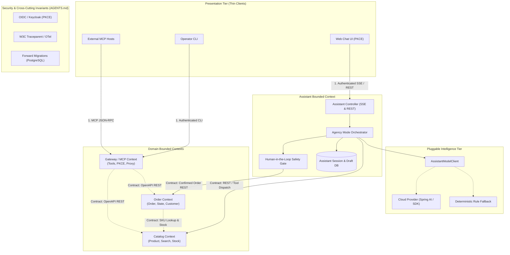

# Architecture State

### 1. System Architecture Topology (Source of Boundaries)

### 2. Active Domains & Contracts

- **Active Domains:**
  - `Catalog`: Product catalog exploration and availability search (`/api/v1/products`, JPA Specification, PostgreSQL / H2 DB).
  - `Order`: Order placement, status tracking, cancellation state machine (`/api/v1/orders`, PostgreSQL / H2 DB).
  - `Gateway`: MCP JSON-RPC service (`mcp/polaris_mcp`), Keycloak OAuth2/OIDC integration.
  - `Assistant`: Conversational AI agency orchestrator, session/draft persistence, human-in-the-loop safety gate, SSE streaming (`vn.danang.polaris.assistant`, `/api/v1/assistant/**`).

- **Active Contracts:**
  - `Catalog Context`: v1 (OpenAPI spec in `ProductController.java`, `CategoryController.java` — `/api/v1/products`, `/api/v1/categories`)
  - `Order Context`: v1 (OpenAPI spec in `OrderController.java`, DTO contracts in `vn.danang.polaris.dto`)
  - `MCP Gateway Context`: v2 Native In-Process (`McpSyncServer` at `/mcp/sse`, `/mcp/message`, `ProductMcpTools`, `OrderMcpTools`)
  - `Assistant Context`: v1 (OpenAPI REST & SSE: `/api/v1/assistant/**`, SSE event types: `thought`, `token`, `widget`, `draft`, `done`)

- **Architecture Decision Records:**
  - [ADR-0001: Architectural Alternatives for Exposing Polaris Services via Model Context Protocol (MCP)](../adr/0001-mcp-server-alternatives.md)
  - [ADR-0002: Architectural Strategies for Pagination & Sort Validation: Boundary Placement and Single Responsibility](../adr/0002-pagination-sort-validation-architecture.md)
  - [ADR-0003: Architectural Strategy for Polaris Persistence: Transition from Embedded H2 to Dedicated PostgreSQL Container Database](../adr/0003-postgresql-container-persistence.md)
  - [ADR-0004: Architectural Topology & Placement of Responsibilities for the Polaris AI Assistant](../adr/0004-web-chat-ai-assistant-architecture.md)

- **Open Slice Work Orders:**
  - [WO-001] Order Context API Contract Hardening & Test Suite -> Status: Verified
  - [WO-002] External API Performance & Contract Test Suite (k6) -> Status: Verified
  - [WO-003] Grafana SSO Integration with Keycloak (OIDC/RBAC & TLS Trust) -> Status: Verified
  - [WO-004] Product Catalog Hierarchy & Taxonomy Domain Slice -> Status: Verified
  - [WO-005] Catalog Pagination & Sort Contract Hardening with Actionable RFC 7807 Error Feedback -> Status: Verified
  - [WO-006] Native Spring Boot MCP Server Architecture Implementation -> Status: Verified
  - [WO-007] Upgrade Java MCP SDK to v2.0.1 GA -> Status: Verified
  - [WO-008] Enforce OAuth2 Authentication on MCP Gateway Endpoints & Fix Security Bypass -> Status: Verified
  - [WO-009] Comprehensive Order Lifecycle API & AI Shop Agent MCP Suite -> Status: Verified
  - [WO-010] Transition Polaris Persistence from H2 to PostgreSQL Container Database -> Status: Verified
  - [WO-011] Assistant Domain Schema & Session/Draft Persistence Slice -> Status: Drafting
  - [WO-012] Pluggable Model Provider & Agency Orchestrator Engine Slice -> Status: Drafting
  - [WO-013] Assistant Dual-Transport REST & SSE Streaming Controller Slice -> Status: Drafting
  - [WO-014] Assistant Role Scoping & Self-Healing RFC 7807 Diagnostic Widget Slice -> Status: Drafting
  - [WO-015] Polaris Web Chat UI & Keycloak PKCE Integration Slice -> Status: Drafting

---

### Sliced Work Orders Specification (PRD-006 & ADR-0004)

#### Slice Work Order: [WO-011] Assistant Domain Schema & Session/Draft Persistence Slice
- **Target Context:** Assistant (`vn.danang.polaris.assistant`)
- **Contract Definition:**
  - Internal Domain Services & Repositories:
    * `AssistantSessionRepository`, `AssistantMessageRepository`, `AssistantOrderDraftRepository`
    * `AssistantSessionService`: `createSession(userId, customerId)`, `getSession(sessionId)`, `closeSession(sessionId)`
    * `AssistantDraftService`: `stageDraft(sessionId, customerId, items)`, `getDraft(draftId)`, `expireDrafts()`
  - REST Session Management:
    * `POST /api/v1/assistant/sessions` -> `201 Created` (`AssistantSessionResponse`)
    * `GET /api/v1/assistant/sessions/{sessionId}` -> `200 OK` (`AssistantSessionDetailResponse` with messages and active draft)
    * `DELETE /api/v1/assistant/sessions/{sessionId}` -> `204 No Content`
- **Persistence Changes:**
  - Flyway Migration `V6__assistant_session_draft_schema.sql`:
    * Table `assistant_sessions`: `id VARCHAR(64) PRIMARY KEY`, `user_id VARCHAR(64) NOT NULL`, `customer_id BIGINT`, `status VARCHAR(32) NOT NULL DEFAULT 'ACTIVE'`, `created_at TIMESTAMP WITH TIME ZONE`, `updated_at TIMESTAMP WITH TIME ZONE`, `version BIGINT NOT NULL DEFAULT 0`
    * Table `assistant_messages`: `id BIGSERIAL PRIMARY KEY`, `session_id VARCHAR(64) NOT NULL REFERENCES assistant_sessions(id) ON DELETE CASCADE`, `role VARCHAR(16) NOT NULL`, `content TEXT`, `widget_type VARCHAR(64)`, `widget_payload JSONB`, `tool_call_id VARCHAR(64)`, `created_at TIMESTAMP WITH TIME ZONE`
    * Table `assistant_order_drafts`: `id VARCHAR(64) PRIMARY KEY`, `session_id VARCHAR(64) NOT NULL REFERENCES assistant_sessions(id) ON DELETE CASCADE`, `customer_id BIGINT NOT NULL`, `status VARCHAR(32) NOT NULL DEFAULT 'WAITING_CONFIRMATION'`, `items JSONB NOT NULL`, `total_amount NUMERIC(12,2) NOT NULL`, `expires_at TIMESTAMP WITH TIME ZONE NOT NULL`, `confirmed_order_number VARCHAR(64)`, `created_at TIMESTAMP WITH TIME ZONE`, `updated_at TIMESTAMP WITH TIME ZONE`, `version BIGINT NOT NULL DEFAULT 0`
    * Indexes: `idx_assistant_sessions_user`, `idx_assistant_messages_session`, `idx_assistant_drafts_session`, `idx_assistant_drafts_expiry`
- **Acceptance Criteria:**
  - Given an authenticated user, when creating an assistant session, then session is persisted with status `ACTIVE`.
  - Given an active session, when staging an order draft, then draft is saved with `WAITING_CONFIRMATION` status, itemized pricing snapshot, and `expires_at` set to 15 minutes in future.
  - Given an order draft whose TTL has passed (`expires_at < now()`), when queried or updated, then status transitions to `EXPIRED`.
- **Verification Command:** `mvn test -Dtest=AssistantPersistenceIntegrationTest`

#### Slice Work Order: [WO-012] Pluggable Model Provider & Agency Orchestrator Engine Slice
- **Target Context:** Assistant (`vn.danang.polaris.assistant`)
- **Contract Definition:**
  - Interface `AssistantModelClient`:
    * `void streamChat(SessionContext context, List<ToolDefinition> tools, SseEmitter emitter)`
  - Implementations:
    * `DeterministicRuleModelClient`: Annotated with `@ConditionalOnProperty(name = "polaris.ai.provider", havingValue = "local", matchIfMissing = true)`. Implements regex intent parsing for catalog discovery, stock checking, order staging, and cancellation.
    * `CloudModelClient`: Annotated with `@ConditionalOnProperty(name = "polaris.ai.provider", havingValue = "cloud")`. Connects via Spring AI / GenAI SDK.
  - Domain Tools (Exposed to cognitive engine):
    * `search_products(query, categoryId, minPrice, maxPrice)` -> delegates to `ProductService.searchProducts(...)`
    * `get_product_stock(sku)` -> delegates to `ProductService.getProductBySku(...)`
    * `stage_order_draft(items)` -> intercepts mutation, calculates snapshot totals, saves `AssistantOrderDraft`, and returns draft summary
  - Asynchronous SecurityContext Propagation:
    * Bean `DelegatingSecurityContextExecutorService` (`assistantExecutor`) configured to ensure async worker threads inherit caller's JWT `SecurityContext`.
- **Persistence Changes:** None (builds on V6 schema).
- **Acceptance Criteria:**
  - Given the application is started with default settings (`polaris.ai.provider=local`), when user asks to search for chargers under $30, then `DeterministicRuleModelClient` executes tool `search_products` and emits progressive thought and token events.
  - Given an order staging intent, when the model invokes `stage_order_draft`, then the agency loop creates an `AssistantOrderDraft` in status `WAITING_CONFIRMATION` and halts autonomous execution without placing an actual order.
  - Given tool execution dispatched on an async thread, then `SecurityContextHolder.getContext().getAuthentication()` retains the authenticated caller's JWT token.
- **Verification Command:** `mvn test -Dtest=AgencyOrchestratorTest,DeterministicRuleModelClientTest`

#### Slice Work Order: [WO-013] Assistant Dual-Transport REST & SSE Streaming Controller Slice
- **Target Context:** Assistant (`vn.danang.polaris.assistant.web`)
- **Contract Definition:**
  - Streaming Endpoint: `POST /api/v1/assistant/sessions/{sessionId}/messages`
    * Headers: `Accept: text/event-stream`, `Authorization: Bearer <JWT>`
    * Body: `{"content": "..."}`
    * Produces: `text/event-stream;charset=UTF-8`
    * SSE Events: `thought`, `token`, `widget`, `draft`, `done`
    * Heartbeat ping: `: keep-alive\n\n` emitted every 15s.
  - Mutation Confirmation Endpoint: `POST /api/v1/assistant/sessions/{sessionId}/drafts/{draftId}/confirm`
    * Headers: `Authorization: Bearer <JWT>`, `Idempotency-Key: <UUIDv4>`
    * Status: `201 Created` with `Location: /api/v1/orders/{orderNumber}` and `OrderResponse` body.
    * Status: `409 Conflict` (RFC 7807) if draft is not in `WAITING_CONFIRMATION` or has expired.
  - Mutation Rejection Endpoint: `POST /api/v1/assistant/sessions/{sessionId}/drafts/{draftId}/cancel`
    * Headers: `Authorization: Bearer <JWT>`
    * Status: `200 OK` (updates draft to `CANCELLED`).
- **Persistence Changes:** None.
- **Acceptance Criteria:**
  - Given an unauthenticated request to any `/api/v1/assistant/**` endpoint, when invoked, then Spring Security returns `401 Unauthorized` (Security Invariant 4).
  - Given a valid message prompt, when received over SSE, then the client receives structured SSE events in real time terminating with `event: done`.
  - Given an active draft in `WAITING_CONFIRMATION`, when `confirm` is called with a unique `Idempotency-Key`, then an order is created via `OrderService.createOrder`, draft transitions to `CONFIRMED`, and `201 Created` is returned.
  - Given an expired draft (past 15 minutes), when `confirm` is called, then returns RFC 7807 `409 Conflict` with title "Draft Expired".
- **Verification Command:** `mvn test -Dtest=AssistantControllerTest,AssistantStreamingIntegrationTest`

#### Slice Work Order: [WO-014] Assistant Role Scoping & Self-Healing RFC 7807 Diagnostic Widget Slice
- **Target Context:** Assistant (`vn.danang.polaris.assistant`)
- **Contract Definition:**
  - Identity Scoping:
    * For `ROLE_USER`: Assistant resolves `customerId` from JWT claims (`sub` / `preferred_username`). Direct parameter specification of customer ID is forbidden; returns `403 Forbidden` if attempting cross-customer access.
    * For `ROLE_STAFF`: Assistant allows specifying `customerId`, verifies existence, and injects `operator_id` into audit metadata.
  - Error-to-Widget Transformation:
    * Intercepts RFC 7807 exceptions (`InsufficientStockException`, `OrderStateConflictException`, `DraftExpiredException`).
    * Emits `event: widget` with `type: "PROBLEM_CARD"`, containing `invalid_param`, `received`, `allowed_values`, and clickable `remedy` action triggers.
- **Persistence Changes:** None.
- **Acceptance Criteria:**
  - Given a user authenticated as `ROLE_USER`, when prompting to view or cancel another customer's order, then returns RFC 7807 `403 Forbidden` Problem Card.
  - Given an `InsufficientStockException` thrown during staging (requested 10, available 5), then a Problem Card is emitted with remedy `[Adjust Quantity to 5]`.
- **Verification Command:** `mvn test -Dtest=AssistantSecurityScopingTest,AssistantProblemWidgetTest`

#### Slice Work Order: [WO-015] Polaris Web Chat UI & Keycloak PKCE Integration Slice
- **Target Context:** Presentation / Web Client (`src/main/resources/static/chat/**` or dedicated client module)
- **Contract Definition:**
  - Static Web Application: `index.html`, `app.js`, `style.css`
  - Auth Flow: Keycloak OIDC Authorization Code Flow with PKCE (RFC 7636, S256). In-memory token management, silent refresh.
  - Streaming Consumer: `fetch()` with `ReadableStream` (`pipeThrough(new TextDecoderStream())`), parsing `event: thought`, `event: token`, `event: widget`, `event: draft`, `event: done`.
  - UI Card Components:
    * `ProductCard`: displays SKU, title, category, price, and real-time stock badge.
    * `OrderDraftCard`: itemized items, subtotals, grand total, 15-minute countdown timer, and "Submit Order" button.
    * `OrderConfirmedCard`: order number badge, status `PLACED`, line items.
    * `ProblemCard`: diagnostic title, details, and clickable remedy action buttons.
  - Accessibility: WCAG 2.1 AA compliant, screen reader announcements via `role="log" aria-live="polite"`, keyboard accessible buttons.
- **Persistence Changes:** None.
- **Acceptance Criteria:**
  - Given an unauthenticated browser, when opening the chat UI, then redirects to Keycloak login with PKCE parameters.
  - Given an authenticated session, when typing "Find chargers under $30", then the response streams in real time and product cards render.
  - Given a staged order draft, when "Submit Order" is clicked, then client sends `POST .../confirm` with UUIDv4 `Idempotency-Key` and displays confirmed order card.
- **Verification Command:** `mvn test -Dtest=WebChatClientIntegrationTest`

---

### 4. Architectural Lessons Learned & Incident Log

- **[INCIDENT-001] MCP Authentication Bypass (WO-006):**
  - *Failure:* In WO-006, the architect mistakenly specified `/mcp/**` as `permitAll()` in `SecurityConfig.java` under the false rationale of "simplifying local desktop AI client and CLI bridge connections", completely violating ADR-0001 (Section 26, 47, 159-163, 357, 562) and AGENTS.md Principle 1.2.
  - *Root Cause:* Prioritizing developer convenience over architectural security invariants. Lack of explicit architectural gate checking that all domain execution paths require OAuth2 tokens. Flawed test design asserting unauthenticated calls succeed (`isNotEqualTo(401)`).
  - *Remediation & Guardrail:* Enforced Core Invariant 4. The CLI bridge (`polaris-mcp-cli`) must supply valid OAuth2 Bearer tokens (`--token` / `POLARIS_TOKEN`), and test harnesses must use standard JWT mock helpers (`JwtMockFactory.user()`). Unauthenticated requests to `/mcp/**` must fail with `401 Unauthorized`.
- **[INCIDENT-002] Autonomous State Mutation Anti-Pattern (ADR-0004):**
  - *Failure:* Early prototype designs allowed AI agent tool loops to directly call `POST /api/v1/orders` during text generation, resulting in duplicate order creation during streaming retries and accidental purchases without user confirmation.
  - *Root Cause:* Conflating conversational generation with transactional state mutation.
  - *Remediation & Guardrail:* Enforced Invariants 6 and 7. Decoupled SSE streaming from transactional HTTP POST mutations. All state mutations require staging an `AssistantOrderDraft` with a 15-minute TTL and explicit human confirmation with an `Idempotency-Key`.