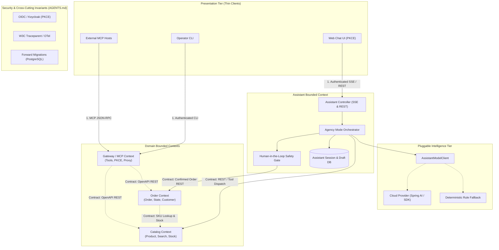

# Architecture State

### 1. System Architecture Topology (Source of Boundaries)

### 2. Active Domains & Contracts

- **Active Domains:**
  - `Catalog`: Product catalog exploration and availability search (`/api/v1/products`, JPA Specification, PostgreSQL / H2 DB).
  - `Order`: Order placement, status tracking, cancellation state machine (`/api/v1/orders`, PostgreSQL / H2 DB).
  - `Gateway`: MCP JSON-RPC service (`mcp/polaris_mcp`), Keycloak OAuth2/OIDC integration.
  - `Assistant`: Conversational AI agency orchestrator, session/draft persistence, human-in-the-loop safety gate, SSE streaming (`vn.danang.polaris.assistant`, `/api/v1/assistant/**`).

- **Active Contracts:**
  - `Catalog Context`: v1 (OpenAPI spec in `ProductController.java`, `CategoryController.java` — `/api/v1/products`, `/api/v1/categories`)
  - `Order Context`: v1 (OpenAPI spec in `OrderController.java`, DTO contracts in `vn.danang.polaris.dto`)
  - `MCP Gateway Context`: v2 Native In-Process (`McpSyncServer` at `/mcp/sse`, `/mcp/message`, `ProductMcpTools`, `OrderMcpTools`)
  - `Assistant Context`: v1 (OpenAPI REST & SSE: `/api/v1/assistant/**`, SSE event types: `thought`, `token`, `widget`, `draft`, `done`)

- **Architecture Decision Records:**
  - [ADR-0001: Architectural Alternatives for Exposing Polaris Services via Model Context Protocol (MCP)](../adr/0001-mcp-server-alternatives.md)
  - [ADR-0002: Architectural Strategies for Pagination & Sort Validation: Boundary Placement and Single Responsibility](../adr/0002-pagination-sort-validation-architecture.md)
  - [ADR-0003: Architectural Strategy for Polaris Persistence: Transition from Embedded H2 to Dedicated PostgreSQL Container Database](../adr/0003-postgresql-container-persistence.md)
  - [ADR-0004: Architectural Topology & Placement of Responsibilities for the Polaris AI Assistant](../adr/0004-web-chat-ai-assistant-architecture.md)

- **Open Slice Work Orders:**
  - [WO-001] Order Context API Contract Hardening & Test Suite -> Status: Verified
  - [WO-002] External API Performance & Contract Test Suite (k6) -> Status: Verified
  - [WO-003] Grafana SSO Integration with Keycloak (OIDC/RBAC & TLS Trust) -> Status: Verified
  - [WO-004] Product Catalog Hierarchy & Taxonomy Domain Slice -> Status: Verified
  - [WO-005] Catalog Pagination & Sort Contract Hardening with Actionable RFC 7807 Error Feedback -> Status: Verified
  - [WO-006] Native Spring Boot MCP Server Architecture Implementation -> Status: Verified
  - [WO-007] Upgrade Java MCP SDK to v2.0.1 GA -> Status: Verified
  - [WO-008] Enforce OAuth2 Authentication on MCP Gateway Endpoints & Fix Security Bypass -> Status: Verified
  - [WO-009] Comprehensive Order Lifecycle API & AI Shop Agent MCP Suite -> Status: Verified
  - [WO-010] Transition Polaris Persistence from H2 to PostgreSQL Container Database -> Status: Verified
  - [WO-011] Assistant Domain Schema & Session/Draft Persistence Slice -> Status: Verified
  - [WO-012] Pluggable Model Provider & Agency Orchestrator Engine Slice -> Status: Verified
  - [WO-013] Assistant Dual-Transport REST & SSE Streaming Controller Slice -> Status: Ready for Execution
  - [WO-014] Assistant Role Scoping & Self-Healing RFC 7807 Diagnostic Widget Slice -> Status: Ready for Execution
  - [WO-015] Polaris Web Chat UI & Keycloak PKCE Integration Slice -> Status: Ready for Execution

---

### Sliced Work Orders Specification (PRD-006 & ADR-0004)

#### Slice Work Order: [WO-011] Assistant Domain Schema & Session/Draft Persistence Slice
- **Status:** Verified
- **Target Context:** Assistant Bounded Context (`vn.danang.polaris.assistant`)
- **Package Layout:**
  - `vn.danang.polaris.assistant.entity` (`AssistantSession`, `AssistantMessage`, `AssistantOrderDraft`, `SessionStatus`, `DraftStatus`, `MessageRole`)
  - `vn.danang.polaris.assistant.repository` (`AssistantSessionRepository`, `AssistantMessageRepository`, `AssistantOrderDraftRepository`)
  - `vn.danang.polaris.assistant.service` (`AssistantSessionService`, `AssistantDraftService`)
  - `vn.danang.polaris.assistant.dto` (`AssistantSessionResponse`, `AssistantSessionDetailResponse`, `AssistantDraftResponse`, `DraftItemDto`)
  - `vn.danang.polaris.assistant.web` (`AssistantSessionController`)
- **Contract Definition:**
  - Internal Domain Services & Repositories:
    * `AssistantSessionRepository`: `findById(id)`, `findByUserIdAndStatus(userId, status)`
    * `AssistantMessageRepository`: `findBySessionIdOrderByCreatedAtAsc(sessionId)`
    * `AssistantOrderDraftRepository`: `findBySessionIdAndStatus(sessionId, status)`, `findExpiredDrafts(now)`
    * `AssistantSessionService`: `createSession(userId, customerId)`, `getSession(sessionId)`, `closeSession(sessionId)`
    * `AssistantDraftService`: `stageDraft(sessionId, customerId, items, totalAmount, ttlMinutes)`, `getDraft(draftId)`, `getActiveDraft(sessionId)`, `expireDrafts()`
  - REST Session Management Endpoints:
    * `POST /api/v1/assistant/sessions` -> `201 Created` with `Location: /api/v1/assistant/sessions/{sessionId}`, returns `AssistantSessionResponse(id, userId, customerId, status, createdAt, updatedAt)`
    * `GET /api/v1/assistant/sessions/{sessionId}` -> `200 OK`, returns `AssistantSessionDetailResponse(id, userId, customerId, status, messages, activeDraft, createdAt, updatedAt)`
    * `DELETE /api/v1/assistant/sessions/{sessionId}` -> `204 No Content` (transitions session status to `CLOSED`)
- **Persistence Changes:**
  - Flyway Migration `V6__assistant_session_draft_schema.sql`:
    * Table `assistant_sessions`: `id VARCHAR(64) PRIMARY KEY`, `user_id VARCHAR(64) NOT NULL`, `customer_id BIGINT`, `status VARCHAR(32) NOT NULL DEFAULT 'ACTIVE'`, `created_at TIMESTAMP WITH TIME ZONE NOT NULL DEFAULT CURRENT_TIMESTAMP`, `updated_at TIMESTAMP WITH TIME ZONE NOT NULL DEFAULT CURRENT_TIMESTAMP`, `version BIGINT NOT NULL DEFAULT 0`
    * Table `assistant_messages`: `id BIGSERIAL PRIMARY KEY`, `session_id VARCHAR(64) NOT NULL REFERENCES assistant_sessions(id) ON DELETE CASCADE`, `role VARCHAR(16) NOT NULL`, `content TEXT`, `widget_type VARCHAR(64)`, `widget_payload JSONB`, `tool_call_id VARCHAR(64)`, `created_at TIMESTAMP WITH TIME ZONE NOT NULL DEFAULT CURRENT_TIMESTAMP`
    * Table `assistant_order_drafts`: `id VARCHAR(64) PRIMARY KEY`, `session_id VARCHAR(64) NOT NULL REFERENCES assistant_sessions(id) ON DELETE CASCADE`, `customer_id BIGINT NOT NULL`, `status VARCHAR(32) NOT NULL DEFAULT 'WAITING_CONFIRMATION'`, `items JSONB NOT NULL`, `total_amount NUMERIC(12, 2) NOT NULL`, `expires_at TIMESTAMP WITH TIME ZONE NOT NULL`, `confirmed_order_number VARCHAR(64)`, `created_at TIMESTAMP WITH TIME ZONE NOT NULL DEFAULT CURRENT_TIMESTAMP`, `updated_at TIMESTAMP WITH TIME ZONE NOT NULL DEFAULT CURRENT_TIMESTAMP`, `version BIGINT NOT NULL DEFAULT 0`
    * Indexes: `idx_assistant_sessions_user` (`user_id, status`), `idx_assistant_messages_session` (`session_id, created_at`), `idx_assistant_drafts_session` (`session_id, status`), `idx_assistant_drafts_expiry` (`status, expires_at`)
    * Strict Context Boundary: Zero foreign keys targeting Catalog or Order tables. Cross-context references are strictly scalars (`customer_id`, `confirmed_order_number`). Compatible with PostgreSQL 16 and H2.
- **Acceptance Criteria:**
  - Given an unauthenticated request to `/api/v1/assistant/sessions/**`, returns `401 Unauthorized` (Security Invariant 4).
  - Given an authenticated caller, when creating an assistant session, then session is persisted with status `ACTIVE` and unique UUID.
  - Given an active session, when staging an order draft, then draft is saved with `WAITING_CONFIRMATION` status, itemized pricing snapshot JSON, version 0, and `expires_at` set to exactly 15 minutes in the future.
  - Given an order draft whose TTL has passed (`expires_at < now()`), when queried or evaluated, status transitions to `EXPIRED`.
- **Verification Commands:**
  - Unit & Integration: `mvn test -Dtest=AssistantPersistenceIntegrationTest,AssistantSessionControllerTest`
  - Playwright CLI: Recipe A (`playwright-cli open https://polaris.local/swagger-ui/index.html` - execute `/api/v1/assistant/sessions` operations with and without Bearer token).

#### Slice Work Order: [WO-012] Pluggable Model Provider & Agency Orchestrator Engine Slice
- **Status:** Ready for Execution
- **Target Context:** Assistant Cognitive Engine (`vn.danang.polaris.assistant.engine`, `vn.danang.polaris.assistant.model`, `vn.danang.polaris.assistant.tool`)
- **Package Layout:**
  - `vn.danang.polaris.assistant.model` (`AssistantModelClient`, `DeterministicRuleModelClient`, `CloudModelClient`, `SessionContext`, `ModelEvent`, `ThoughtEvent`, `TokenDeltaEvent`, `ToolCallRequestEvent`, `TextCompletionEvent`)
  - `vn.danang.polaris.assistant.tool` (`AssistantToolRegistry`, `CatalogTools`, `OrderTools`, `ToolDefinition`, `ToolExecutionResult`)
  - `vn.danang.polaris.assistant.engine` (`AgencyOrchestrator`, `AssistantSecurityContextExecutorConfig`)
- **Contract Definition:**
  - Interface `AssistantModelClient`:
    * `void streamChat(SessionContext context, List<ToolDefinition> tools, SseEmitter emitter)`
  - Concrete Providers:
    * `DeterministicRuleModelClient`: Annotated with `@ConditionalOnProperty(name = "polaris.ai.provider", havingValue = "local", matchIfMissing = true)`. Implements zero-config local rule engine handling intents: search products (`search <query>`, price bounds), stock check (`stock <sku>`), stage order (`order <sku> <qty>`), order tracking (`orders`, `order <orderNumber>`), cancel order (`cancel <orderNumber>`).
    * `CloudModelClient`: Annotated with `@ConditionalOnProperty(name = "polaris.ai.provider", havingValue = "cloud")`. Connects via Spring AI / Google GenAI SDK.
  - Cognitive Domain Tools (Exposed to cognitive engine):
    * `search_products(query, categoryId, minPrice, maxPrice)` -> delegates to `ProductService.searchProducts(...)`
    * `get_product_stock(sku)` -> delegates to `ProductService.getProductBySku(...)`
    * `stage_order_draft(items)` -> intercepts mutation, calculates snapshot pricing, saves draft in DB via `AssistantDraftService`, halts autonomous execution, returns draft summary.
    * `get_order_status(orderNumber)` -> delegates to `OrderService.getOrderStatus(...)`
    * `cancel_order_review(orderNumber)` -> inspects status, checks eligibility, stages cancellation review card without committing mutation.
  - Asynchronous Security Invariant:
    * Configures `DelegatingSecurityContextExecutorService` (`assistantExecutor`) bean wrapping virtual or pooled threads, ensuring JWT `SecurityContext` propagates to all async agent loops and tool calls (Zero-Bypass security invariant).
- **Persistence Changes:** None (builds on V6 schema).
- **Acceptance Criteria:**
  - Given default configuration (`polaris.ai.provider=local`), when user asks to search products, `DeterministicRuleModelClient` dispatches `search_products` tool and streams progressive events without cloud API keys.
  - Given an order placement prompt, when the cognitive engine recognizes the order intent, then it invokes `stage_order_draft` tool, creates an `AssistantOrderDraft` (`WAITING_CONFIRMATION`), and terminates turn with `event: draft` and `event: done` WITHOUT creating an order in `OrderService`.
  - Given tool execution dispatched on an async thread, then `SecurityContextHolder.getContext().getAuthentication()` retains the authenticated caller's JWT token.
- **Verification Commands:**
  - Unit & Integration: `mvn test -Dtest=AgencyOrchestratorTest,DeterministicRuleModelClientTest,AssistantToolDispatchTest`

#### Slice Work Order: [WO-013] Assistant Dual-Transport REST & SSE Streaming Controller Slice
- **Status:** Ready for Execution
- **Target Context:** Assistant Web & Streaming Tier (`vn.danang.polaris.assistant.web`)
- **Package Layout:**
  - `vn.danang.polaris.assistant.web` (`AssistantController`, `AssistantStreamingController`, `ChatMessageRequest`)
- **Contract Definition:**
  - Streaming Endpoint: `POST /api/v1/assistant/sessions/{sessionId}/messages`
    * Headers: `Accept: text/event-stream`, `Authorization: Bearer <JWT>`, `Content-Type: application/json`
    * Body: `ChatMessageRequest(String content)`
    * Produces: `text/event-stream;charset=UTF-8`
    * Wire Events:
      - `event: thought`: `{"step":"SEARCHING_CATALOG","message":"Querying catalog for fast chargers under $30..."}`
      - `event: token`: `{"delta":"We have 2 fast chargers in stock:"}`
      - `event: widget`: `{"type":"PRODUCT_LIST","payload":{"items":[...]}}`
      - `event: draft`: `{"draftId":"dft-9821a","status":"WAITING_CONFIRMATION","expiresAt":"...","items":[...],"totalAmount":49.80}`
      - `event: done`: `{"sessionId":"sess-101","status":"WAITING_CONFIRMATION"}`
    * Resiliency: Periodic keep-alive comments (`: keep-alive\n\n`) emitted every 15s. SseEmitter timeout configured to 180,000 ms with lifecycle callbacks (`onCompletion`, `onTimeout`, `onError`).
  - Mutation Confirmation Endpoint: `POST /api/v1/assistant/sessions/{sessionId}/drafts/{draftId}/confirm`
    * Headers: `Authorization: Bearer <JWT>`, `Idempotency-Key: <UUIDv4>`
    * Returns: `201 Created` with `Location: /api/v1/orders/{orderNumber}` and `OrderResponse` body.
    * Returns: `409 Conflict` (RFC 7807) if draft is expired, cancelled, already confirmed, or stock depleted during pre-commit re-verification.
  - Mutation Rejection / Cancellation Endpoint: `POST /api/v1/assistant/sessions/{sessionId}/drafts/{draftId}/cancel`
    * Headers: `Authorization: Bearer <JWT>`
    * Returns: `200 OK` (updates draft status to `CANCELLED`).
- **Persistence Changes:** None.
- **Acceptance Criteria:**
  - Given an unauthenticated request to `/api/v1/assistant/sessions/{sessionId}/messages` or `.../confirm`, returns `401 Unauthorized` (Security Invariant 4).
  - Given a valid chat message, when streaming, client receives valid SSE formatted frames ending with `event: done`.
  - Given an active draft in `WAITING_CONFIRMATION`, when `confirm` is called with `Idempotency-Key`, then creates order via `OrderService.createOrder` with idempotency key, marks draft `CONFIRMED`, and returns `201 Created`.
  - Given an expired draft (`expires_at < now()`), when `confirm` is called, returns RFC 7807 `409 Conflict` (`https://polaris.local/errors/draft-expired`).
- **Verification Commands:**
  - Unit & Integration: `mvn test -Dtest=AssistantControllerTest,AssistantStreamingIntegrationTest`
  - Playwright CLI: Recipe A (`playwright-cli open https://polaris.local/swagger-ui/index.html` - test SSE streaming and draft confirm endpoints with OAuth2 token).

#### Slice Work Order: [WO-014] Assistant Role Scoping & Self-Healing RFC 7807 Diagnostic Widget Slice
- **Status:** Ready for Execution
- **Target Context:** Assistant Security & Diagnostic Tier (`vn.danang.polaris.assistant.security`, `vn.danang.polaris.assistant.web`)
- **Package Layout:**
  - `vn.danang.polaris.assistant.security` (`AssistantSecurityContext`, `AssistantIdentityScopingAspect`)
  - `vn.danang.polaris.assistant.widget` (`ProblemWidgetFactory`, `WidgetResponse`, `ProblemCardPayload`, `RemedyAction`)
- **Contract Definition:**
  - Strict Identity Scoping & Anti-IDOR Enforcement:
    * `AssistantSecurityContext`: Extracts authenticated user details and roles (`ROLE_USER`, `ROLE_STAFF`, `ROLE_ADMIN`).
    * For `ROLE_USER`: Binds `customerId` strictly to caller's identity (`sub` / `preferred_username`). Rejects any request specifying or attempting to access another customer's ID with RFC 7807 `403 Forbidden`.
    * For `ROLE_STAFF` / `ROLE_ADMIN`: Allows explicit `customer_id` assignment for assisted sales; injects staff `operator_id` into order metadata/audit trail.
  - RFC 7807 Error-to-Widget Translation:
    * Intercepts `InsufficientStockException`, `OrderStateConflictException`, `DraftExpiredException`, `AccessDeniedException`.
    * Formats machine-actionable widget: `event: widget`, `type: "PROBLEM_CARD"`, payload containing `title`, `detail`, `invalid_param`, `received`, `allowed_values`, and array of clickable `remedy` action triggers (e.g. `[Adjust Quantity to 5]`, `[Search Alternatives]`).
- **Persistence Changes:** None.
- **Acceptance Criteria:**
  - Given a user authenticated as `ROLE_USER` (customer 2), when attempting to view or cancel orders for customer 1, then returns RFC 7807 `403 Forbidden` Problem Card with zero customer 1 data leaked.
  - Given an `InsufficientStockException` thrown during staging (e.g. requested 10, available 5), then a Problem Card is emitted containing remedy `[Adjust Quantity to 5]`.
  - Given an attempt to cancel an order in `SHIPPED` status, then returns RFC 7807 `409 Conflict` Problem Card explaining terminal fulfillment state.
- **Verification Commands:**
  - Unit & Integration: `mvn test -Dtest=AssistantSecurityScopingTest,AssistantProblemWidgetTest`
  - Playwright CLI: Recipe D (`playwright-cli open https://polaris.local/swagger-ui/index.html` - test negative access control and stock constraint error feedback).

#### Slice Work Order: [WO-015] Polaris Web Chat UI & Keycloak PKCE Integration Slice
- **Status:** Ready for Execution
- **Target Context:** Presentation / Web Client (`src/main/resources/static/chat/**`, `vn.danang.polaris.assistant.web.ChatViewController`)
- **Package & Static Asset Layout:**
  - `src/main/resources/static/chat/index.html` (accessible semantic HTML5 layout)
  - `src/main/resources/static/chat/app.js` (OIDC PKCE client, SSE reader, card renderer, confirmation handlers)
  - `src/main/resources/static/chat/style.css` (responsive design, WCAG high-contrast focus rings, status badges)
  - `vn.danang.polaris.assistant.web.ChatViewController` (maps `GET /chat` and forwarders)
  - `vn.danang.polaris.config.SecurityConfig` (permits public `GET /chat/**` and `/static/**`, while strictly enforcing JWT authentication on `/api/v1/assistant/**`)
- **Contract Definition:**
  - Web Assets: Static chat application served at `/chat`.
  - OIDC PKCE Client: Keycloak Authorization Code Flow with PKCE (RFC 7636, S256). In-memory token storage, silent background refresh before token expiry. Client ID: `polaris-web`.
  - Streaming Parser: `fetch()` with `ReadableStream` (`pipeThrough(new TextDecoderStream())`) parsing SSE events (`thought`, `token`, `widget`, `draft`, `done`).
  - Interactive Card Components:
    * `ProductCard`: Thumbnail, name, SKU, price, real-time stock badge, "Add to Draft" action.
    * `OrderDraftCard`: Line items, quantities, pricing breakdown, 15-minute countdown timer, "Submit Order" button, "Cancel Draft" button.
    * `OrderConfirmedCard`: Order number badge (`ORD-XXXXX`), status `PLACED`, total amount, item summary.
    * `ProblemCard`: RFC 7807 error diagnostic card with clickable remedy buttons (`[Adjust Quantity]`, `[Search Alternatives]`).
  - Accessibility & Usability: WCAG 2.1 AA compliant, `role="log" aria-live="polite" aria-atomic="false"`, keyboard navigation, mobile-responsive layout.
- **Persistence Changes:** None.
- **Acceptance Criteria:**
  - Given an unauthenticated browser navigating to `/chat`, automatically redirects to Keycloak login with PKCE parameters (`code_challenge`, `code_challenge_method=S256`).
  - Given an authenticated user, typing "Find chargers under $30", tokens stream smoothly and product cards render with live stock.
  - Given a staged order draft card, clicking "Submit Order" executes `POST /api/v1/assistant/sessions/{id}/drafts/{draftId}/confirm` with a generated UUIDv4 `Idempotency-Key` and transitions UI to confirmed order card.
  - Given out-of-stock response, problem card renders with remedy button that updates staged quantity on click.
- **Verification Commands:**
  - Unit & Integration: `mvn test -Dtest=WebChatClientIntegrationTest`
  - Playwright CLI Live Stack: Recipe B (`playwright-cli open https://polaris.local/chat`, capturing `.playwright-cli/chat-stream-verified.yml` and `.playwright-cli/chat-stream-verified.png`).

---

### 4. Architectural Lessons Learned & Incident Log

- **[INCIDENT-001] MCP Authentication Bypass (WO-006):**
  - *Failure:* In WO-006, the architect mistakenly specified `/mcp/**` as `permitAll()` in `SecurityConfig.java` under the false rationale of "simplifying local desktop AI client and CLI bridge connections", completely violating ADR-0001 (Section 26, 47, 159-163, 357, 562) and AGENTS.md Principle 1.2.
  - *Root Cause:* Prioritizing developer convenience over architectural security invariants. Lack of explicit architectural gate checking that all domain execution paths require OAuth2 tokens. Flawed test design asserting unauthenticated calls succeed (`isNotEqualTo(401)`).
  - *Remediation & Guardrail:* Enforced Core Invariant 4. The CLI bridge (`polaris-mcp-cli`) must supply valid OAuth2 Bearer tokens (`--token` / `POLARIS_TOKEN`), and test harnesses must use standard JWT mock helpers (`JwtMockFactory.user()`). Unauthenticated requests to `/mcp/**` must fail with `401 Unauthorized`.
- **[INCIDENT-002] Autonomous State Mutation Anti-Pattern (ADR-0004):**
  - *Failure:* Early prototype designs allowed AI agent tool loops to directly call `POST /api/v1/orders` during text generation, resulting in duplicate order creation during streaming retries and accidental purchases without user confirmation.
  - *Root Cause:* Conflating conversational generation with transactional state mutation.
  - *Remediation & Guardrail:* Enforced Invariants 6 and 7. Decoupled SSE streaming from transactional HTTP POST mutations. All state mutations require staging an `AssistantOrderDraft` with a 15-minute TTL and explicit human confirmation with an `Idempotency-Key`.