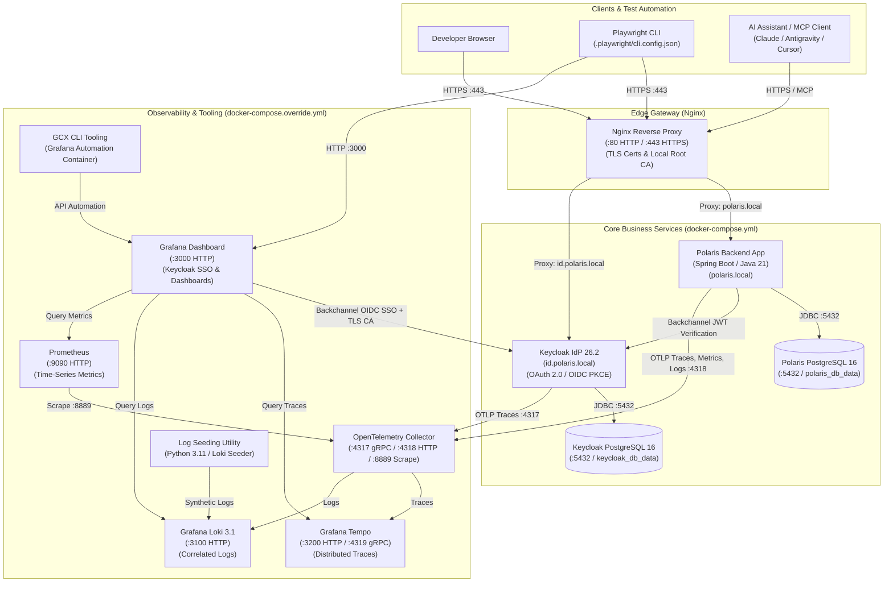
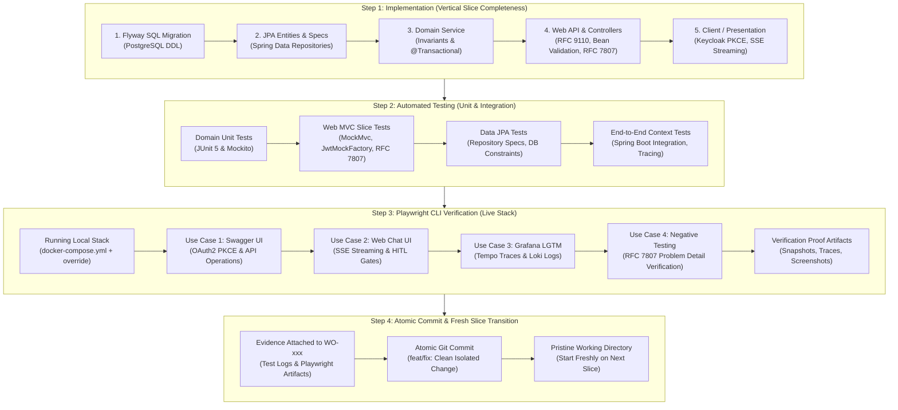

# Polaris Technical & Implementation Guidelines

This document provides codebase-specific implementation guidelines, conventions, and engineering standards for developers and architects working on Polaris.

---

### 1. Web API Layer Standards (Spring Boot & RESTful Conventions)

1. **Resource-Oriented URIs:**
   - Use plural nouns for resources (`/api/v1/products`, `/api/v1/categories`, `/api/v1/orders`).
   - Express hierarchy through nested paths (`/api/v1/categories/{id}/products`).
   - Use lowercase kebab-case for paths; never include verbs or file extensions in resource paths.
   - Use explicit sub-resources for lifecycle actions (`POST /api/v1/orders/{orderNumber}/cancel`).

2. **Strict HTTP Verbs & Semantics:**
   - `GET`: Safe, idempotent, cacheable. Read-only; must NEVER alter state. Return `200 OK`.
   - `POST`: Create resource (`201 Created` with `Location` header) or trigger non-idempotent lifecycle operations (`200 OK`).
   - `PUT`: Complete idempotent resource replacement (`200 OK` or `204 No Content`).
   - `PATCH`: Partial resource modification (`200 OK` or `204 No Content`).
   - `DELETE`: Idempotent resource removal (`204 No Content`).

3. **Status Codes & Protocols:**
   - Never return `200 OK` with an error message payload.
   - `400 Bad Request`: Malformed syntax, invalid parameters, out-of-range inputs.
   - `401 Unauthorized`: Missing or invalid Bearer token.
   - `403 Forbidden`: Authenticated caller lacks required role or customer scope.
   - `404 Not Found`: Resource identifier does not exist.
   - `409 Conflict`: Business invariant or state machine conflict.
   - `422 Unprocessable Content`: Semantic or bean validation failures.
   - `500 Internal Server Error`: Masked internal server error (never leak raw stack traces).
   - Distributed Tracing: Propagate standard W3C `traceparent` via `TraceFilter` and echo `X-Trace-Id` in all HTTP responses.

---

### 2. Input Parameter Validation Standards

1. **Path Variables:**
   - Numeric IDs: Must be positive (`id > 0`). Reject negative numbers or zero with `400 Bad Request`.
   - Business Codes/SKUs: Enforce alphanumeric/hyphen patterns, non-blank, sanitized against path traversal.

2. **Query Parameters:**
   - Pagination: Enforce bounded limits (`0 <= page <= 10000`, `1 <= size <= 100`) via `PageableValidator`.
   - Sorting: Enforce explicit allowlists (`ALLOWED_SORT_PROPERTIES`). Reject arbitrary database columns to prevent SQL injection or schema leakage.
   - Filters & Ranges: Validate types, enum names, price bounds (`minPrice >= 0`), and logical ranges (`minPrice <= maxPrice`).

3. **Request Bodies (DTOs):**
   - Annotate incoming DTOs with Jakarta Bean Validation (`@Valid`, `@NotNull`, `@NotBlank`, `@Size`, `@Positive`, `@Pattern`).
   - Fail fast in `GlobalExceptionHandler` on `MethodArgumentNotValidException`, extracting and mapping all field-level constraint violations.

---

### 3. AI-Agent-Friendly RFC 7807 Error Feedback

All error responses emitted by `GlobalExceptionHandler` must be structured RFC 7807 `ProblemDetail` payloads containing machine-readable diagnostic fields and actionable remedies:

- `type`: Stable, resolvable URI identifying the error taxonomy (e.g. `https://polaris.local/errors/invalid-parameter`).
- `title`: Short human-readable category title.
- `status`: HTTP status code integer.
- `detail`: Precise, plain-language description explaining what was received and why it failed.
- `instance`: URI path of the invoked request.
- Extension Properties:
  - `invalid_param` or `field`: Name of the exact parameter or DTO field that caused the failure.
  - `location`: Parameter source (`path`, `query`, `header`, `body`).
  - `received`: The rejected value provided by the caller.
  - `expected`: The required type, format, or bounds.
  - `allowed_values`: Exhaustive array of permitted options when selecting from an allowlist or enum.
  - `remedy`: Explicit, actionable instruction telling the calling agent how to correct the call, including a valid example.
  - `errors`: Array of individual field violations for multi-field body validation errors (`[{ field, rejected, message, remedy }]`).

---

### 4. Server-Sent Events (SSE) Streaming Standards

1. **Spring MVC `SseEmitter` with Virtual Threads:**
   - Maintain `spring-boot-starter-webmvc` architectural purity (no WebFlux).
   - Use `SseEmitter` with Java 21 Virtual Threads (`Thread.ofVirtual().start(...)` or `spring.threads.virtual.enabled=true`).
   - Set an explicit timeout (e.g. 180,000 ms / 3 minutes): `new SseEmitter(180_000L)`.
   - Register lifecycle callbacks: `emitter.onCompletion(...)`, `emitter.onTimeout(...)`, and `emitter.onError(...)`.

2. **Standard Event Taxonomy & Framing:**
   - `event: token`: Incremental natural language tokens emitted during generation. Payload: `{"delta": "text chunk"}`.
   - `event: card`: Discrete, structured UI widgets pushed as soon as domain queries resolve. Payload: `{"type": "<CARD_TYPE>", "payload": { ... }}`.
   - `event: error`: Mid-stream business or domain failure. Payload: RFC 7807 `ProblemDetail` JSON with machine-actionable `remedy`. Always followed immediately by `emitter.complete()`.
   - `event: done`: Terminal signal marking end of turn. Payload: `{"sessionId": "<id>", "finishReason": "STOP|LENGTH"}` followed by `emitter.complete()`.

3. **Connection Heartbeat & Timeout Defense:**
   - Send SSE comment lines periodically (every 15s) while model inference or tool execution is in progress:
     `emitter.send(SseEmitter.event().comment("ping"));`

---

### 5. Web Client Standards (OAuth2 PKCE & Accessible UI)

1. **Authentication via OAuth 2.0 PKCE (RFC 7636):**
   - Implement Authorization Code Flow with S256 PKCE against Keycloak.
   - Never store or transmit client secrets in client runtimes.
   - Store access tokens in memory or ephemeral `sessionStorage`; implement silent background refresh using refresh tokens before token expiration.

2. **Bearer-Authenticated Streaming (`fetch` + `ReadableStream`):**
   - Consume SSE via `fetch()` with `ReadableStream` (`pipeThrough(new TextDecoderStream())` and `ReadableStreamDefaultReader`):
     ```javascript
     const response = await fetch('/api/v1/assistant/sessions/' + sessionId + '/messages', {
       method: 'POST',
       headers: {
         'Content-Type': 'application/json',
         'Authorization': 'Bearer ' + token,
         'Accept': 'text/event-stream'
       },
       body: JSON.stringify({ content })
     });
     ```

3. **Accessible UI Components (WCAG 2.1 AA):**
   - Live stream region must use `role="log" aria-live="polite" aria-atomic="false"`.
   - All interactive cards must support full keyboard navigation (`tabindex="0"`, Enter/Space triggers) and high-contrast focus rings (`:focus-visible`).

---

### 6. Comprehensive Local Development Environment Stack

Polaris provides a production-grade, containerized local development environment defined across [`docker-compose.yml`](file:///Users/vung.do/projects/hometask1/src/java/03-Polaris/docker-compose.yml) (core services) and [`docker-compose.override.yml`](file:///Users/vung.do/projects/hometask1/src/java/03-Polaris/docker-compose.override.yml) (complete LGTM observability stack). Every local capability is backed by standard protocols and reachable via local HTTPS and DNS.

#### 1. Stack Topology & Component Map



#### 2. Service Catalog & Port Allocation

| Service | Container Name | Host Port / Protocol | Internal Address | Configuration & Purpose |
| :--- | :--- | :--- | :--- | :--- |
| **Edge Gateway** | `nginx` | `80:80` (HTTP), `443:443` (HTTPS) | `nginx:80`, `nginx:443` | Reverse proxy terminating TLS via `mkcert` certificates (`./nginx/certs`). Maps `polaris.local` and `id.polaris.local`. |
| **Polaris Core** | `polaris` | Internal only (routed via Nginx) | `polaris:8080` | Spring Boot 3/4 on Java 21. Uses Virtual Threads, Flyway migrations against `polaris-db`, OTLP export to `otel-collector:4318`. |
| **Polaris DB** | `polaris-postgres` | Internal only (`polaris-net`) | `polaris-db:5432` | PostgreSQL 16 dedicated to Polaris business contexts (`polaris` user/db). Volume: `polaris_db_data`. |
| **Keycloak IdP** | `keycloak` | Internal only (routed via Nginx) | `keycloak:8080` | Keycloak 26.2 (`start-dev --import-realm`). Imports realm from `./keycloak/realm-export.json`. Hostname: `https://id.polaris.local`. |
| **Keycloak DB** | `keycloak-postgres` | Internal only (`polaris-net`) | `postgres:5432` | PostgreSQL 16 dedicated to Keycloak identity persistence. Volume: `keycloak_db_data`. |
| **OTel Collector** | `otel-collector` | `4317:4317` (gRPC), `4318:4318` (HTTP), `8889:8889` (metrics) | `otel-collector:4317`, `otel-collector:4318` | Contrib collector forwarding OTLP traces to Tempo and logs to Loki; exposes Prometheus scrape endpoint on `:8889`. |
| **Prometheus** | `prometheus` | `9090:9090` (HTTP) | `prometheus:9090` | Scrapes JVM, HTTP, and system metrics from `otel-collector:8889` every 15s. UI: `http://localhost:9090`. |
| **Tempo** | `tempo` | `3200:3200` (HTTP), `4319:4317` (gRPC) | `tempo:3200`, `tempo:4317` | Distributed tracing backend storing spans with W3C traceparent correlation. |
| **Loki** | `loki` | `3100:3100` (HTTP) | `loki:3100` | High-efficiency log aggregation engine storing structured JSON logs with `trace_id` and `span_id`. |
| **Grafana** | `grafana` | `3000:3000` (HTTP) | `grafana:3000` | Unified visualization UI. Pre-provisioned datasources (Prometheus, Tempo, Loki). Dual auth: Keycloak SSO (OIDC/PKCE) + `admin:admin`. |
| **Log Seeder** | `logseeding` | Internal only (`polaris-net`) | `logseeding` | Python 3.11 container mounting `./telemetry/sample-logs/logseeding.py` for synthetic log generation into Loki. |
| **GCX CLI** | `gcx-cli` | Internal CLI container | `gcx-cli` | Pre-authenticated Grafana CLI container for automated dashboard, datasource, and alert provisioning (`make gcx`). |

#### 3. Local Hostnames & TLS Certificate Prerequisites

1. **DNS / `/etc/hosts` Setup:**
   Ensure local hostnames resolve to localhost:
   ```bash
   # Add to /etc/hosts if not already present:
   127.0.0.1 polaris.local id.polaris.local
   ```
2. **Local CA & Truststore Setup (One-Time Execution):**
   ```bash
   # Run the automated setup script for macOS / Linux:
   ./scripts/setup-local-https-mac-m1.sh
   ```
   This generates trusted wildcard certificates with `mkcert`, packages them into `nginx/certs/`, and creates `nginx/truststore.jks` and `nginx/rootCA.pem` mounted by Polaris and Grafana.

3. **Lifecycle Management Commands:**
   ```bash
   # Start the complete stack (core + observability) in the background
   make up

   # Inspect service health and container status
   docker compose ps

   # View live logs from Polaris backend
   docker compose logs -f polaris

   # Restart a specific service after changes
   make restart-polaris

   # Connect directly to the Polaris PostgreSQL shell
   make polaris-sql

   # Tear down stack and remove persistent dev volumes (clean slate)
   make down
   ```

---

### 7. Four-Step Vertical Slice Development & Verification Lifecycle

Adhering strictly to **Principle 2 (Minimal, Bounded, and Vertically Complete Change Scope)** and **Principle 3 (Cross-Cutting Engineering Discipline)** in `AGENTS.md`, every feature, work order (`WO-xxx`), or bug fix MUST proceed through this non-negotiable 4-step lifecycle. Never submit or approve a slice that skips any step.




#### Step 1: Implementation (Vertical Completeness)

Build the vertical slice through all architectural tiers within the bounded context without stubbing:

1. **Schema & Migration Tier:**
   - Author forward-only SQL migrations in `src/main/resources/db/migration/V<version>__<description>.sql`.
   - Ensure DDL uses ANSI SQL compatible with PostgreSQL 16 (and H2 test compatibility).
   - Define strict constraints, foreign keys, and indexes within the bounded context. Never create foreign keys targeting tables of another context.
2. **Persistence & Entity Tier:**
   - Create Jakarta Persistence (JPA) entities under `vn.danang.polaris.entity` with auditing timestamps and optimistic locking (`@Version`).
   - Implement Spring Data JPA repositories with `JpaSpecificationExecutor` for dynamic querying.
   - Enforce context isolation: cross-context data references must be stored as immutable business codes/SKUs, never as direct entity `@ManyToOne` joins.
3. **Domain Service Tier:**
   - Place business logic, domain state machines, and business invariant validations inside `@Service` classes (`vn.danang.polaris.service`).
   - Define explicit transaction boundaries with `@Transactional`.
   - Throw domain-specific runtime exceptions (e.g. `InsufficientStockException`, `ResourceNotFoundException`) that carry machine-readable context.
4. **Web API & DTO Tier:**
   - Implement `@RestController` endpoints with strict RFC 9110 HTTP verbs (`GET`, `POST`, `PUT`, `PATCH`, `DELETE`).
   - Define request/response DTOs as Java records (`vn.danang.polaris.dto`).
   - Annotate all incoming request fields with Jakarta Bean Validation (`@Valid`, `@NotNull`, `@Size`, `@Positive`).
   - Map all domain exceptions in `GlobalExceptionHandler` to RFC 7807 `ProblemDetail` responses with actionable `remedy` extension fields.
   - Echo W3C `traceparent` and inject `X-Trace-Id` into response headers via `TraceFilter`.
5. **Presentation & Web Client Tier (when applicable):**
   - Implement browser client authentication with Keycloak using Authorization Code Flow with PKCE (S256).
   - Consume SSE streaming endpoints using `fetch()` and `ReadableStream` with Bearer headers.
   - Ensure all interactive widgets adhere to WCAG 2.1 AA accessibility standards.

#### Step 2: Automated Unit & Integration Testing

Execute automated verification suites locally to guarantee logic correctness and contract adherence before touching browser tooling:

1. **Domain Unit Tests (`JUnit 5` + `Mockito`):**
   - Test business algorithms, pricing calculations, and state transition logic in pure isolation.
   - Run via: `mvn test -Dtest=*UnitTest` or targeted test classes.
2. **Web MVC Slice Tests (`@WebMvcTest` + `MockMvc`):**
   - Verify HTTP status codes, JSON serialization, and parameter validation without booting the database.
   - Utilize `JwtMockFactory` (`test/java/vn/danang/polaris/web/support/JwtMockFactory.java`) to inject mock JWT tokens with specific customer IDs and roles (`ROLE_USER`, `ROLE_STAFF`, `ROLE_ADMIN`).
   - Verify that invalid parameters return `400 Bad Request` or `422 Unprocessable Content` with RFC 7807 payload containing `remedy`, `invalid_param`, and `allowed_values`.
3. **Repository & Persistence Tests (`@DataJpaTest`):**
   - Validate JPA queries, pagination boundary logic (`PageableValidator`), and dynamic specifications against PostgreSQL / H2.
4. **End-to-End Context Integration Tests (`@SpringBootTest`):**
   - Verify full Spring context initialization, Flyway migration execution, security filter chain, and telemetry header propagation (`X-Trace-Id`).
   - Run complete suite:
     ```bash
     mvn clean test
     ```

#### Step 3: End-to-End System Verification with Playwright CLI

Unit and integration tests verify code against mocks or embedded contexts. **Playwright CLI provides the final, essential verification step**: validating the slice end-to-end against the live, fully assembled local stack (`docker-compose.yml` + `docker-compose.override.yml`).

##### Why Playwright CLI is Required in Every Slice:
- Exercises real TLS termination and URL path rewriting through Nginx (`https://polaris.local`).
- Exercises real OAuth2 PKCE authorization code exchange and token issuance through Keycloak (`https://id.polaris.local`).
- Exercises live PostgreSQL transactions and constraints under realistic container network conditions.
- Exercises live OpenTelemetry spans and correlated log generation into Tempo and Loki.
- Provides tamper-proof verification artifacts (snapshots, traces, screenshots) for architectural review.

#### Step 4: Atomic Commit & Fresh Slice Transition

Once verification evidence is captured (passing test logs from Step 2 and Playwright CLI session snapshots/traces from Step 3):
1. **Commit Acceptability & Best Practice:**
   - It is standard and acceptable to execute an atomic Git commit isolating the verified vertical slice:
     ```bash
     git add .
     git commit -m "feat(<domain>): implement <WO-xxx> <description> [verified: unit, integ, playwright]"
     ```
2. **Fresh Slice Transition:**
   - Ensure temporary session logs under `.playwright-cli/` are archived or excluded (via `.gitignore`).
   - Leave the working tree in a clean state (`git status` clean).
   - The developer or AI agent can immediately proceed to the next assigned Slice Work Order (`WO-xxx`) without carrying over uncommitted code, context bleed, or broken state.

---

### 8. Playwright CLI End-to-End Verification Playbook & Recipes

Polaris includes pre-configured Playwright CLI support via [`.playwright/cli.config.json`](file:///Users/vung.do/projects/hometask1/src/java/03-Polaris/.playwright/cli.config.json). The configuration automatically relaxes TLS verification (`ignoreHTTPSErrors: true`) to support local `mkcert` certificates and sets standard desktop viewport dimensions (`1280x800`).

#### 1. Playwright CLI Command Fundamentals

```bash
# Open browser session pointing to local Polaris stack
playwright-cli open https://polaris.local/swagger-ui/index.html

# Capture an accessibility snapshot with element reference IDs (e.g. e15, e42)
playwright-cli snapshot

# Interact using snapshot ref IDs, CSS selectors, or role locators
playwright-cli click "button.authorize"
playwright-cli fill "input[name='username']" "testuser"
playwright-cli fill "input[name='password']" "testpass"
playwright-cli click "input#kc-login"

# Wait or evaluate Javascript in page context
playwright-cli eval "() => new Promise(r => setTimeout(r, 1000))"

# Inspect network requests made during the session
playwright-cli requests
playwright-cli request <request_number>

# Capture diagnostic trace or screenshot
playwright-cli screenshot --filename=verification.png
playwright-cli tracing-start
playwright-cli tracing-stop

# Close browser session
playwright-cli close
# Forcefully close all active sessions
playwright-cli close-all
```

#### 2. Standard Playwright CLI Recipes for Major Use Cases

Every vertical slice must be tested using the recipe matching its user-facing capability:

##### Recipe A: Interactive API Contract & Security Verification via Swagger UI (OAuth2 + PKCE)
Use this recipe for all REST API endpoints (`/api/v1/products`, `/api/v1/orders`, etc.):

```bash
# 1. Open Swagger UI through local Nginx reverse proxy
playwright-cli open https://polaris.local/swagger-ui/index.html
playwright-cli eval "() => new Promise(r => setTimeout(r, 2000))"

# 2. Trigger Keycloak OAuth2 Authorization Flow
playwright-cli click "button.authorize"
playwright-cli eval "() => new Promise(r => setTimeout(r, 500))"
# Click the Authorize button inside the modal to redirect to Keycloak
playwright-cli click ".auth-container .btn.authorize"
playwright-cli eval "() => new Promise(r => setTimeout(r, 1500))"

# 3. Authenticate against Keycloak IdP
playwright-cli fill "input#username" "testuser"
playwright-cli fill "input#password" "testpass"
playwright-cli click "input#kc-login"
playwright-cli eval "() => new Promise(r => setTimeout(r, 2000))"

# 4. Close the Authorize dialog in Swagger UI
playwright-cli click ".auth-container .btn-done"

# 5. Execute Protected Endpoint Operation (e.g. GET /api/v1/products)
playwright-cli click "button:has-text('GET /api/v1/products')"
playwright-cli click "button:has-text('Try it out')"
playwright-cli click "button:has-text('Execute')"
playwright-cli eval "() => new Promise(r => setTimeout(r, 1500))"

# 6. Capture Verification Snapshot & Screenshot
playwright-cli snapshot --filename=.playwright-cli/swagger-products-verified.yml
playwright-cli screenshot --filename=.playwright-cli/swagger-products-verified.png
playwright-cli close-all
```

##### Recipe B: Conversational Web Chat UI & Real-Time SSE Streaming (PRD-006)
Use this recipe for assistant streaming endpoints (`/api/v1/assistant/**`):

```bash
# 1. Open Web Chat Client
playwright-cli open https://polaris.local/chat
playwright-cli eval "() => new Promise(r => setTimeout(r, 1000))"

# 2. Authenticate if redirected to Keycloak
playwright-cli eval "() => window.location.href.includes('id.polaris.local')"
# If on Keycloak login page:
playwright-cli fill "input#username" "testuser"
playwright-cli fill "input#password" "testpass"
playwright-cli click "input#kc-login"
playwright-cli eval "() => new Promise(r => setTimeout(r, 2000))"

# 3. Start Tracing and Submit User Chat Prompt
playwright-cli tracing-start
playwright-cli fill "textarea[name='message']" "Search for wireless noise-cancelling headphones under $250"
playwright-cli press Enter

# 4. Verify Live Streaming Tokens & Structured Widgets
# Wait for stream resolution
playwright-cli eval "() => new Promise(r => setTimeout(r, 3000))"
# Capture snapshot showing stream token container and product cards
playwright-cli snapshot --filename=.playwright-cli/chat-stream-verified.yml

# 5. Verify Accessibility & State Mutation Gate
# Confirm accessibility live region exists
playwright-cli eval "() => document.querySelector('[role=\"log\"][aria-live=\"polite\"]') !== null"
# If an order draft is staged, verify confirmation button exists before mutating state
playwright-cli eval "() => document.querySelector('button[data-action=\"confirm-order\"]') !== null"

# 6. Finalize Trace and Close
playwright-cli tracing-stop
playwright-cli screenshot --filename=.playwright-cli/chat-stream-verified.png
playwright-cli close-all
```

##### Recipe C: Distributed Tracing & Observability Verification in Grafana (LGTM Stack)
Use this recipe to verify that the slice emits correlated traces, logs, and metrics:

```bash
# 1. Open Grafana Dashboard
playwright-cli open http://localhost:3000

# 2. Login via Keycloak SSO or default admin
playwright-cli click "a:has-text('Sign in with Keycloak')" || (playwright-cli fill "input[name='user']" "admin" && playwright-cli fill "input[name='password']" "admin" && playwright-cli click "button:has-text('Log in')")
playwright-cli eval "() => new Promise(r => setTimeout(r, 2000))"

# 3. Navigate to Explore View
playwright-cli goto http://localhost:3000/explore
playwright-cli eval "() => new Promise(r => setTimeout(r, 1500))"

# 4. Verify Tempo Traces
# Query traces for service "polaris"
playwright-cli click "button:has-text('Tempo')"
playwright-cli click "button:has-text('Run query')"
playwright-cli eval "() => new Promise(r => setTimeout(r, 2000))"
playwright-cli snapshot --filename=.playwright-cli/grafana-tempo-verified.yml

# 5. Verify Loki Structured Logs
playwright-cli goto http://localhost:3000/explore
playwright-cli click "button:has-text('Loki')"
# Enter LogQL query for polaris service
playwright-cli fill ".monaco-editor textarea" "{service_name=\"polaris\"}"
playwright-cli click "button:has-text('Run query')"
playwright-cli eval "() => new Promise(r => setTimeout(r, 2000))"
playwright-cli screenshot --filename=.playwright-cli/grafana-loki-verified.png
playwright-cli close-all
```

##### Recipe D: Boundary & Negative Testing (Actionable RFC 7807 Error Verification)
Use this recipe to verify self-healing error reporting when invalid inputs are supplied:

```bash
# 1. Open Swagger UI
playwright-cli open https://polaris.local/swagger-ui/index.html
playwright-cli eval "() => new Promise(r => setTimeout(r, 2000))"

# 2. Trigger an Invalid Request (e.g. GET /api/v1/products with invalid sort property)
playwright-cli click "button:has-text('GET /api/v1/products')"
playwright-cli click "button:has-text('Try it out')"
playwright-cli fill "input[placeholder='sort']" "malicious_column,desc"
playwright-cli click "button:has-text('Execute')"
playwright-cli eval "() => new Promise(r => setTimeout(r, 1500))"

# 3. Inspect Error Response Body & Status Code
# Ensure HTTP 400 Bad Request is returned
playwright-cli eval "() => document.querySelector('.response .status').textContent.includes('400')"
# Verify RFC 7807 structure and remedy field
playwright-cli eval "() => {
  const text = document.querySelector('.response .microlight').textContent;
  const json = JSON.parse(text);
  return json.type.includes('errors/invalid-sort-property') &&
         json.status === 400 &&
         Array.isArray(json.allowed_values) &&
         json.remedy.length > 0;
}"

# 4. Capture Evidence Snapshot
playwright-cli snapshot --filename=.playwright-cli/rfc7807-error-verified.yml
playwright-cli close-all
```

---

### 9. Developer & AI Agent Verification Proof Standards

When submitting a Slice Work Order (`WO-xxx`) for technical verification by `arch-agent` or review by senior engineers, the Completion Report MUST include the following three verification proofs:

1. **Proof 1: Automated Unit & Integration Test Proof:**
   - Terminal log proving all tests passed:
     ```text
     [INFO] Tests run: 45, Failures: 0, Errors: 0, Skipped: 0
     [INFO] BUILD SUCCESS
     ```
   - List of newly authored unit, slice (`MockMvc`), and integration test classes.
2. **Proof 2: Playwright CLI E2E Verification Proof:**
   - Path to the captured Playwright snapshot (YAML) or screenshot (PNG) under `.playwright-cli/`.
   - Proof of successful interaction through Nginx with Keycloak authentication.
   - Proof of HTTP 200/201 response payload for positive cases or RFC 7807 Problem Details for negative cases.
3. **Proof 3: Architecture & Security Invariant Conformance Checklist:**
   - [x] Strict RFC 9110 HTTP verbs used; no 200 OK with error bodies.
   - [x] Input validation on all path, query, and body parameters.
   - [x] RFC 7807 `ProblemDetail` with actionable `remedy` for all errors.
   - [x] Zero cross-context entity joins in JPA or database schema.
   - [x] Distributed tracing context (`traceparent`, `X-Trace-Id`) propagated end-to-end.
4. **Proof 4: Atomic Commit & Clean Workspace Handoff:**
   - Git commit hash isolating the verified slice:
     ```bash
     commit a1b2c3d (HEAD -> main)
     Author: Polaris Developer <dev@polaris.local>
     Date:   2026-09-09
     feat(order): implement WO-009 comprehensive order lifecycle [verified: unit, integ, playwright]
     ```
   - Working tree clean confirmation (`git status` shows zero unstaged or untracked business files).
   - Ready to start freshly on the next slice.


