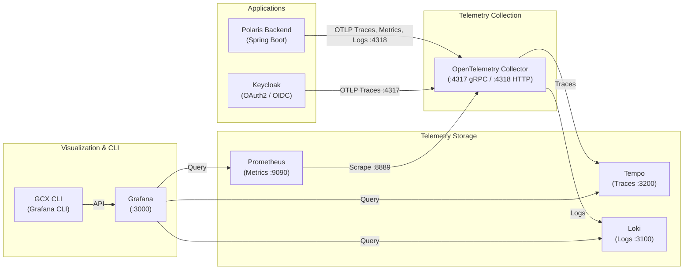

# Observability & Telemetry (LGTM Stack)

Polaris includes a production-grade local telemetry stack adhering to OpenTelemetry (OTel) standards for distributed tracing, metrics, and correlated structured logging.

---

## Architecture Overview



---

## Telemetry Components

### 1. Metrics (Prometheus & OpenTelemetry)
- **Polaris Export**: The Spring Boot backend emits runtime, HTTP, and JVM metrics using OpenTelemetry to `otel-collector:4318/v1/metrics`.
- **Scraping**: Prometheus scrapes processed metrics from `otel-collector:8889`.
- **Access**:
  - Prometheus UI: [http://localhost:9090](http://localhost:9090)
  - Grafana Metrics Dashboards: [http://localhost:3000](http://localhost:3000)

### 2. Distributed Tracing (Tempo)
- **End-to-End Tracing**: Polaris and Keycloak trace transactions end-to-end using standard W3C Trace Context (`traceparent`).
- **Keycloak Traces**: Keycloak exports gRPC OTLP traces to `otel-collector:4317` (`KC_TRACING_ENABLED=true`).
- **Polaris Traces**: Polaris forwards traces via HTTP OTLP to `otel-collector:4318/v1/traces` (100% sample rate in development).
- **Tempo Storage**: OTel Collector batches and delivers traces to Tempo (`tempo:4317`).
- **Inspection**: Traces can be queried and analyzed in Grafana via the Tempo datasource.

### 3. Correlated Logging (Loki)
- **Structured Logs**: Polaris forwards application logs with correlated `trace_id` and `span_id` metadata to `otel-collector:4318/v1/logs`, forwarded into Loki (`http://loki:3100/otlp`).
- **Log Seeding Utility**: A standalone `logseeding` container is provided to generate sample log volume:
  ```bash
  # Send a batch of 50 sample logs
  docker compose exec logseeding python logseeding.py --url http://loki:3100 --count 50

  # Continuously stream sample logs
  docker compose exec logseeding python logseeding.py --url http://loki:3100 --stream --interval 1.0
  ```

### 4. Grafana & GCX CLI
- **Grafana Web Dashboard**: Accessible at [http://localhost:3000](http://localhost:3000) (Credentials: `admin` / `admin`).
  - Pre-provisioned datasources: Prometheus (default), Loki, and Tempo.
- **Grafana CLI (GCX)**: A pre-authenticated command-line container for interacting with Grafana:
  ```bash
  # Check CLI help
  ./gcx.sh --help

  # List dashboards
  ./gcx.sh dashboards list

  # Open interactive shell in the CLI container
  make gcx
  ```

---

## Infrastructure Catalog

| Service | Container Name | Image / Source | Host Port / URL | Credentials | Purpose |
|---|---|---|---|---|---|
| **otel-collector** | `otel-collector` | `otel/opentelemetry-collector-contrib` | `4317` (gRPC), `4318` (HTTP), `8889` (metrics) | - | Central telemetry ingestion and routing |
| **prometheus** | `prometheus` | `prom/prometheus:latest` | `http://localhost:9090` | - | Time-series metrics storage and engine |
| **tempo** | `tempo` | `grafana/tempo:latest` | `http://localhost:3200`, `4319` | - | Distributed tracing backend |
| **loki** | `loki` | `grafana/loki:3.1.0` | `http://localhost:3100` | - | High-efficiency log aggregation |
| **grafana** | `grafana` | `grafana/grafana:latest` | `http://localhost:3000` | `admin` / `admin` | Unified visualization dashboard |
| **logseeding** | `logseeding` | `python:3.11-slim` | Internal only | - | Synthetic log stream generator |
| **gcx-cli** | `gcx-cli` | `debian:bookworm-slim` | CLI (`make gcx` / `./gcx.sh`) | Pre-authenticated | Grafana automation CLI |
