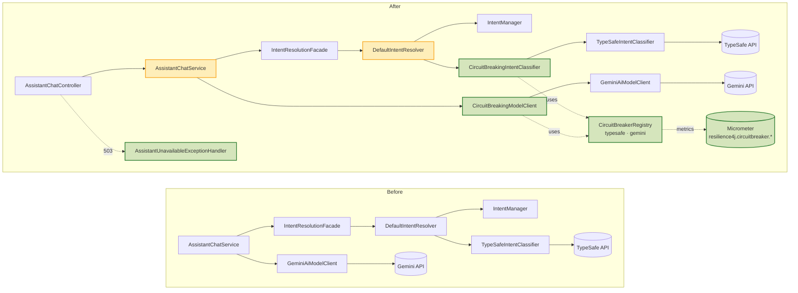
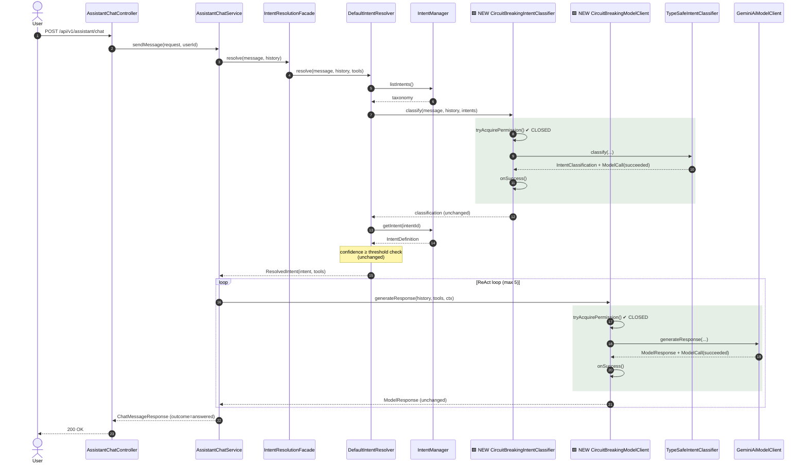
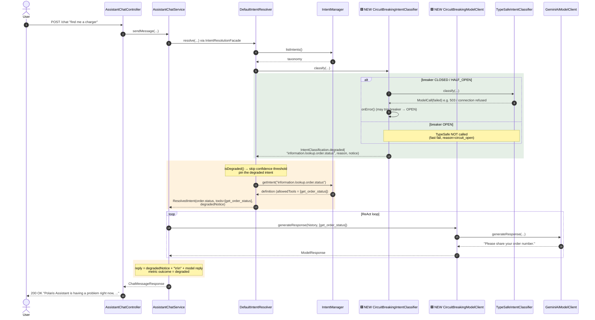
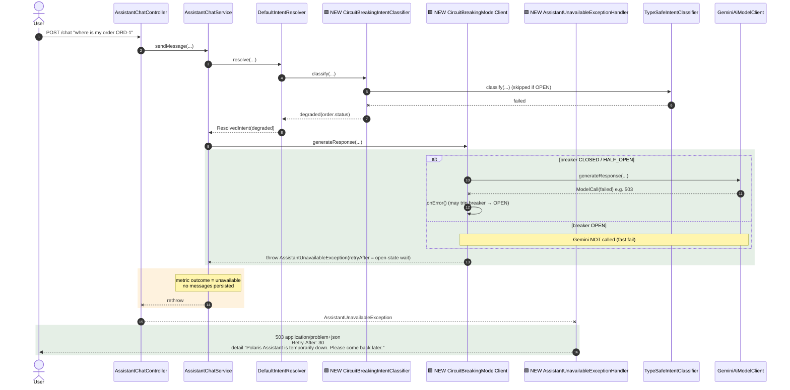
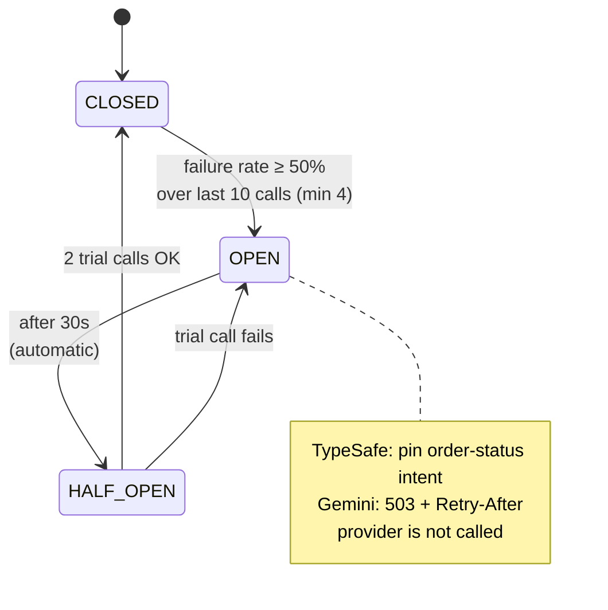

# Assistant Circuit Breakers (TypeSafe & Gemini)

How Polaris Assistant degrades when its two model providers fail, and what changed in the existing components
to get there.

| TypeSafe (intent) | Gemini (reply) | Shopper sees |
|---|---|---|
| up | up | Normal turn (unchanged) |
| **down** | up | `200 OK`, turn pinned to `information.lookup.order.status`, reply starts with *"Polaris Assistant is having a problem right now, so I can only help with checking your order status."* |
| any | **down** | `503` Problem Details *"Polaris Assistant is temporarily down. Please come back later."* + `Retry-After` |

**Legend for all diagrams:** 🟩 green / `🟩 NEW` participants = new component, 🟨 yellow = new or changed
behaviour in an existing component. Anything without a colour is unchanged.

---

## 1. Component wiring: before vs after

The breakers are **decorators** (Facade pattern, AGENTS.md P3.3). They are `@Primary`, so every existing
injection point of `IntentClassifier` / `AssistantModelClient` now gets the guarded version. The provider
clients themselves are unchanged.

---

## 2. Normal turn (both breakers CLOSED)

The behaviour is the same as before. The only addition is that each decorator records the outcome of each
provider call on its breaker.

---

## 3. TypeSafe down → degraded "order status only" turn

TypeSafe either fails (`ModelCall.failed`: I/O error, non-2xx, or an exception) or its breaker is OPEN
(then TypeSafe is not called at all). The decorator returns a **degraded** `IntentClassification` that pins the
configured `degraded-intent`. `IntentManager` is still asked for that intent's definition, so the turn only
gets the tools that intent allows (`get_order_status`). Gemini still writes the reply.

---

## 4. Gemini down (alone or with TypeSafe) → 503 "temporarily down"

Without Gemini no reply can be produced at all, not even the degraded one. The decorator throws
`AssistantUnavailableException`, either because the call failed or because the breaker is OPEN (then Gemini is
not called). `AssistantChatService` records the turn as `unavailable` and persists nothing. A dedicated
advice, ordered ahead of the shared `GlobalExceptionHandler`, maps the exception to RFC 7807.

---

## 5. Breaker lifecycle (per provider)

One breaker per provider (`typesafe`, `gemini`), configured under `polaris.assistant.resilience.circuit-breaker`.

A result where the provider was **not consulted** (missing API key: local fallback or echo) passes through
unchanged and does not count toward the breaker.

---

## 6. Impact per component

| Component | Change | Impact |
|---|---|---|
| `IntentManager` | **None** | Still the source of the taxonomy (`listIntents`) and of the degraded intent's definition (`getIntent`). It decides which tools the degraded turn may use, so the degraded intent must exist in `intents.json` / Redis. |
| `TypeSafeIntentClassifier` | **None** (now wrapped) | Called only when its breaker allows it. GenAI telemetry is still recorded for real calls, and none is recorded while the breaker is OPEN. |
| `GeminiAiModelClient` | **None** (now wrapped) | Called only when its breaker allows it. Its error-text replies (*"Unable to get response from AI Model…"*) no longer reach the shopper and become a 503 instead. |
| `CircuitBreakingIntentClassifier` 🟩 | New `@Primary IntentClassifier` | Records TypeSafe outcomes. Returns `IntentClassification.degraded(...)` when TypeSafe fails or the breaker is OPEN. |
| `CircuitBreakingModelClient` 🟩 | New `@Primary AssistantModelClient` | Records Gemini outcomes. Throws `AssistantUnavailableException` when Gemini fails or the breaker is OPEN. |
| `DefaultIntentResolver` 🟨 | Honours `isDegraded()` | Skips the confidence threshold (degraded confidence is 0.0) and carries `degradedNotice` on `ResolvedIntent`. |
| `IntentClassification` / `ResolvedIntent` 🟨 | New `degradedNotice` component | Additive. Old constructors are kept, and the field is `@JsonIgnore` on the classification. |
| `AssistantChatService` 🟨 | Prefix and new outcomes | Puts the notice in front of the reply for degraded turns. Turn outcomes `degraded` and `unavailable` on `polaris.assistant.turns`. |
| `AssistantUnavailableExceptionHandler` 🟩 | New advice (`HIGHEST_PRECEDENCE`) | Returns 503 Problem Details with `Retry-After`. Documented on the OpenAPI `/chat` operation. |
| Readiness probe 🟨 | `gemini`, `typeSafe` removed from group | An outage keeps the pod in load balancing so shoppers get the messages above instead of a gateway error. Both indicators still appear in `/actuator/health`. |

Tests covering these flows: `CircuitBreakingIntentClassifierTest`, `CircuitBreakingModelClientTest`,
`DefaultIntentResolverTest`, `AssistantChatServiceTest` (outcome metrics), `AssistantChatControllerTest`, and
the end-to-end `AssistantCircuitBreakerIntegrationTest` (WireMock TypeSafe and Gemini through `POST /chat`).
