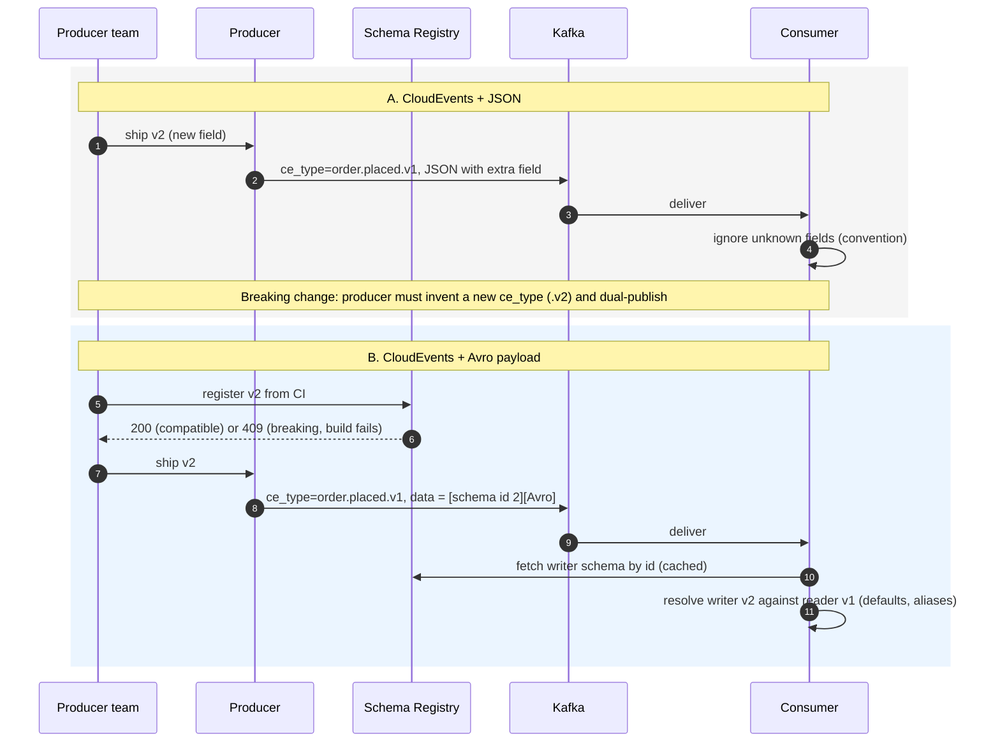
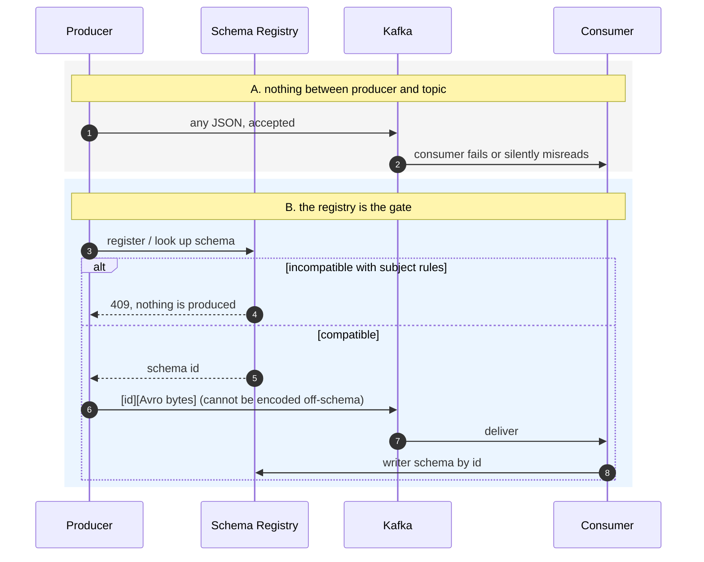

# ADR-0021: Avro payload schema (with Schema Registry) inside the CloudEvents envelope

* **Status:** Proposed. Built as additive components on branch `experiment/avro-schema-evolution`; **not adopted**. ADR-0019 stays in force and its code is unchanged.
* **Date:** 2026-10-01
* **Would amend (only if adopted):** [ADR-0019](0019-kafka-and-cloudevents-binding.md) §3.1 (value format) and §4.1 item 2 (lenient-consumer convention). CloudEvents stays the envelope.
* **Evidence:** [experiment notes](../experiments/avro-schema-evolution.md), module `libs/polaris-events-avro`.

## 1. Question

CloudEvents already standardises the **envelope** (id, type, source, time). It says nothing about the **payload schema**. Can Avro plus a Schema Registry be added as a stronger payload layer, without replacing CloudEvents?

Answer: yes. CloudEvents binary mode treats `data` as opaque bytes, so the Avro payload rides in it with `content-type: application/avro`. Nothing else in the record changes.

Two candidates:

| | A. CloudEvents + JSON (ADR-0019, today) | B. CloudEvents + Avro payload (built) |
|:--|:--|:--|
| `ce_*` headers, key, trace headers | same | same |
| `data` | JSON text | Avro, Confluent wire format |
| Schema lives in | contract record + docs | Registry subject `<topic>-value` |

A message-level Avro schema (metadata inside the value) was also built and rejected: it drops the CloudEvents envelope and forces consumers to decode before routing.

## 2. Flow: how each candidate handles a schema change

## 3. Flow: how each candidate guarantees the schema contract

## 4. Comparison

| | A. CloudEvents + JSON | B. CloudEvents + Avro payload |
|:--|:--|:--|
| Breaking change caught | never, found in production | at registration or CI (HTTP 409) **[measured]** |
| Rule for a safe change | convention: consumers ignore unknown fields | mechanical: compatibility mode per subject |
| Breaking change path | new `.vN` type, dual publish | same, but the break is detected instead of trusted |
| Producer can emit off-schema data | yes | no: encoding fails first |
| Consumer decodes old and new | only by being lenient | by schema resolution against the writer schema |

**Strongest points**
* **A:** zero new runtime dependency; events readable as text (`kafka-tail`, e2e scripts, k6).
* **B:** the contract is *enforced before the event exists*, and the same check runs in a plain unit test with no broker (`SchemaCompatibility`). The envelope, routing on headers and tracing are untouched, so adoption is one topic at a time.

**Weakest points**
* **A:** the contract is a promise. Nothing stops a producer from breaking it, and a silent field rename loses data without any error.
* **B:**
  * The registry is on the relay's path: unreachable registry fails every Avro send **[measured]**.
  * Enforcement is configuration: the same breaking schema is accepted on a subject set to `NONE` **[measured]**.
  * "Compatible" is not "correct": a rename without an alias passes the check and loses the value; a v1 reader drops v2 fields silently **[measured]**.
  * Payload is no longer text, and the wire format (magic byte + schema id) is Confluent's, not a standard.

## 5. Decision (proposed)

1. **Do not adopt yet.** With two topics and all consumers in one repository the enforcement gain does not outweigh a new critical service.
2. **If a hard contract is needed sooner, take the cheaper step first:** keep JSON and run the same compatibility gate in CI on committed schemas. No runtime service, no code change.
3. **If adopted, take B, not a message-level Avro schema.** Switch one topic by selecting `AvroKafkaEventTransport`; the CloudEvents path keeps working during migration.
4. **Minimum conditions:** schemas registered from CI with `auto.register.schemas=false`; `BACKWARD_TRANSITIVE` or stricter set by provisioning code; enums declare a default; renames use aliases; the registry gets HA, access control, metrics and a runbook as its own slice.
5. **Revisit when:** external partners consume the topics, several teams produce to shared topics, or analytics/CDC sinks are planned.

## 6. Status of the experiment

Wired end to end and the default on this branch (`polaris.events.format=avro`; `json` restores ADR-0019): Polaris publishes order events, fulfilment consumes them and publishes shipment events, Polaris updates the order status, all with Avro payloads in CloudEvents, schemas registered by the local gate. Verified live and by integration tests; see the experiment notes, section 5.

Not done: a staged rollout and rollback procedure, the outbox still stores JSON text (converted at send time), registry HA, access control and performance.
