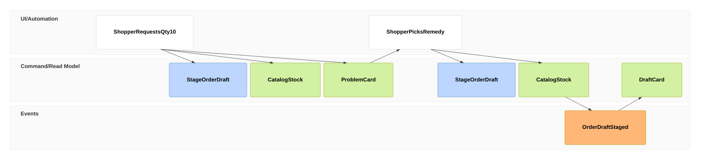
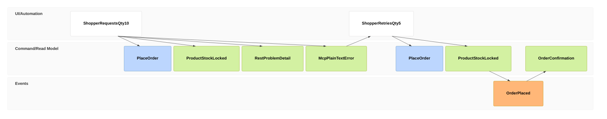

# EM-001: Out-of-Stock at Order Staging

- **Use case:** [Exception Path: Out-of-Stock at Order Staging](../../business/README.md#exception-path-out-of-stock-at-order-staging), branching off step 2 of [Business Process: Shopper Search & Order Placement](../../business/README.md#business-process-shopper-search--order-placement-bpmn).
- **Sources:** [PRD-003](../../business/prds/PRD-003-web-chat-ai-assistant.md) §3.5 / Scenario 5; [PRD-002](../../business/prds/PRD-002-comprehensive-order-apis.md) Scenario 2; [ADR-0004](../decisions/0004-web-chat-ai-assistant-architecture.md) §3 (Session & Order Draft Persistence State Machines).
- **Status:** Section 1 is the flow as specified in PRD-003/ADR-0004. Section 2 is the flow as actually implemented, verified against the code below as of 2026-09-26. They diverge — see the [Gap Analysis](#3-gap-analysis).

See the [notation](README.md#notation) for the `ui`/`cmd`/`evt`/`rmo` frame types used below.

---

## 1. As Designed (PRD-003 / ADR-0004 intent)

1. **01–02 — Command:** `StageOrderDraft` is issued with the requested quantity (10 units of `NG-WATCH-01`).
2. **03 — Given:** The assistant checks live catalog stock (`CatalogStock`, 5 available) to decide the outcome.
3. **04 — Rejected, no event:** Stock is short, so no `OrderDraftStaged` fact is recorded — the draft is not persisted. `ProblemCard` is a bare `rmo` (no `->>`) because nothing changed; its content is `InsufficientStockException{sku, requested:10, available:5}`, rendered with one-click remedies (adjust quantity / search alternatives / remove item).
4. **05–06 — Retry:** The shopper's remedy re-issues `StageOrderDraft` with a corrected quantity (5 units).
5. **07 — Given:** `CatalogStock` is checked again; this time it's sufficient.
6. **08–09 — Event & View:** `OrderDraftStaged` is recorded (`assistant_order_drafts` row, `status=WAITING_CONFIRMATION`, 15-minute TTL, price snapshot per [ADR-0004](../decisions/0004-web-chat-ai-assistant-architecture.md#b-order-draft-state-machine--expiration-ttl)), and `DraftCard` (items, total) is projected from it (`->> 08`), resuming the happy path at the confirmation gate.

---

## 2. As Built (current implementation)

There is no persisted draft anywhere in the running system: `assistant_order_drafts` and `assistant_sessions` are commented out in [`V6__assistant_session_draft_schema.sql`](../../../libs/polaris-common/src/main/resources/db/migration/V6__assistant_session_draft_schema.sql) (only `assistant_messages`, a plain chat transcript, was ever created). "Staging" exists only as the LLM's own conversational reasoning about what to order next — there is no `StageOrderDraft` command, no `draftId`, and nothing to resume. The one command that actually exists, `place_order`, both verifies and commits in a single atomic step.

1. **01–02 — Command:** The assistant calls the `place_order` MCP tool, which invokes `OrderService.placeOrder(customerId, items, idempotencyKey)` directly — [`OrderService.java:50-121`](../../../apps/polaris/src/main/java/vn/danang/polaris/order/service/OrderService.java).
2. **03 — Given:** Phase 1 of that single `@Transactional` method locks the product row (`findBySkuIgnoreCaseForUpdate`, [`OrderService.java:79-87`](../../../apps/polaris/src/main/java/vn/danang/polaris/order/service/OrderService.java)) and reads `ProductStockQty = 5`.
3. **04–05 — Rejected, no event, and the view diverges by surface:** Stock is short, so `InsufficientStockException{sku, requestedQuantity:10, availableQuantity:5}` ([`InsufficientStockException.java:3-27`](../../../libs/polaris-common/src/main/java/vn/danang/polaris/web/exception/InsufficientStockException.java)) is thrown before Phase 2 (deduction) runs; the transaction rolls back, so no `Order` row and no stock mutation occur — both `rmo` frames below are bare (no `->>`), since no event was produced:
   - `RestProblemDetail`: a direct REST client of `OrderController` gets the full RFC 7807 `ProblemDetail` with a structured `actions[]` array (`adjust_quantity`, `search_alternatives`) via `GlobalExceptionHandler.handleInsufficientStockException` ([`GlobalExceptionHandler.java:62-93`](../../../libs/polaris-common/src/main/java/vn/danang/polaris/web/exception/GlobalExceptionHandler.java)).
   - `McpPlainTextError`: the AI Assistant, going through `OrderMcpTools.placeOrder`'s catch block ([`OrderMcpTools.java:443-453`](../../../apps/polaris/src/main/java/vn/danang/polaris/mcp/OrderMcpTools.java)), only gets a formatted **plain-text** sentence with `isError(true)` — the structured `actions[]` never crosses the MCP boundary. `PolicyToolManager`/`ToolResult` on the assistant side just forward that text (`apps/polaris-assistant/.../tools/PolicyToolManager.java:252-264`, `ToolResult.java:84-89`) — there is no Problem Card component; the LLM has to improvise a remedy suggestion from prose.
4. **06–07 — Retry:** Because nothing was staged, the shopper's follow-up is a **new** `PlaceOrder` command, not a resumed draft — there is no `draftId` linking frame 07 back to frame 02.
5. **08 — Given:** `ProductStockQty` is locked and re-read; this time it's sufficient.
6. **09–10 — Event & View:** Both the `Order` row (`status=PLACED`) and the `Product.stockQty` decrement commit in the same transaction ([`OrderService.java:90-121`](../../../apps/polaris/src/main/java/vn/danang/polaris/order/service/OrderService.java)), and `OrderConfirmation` text is projected from `OrderPlaced` (`->> 09`) back to the chat.

---

## 3. Gap Analysis

| Aspect | As Designed (PRD-003 / ADR-0004) | As Built (current code) |
| :--- | :--- | :--- |
| Staging is a distinct, persisted step | `StageOrderDraft` writes an `assistant_order_drafts` row, 15-min TTL, price snapshot | Not built — the draft/session tables are commented out in [`V6__assistant_session_draft_schema.sql`](../../../libs/polaris-common/src/main/resources/db/migration/V6__assistant_session_draft_schema.sql); only the chat transcript (`assistant_messages`) persists |
| Stock check is read-only at staging, separate from commit | Yes — verify now, commit later within the TTL | No — `OrderService.placeOrder` verifies and deducts stock atomically in one transaction; there is no non-mutating verification step |
| A retried remedy resumes the same draft | Yes, via `draftId` | No — every retry is an independent `place_order` command; there is no `draftId` to reference |
| Structured remedy actions reach the shopper | Implied for all surfaces (Problem Card w/ buttons) | Only for direct REST API clients; the Assistant/MCP path gets plain text only |
| "Remove Item" remedy | Specified ([PRD-003](../../business/prds/PRD-003-web-chat-ai-assistant.md) FR-5) | Not implemented — `GlobalExceptionHandler` only builds `adjust_quantity` and `search_alternatives` actions |
| Draft expiration handling | Specified: 409 `draft-expired`, 15-min TTL | Dead code — `DraftExpiredException` is defined and handled in `GlobalExceptionHandler` but is never thrown anywhere |
| Domain/integration events (`OrderDraftStaged`, `OrderPlaced`, …) | Implied by the design's staging/confirmation split | None exist — no event bus, no `ApplicationEventPublisher`, no event classes anywhere in the codebase. The "events" in Section 2 are inferred from committed DB state changes, not published objects |

## 4. Implications

- **Price/inventory guarantee gap:** Without a persisted draft or TTL, there is no price-lock across a multi-turn remedy negotiation — each retry re-reads the live price and stock, which is simpler and still safe against overselling (thanks to the pessimistic row lock), but does not match the "guaranteed price within 15 minutes" promise in ADR-0004.
- **Inconsistent remedy UX:** Shoppers using the chat assistant today get a strictly worse error experience than a direct API integrator — a plain sentence instead of clickable remedy actions — because the structured `actions[]` payload is never threaded through the MCP tool boundary.
- **Before implementing the designed flow:** decide whether to (a) build the `assistant_order_drafts` persistence and thread `actions[]` through the MCP response, closing the gap, or (b) update PRD-003/ADR-0004 to describe the simpler as-built flow, so the two stop drifting apart.
