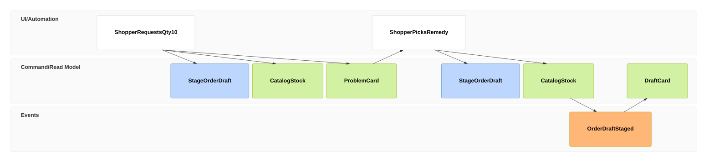
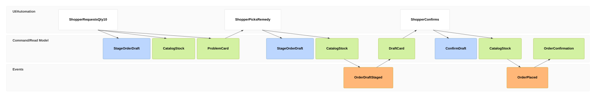

# EM-001: Out-of-Stock at Order Staging

- **Use case:** [Exception Path: Out-of-Stock at Order Staging](../../business/README.md#exception-path-out-of-stock-at-order-staging), branching off step 2 of [Business Process: Shopper Search & Order Placement](../../business/README.md#business-process-shopper-search--order-placement-bpmn).
- **Sources:** [PRD-003](../../business/prds/PRD-003-web-chat-ai-assistant.md) §3.5 / Scenario 5; [PRD-002](../../business/prds/PRD-002-comprehensive-order-apis.md) Scenario 2; [ADR-0004](../decisions/0004-web-chat-ai-assistant-architecture.md) §3 (Session & Order Draft Persistence State Machines).
- **Status:** Section 1 is the flow as specified in PRD-003/ADR-0004. Section 2 describes the as-built flow verified against the code as of 2026-09-27, after [WO-019](../work-orders/WO-019-assistant-session-and-draft-persistence.md)–[WO-022](../work-orders/WO-022-structured-remedy-actions-across-mcp-boundary.md) (PRs #8–#11, all merged into `feature/em-001-order-staging-drafts`) closed the divergence this document originally recorded on 2026-09-26. Sections 1 and 2 now largely agree — see the [Gap Analysis](#3-gap-analysis) for exactly what closed and the one item that's still open by design, not oversight (the ADR-0004 price-guarantee promise, [§4](#4-implications)).

See the [notation](README.md#notation) for the `ui`/`cmd`/`evt`/`rmo` frame types used below.

---

## 1. As Designed (PRD-003 / ADR-0004 intent)

```mermaid
eventmodeling
tf 01 ui ShopperRequestsQty10
tf 02 cmd StageOrderDraft
tf 03 rmo CatalogStock
tf 04 rmo ProblemCard
tf 05 ui ShopperPicksRemedy
tf 06 cmd StageOrderDraft
tf 07 rmo CatalogStock
tf 08 evt OrderDraftStaged
tf 09 rmo DraftCard ->> 08
```

1. **01–02 — Command:** `StageOrderDraft` is issued with the requested quantity (10 units of `NG-WATCH-01`).
2. **03 — Given:** The assistant checks live catalog stock (`CatalogStock`, 5 available) to decide the outcome.
3. **04 — Rejected, no event:** Stock is short, so no `OrderDraftStaged` fact is recorded — the draft is not persisted. `ProblemCard` is a bare `rmo` (no `->>`) because nothing changed; its content is `InsufficientStockException{sku, requested:10, available:5}`, rendered with one-click remedies (adjust quantity / search alternatives / remove item).
4. **05–06 — Retry:** The shopper's remedy re-issues `StageOrderDraft` with a corrected quantity (5 units).
5. **07 — Given:** `CatalogStock` is checked again; this time it's sufficient.
6. **08–09 — Event & View:** `OrderDraftStaged` is recorded (`assistant_order_drafts` row, `status=WAITING_CONFIRMATION`, 15-minute TTL, price snapshot per [ADR-0004](../decisions/0004-web-chat-ai-assistant-architecture.md#b-order-draft-state-machine--expiration-ttl)), and `DraftCard` (items, total) is projected from it (`->> 08`), resuming the happy path at the confirmation gate.

---

## 2. As Built (current implementation, post WO-019..WO-022)

`assistant_sessions` and `assistant_order_drafts` are real, populated tables now — [`V12__assistant_session_and_order_draft_tables.sql`](../../../libs/polaris-common/src/main/resources/db/migration/V12__assistant_session_and_order_draft_tables.sql) (additive; the original commented-out stubs in [`V6__assistant_session_draft_schema.sql`](../../../libs/polaris-common/src/main/resources/db/migration/V6__assistant_session_draft_schema.sql) are untouched, since that migration was already applied). `stage_order_draft` is a real local tool — read-only Catalog stock check, insert-or-update-by-`draftId` persistence, no order placed. Confirm/cancel are real REST endpoints hitting Order's published contract. TTL expiration is enforced two ways. Structured `actions[]`, including `remove_item`, now reaches REST, MCP, and chat surfaces identically. The atomic `place_order` path still exists unchanged — it remains valid for headless/MCP clients per [ADR-0004](../decisions/0004-web-chat-ai-assistant-architecture.md)'s Topology C, not a leftover.

```mermaid
eventmodeling
tf 01 ui ShopperRequestsQty10
tf 02 cmd StageOrderDraft
tf 03 rmo CatalogStock
tf 04 rmo ProblemCard
tf 05 ui ShopperPicksRemedy
tf 06 cmd StageOrderDraft
tf 07 rmo CatalogStock
tf 08 evt OrderDraftStaged
tf 09 rmo DraftCard ->> 08
tf 10 ui ShopperConfirms
tf 11 cmd ConfirmDraft
tf 12 rmo CatalogStock
tf 13 evt OrderPlaced
tf 14 rmo OrderConfirmation ->> 13
```

1. **01–02 — Command:** `StageOrderDraft` is the local tool `stage_order_draft` — intercepted inside `apps/polaris-assistant` **before** MCP dispatch, never a new MCP tool on `apps/polaris` (WO-020's explicit constraint). `PolicyToolManager.discoverAllTools()` appends its schema to whatever Polaris Core's MCP server reports ([`PolicyToolManager.java:144-148`](../../../apps/polaris-assistant/src/main/java/vn/danang/polaris/assistant/tools/PolicyToolManager.java)), and `handleToolCalls` routes it by name to `executeStageOrderDraft` ([`PolicyToolManager.java:184-192`](../../../apps/polaris-assistant/src/main/java/vn/danang/polaris/assistant/tools/PolicyToolManager.java), dispatch at [`PolicyToolManager.java:293-359`](../../../apps/polaris-assistant/src/main/java/vn/danang/polaris/assistant/tools/PolicyToolManager.java)) — still through the same policy/intent gate every other tool call goes through first. The actual staging logic lives in `DraftStagingService.stage` ([`DraftStagingService.java:87-138`](../../../apps/polaris-assistant/src/main/java/vn/danang/polaris/assistant/service/DraftStagingService.java)).
2. **03 — Given:** `CatalogStock` is now a genuine, separate, read-only HTTP call — `CatalogRestClient.getBySku` → `GET /api/v1/products/sku/{sku}` ([`HttpCatalogRestClient.java:71`](../../../apps/polaris-assistant/src/main/java/vn/danang/polaris/assistant/tools/HttpCatalogRestClient.java)), invoked once per requested line item from `DraftStagingService.stage` ([`DraftStagingService.java:94`](../../../apps/polaris-assistant/src/main/java/vn/danang/polaris/assistant/service/DraftStagingService.java)) — not a row lock inside the same transaction as a mutation. No stock is deducted here; this is exactly the read-only verification step ADR-0004 §1.A specifies.
3. **04 — Rejected, no event:** on the first insufficient item, `DraftStagingService.stage` returns `StageOutcome.Rejected` without creating or touching any `assistant_order_drafts` row ([`DraftStagingService.java:98-101`](../../../apps/polaris-assistant/src/main/java/vn/danang/polaris/assistant/service/DraftStagingService.java)), using the shared `InsufficientStockActions.build(ex)` helper ([`InsufficientStockActions.java:27-36`](../../../libs/polaris-common/src/main/java/vn/danang/polaris/web/exception/InsufficientStockActions.java)) for the `actions[]` list — `adjust_quantity` / `search_alternatives` / **`remove_item`** (PRD-003 FR-5, closed by WO-022, not just the first two). `ProblemCard` genuinely renders on every surface now, not just prose on some of them:
   - **Chat/SSE:** `PolicyToolManager.executeStageOrderDraft` wraps the rejection into `ToolResult.error(..., rejected.actions(), problemData(rejected))` ([`PolicyToolManager.java:349-354`](../../../apps/polaris-assistant/src/main/java/vn/danang/polaris/assistant/tools/PolicyToolManager.java)), and `AssistantChatService.emitToolOutcomeEvents` turns that into an SSE `problem` event ([`AssistantChatService.java:238-254`](../../../apps/polaris-assistant/src/main/java/vn/danang/polaris/assistant/service/AssistantChatService.java)) delivered over the new `POST /api/v1/assistant/sessions/{sessionId}/messages` streaming endpoint ([`AssistantChatController.java:63-74`](../../../apps/polaris-assistant/src/main/java/vn/danang/polaris/assistant/web/AssistantChatController.java)).
   - **Direct REST / headless MCP:** the same three-action shape reaches a direct REST client of `OrderController` via `GlobalExceptionHandler.handleInsufficientStockException`, now delegating to the same shared helper instead of its own inline two-action list ([`GlobalExceptionHandler.java:76`](../../../libs/polaris-common/src/main/java/vn/danang/polaris/web/exception/GlobalExceptionHandler.java)); and a headless MCP client calling `place_order` directly gets it via `structuredContent` — attached in `OrderMcpTools.placeOrder`'s catch block ([`OrderMcpTools.java:453-463`](../../../apps/polaris/src/main/java/vn/danang/polaris/mcp/OrderMcpTools.java)), read back out by `PolicyToolManager.extractActions` ([`PolicyToolManager.java:465-485`](../../../apps/polaris-assistant/src/main/java/vn/danang/polaris/assistant/tools/PolicyToolManager.java)), and surfaced into conversation history as a `PROBLEM_CARD` widget by `AssistantChatService.toToolTurn` ([`AssistantChatService.java:402-419`](../../../apps/polaris-assistant/src/main/java/vn/danang/polaris/assistant/service/AssistantChatService.java)). This is the "Inconsistent remedy UX" gap §4 originally named, closed by threading one shared builder to every surface rather than hand-copying the action list three times.
4. **05–06 — Retry:** the shopper's remedy re-issues `stage_order_draft`. A retry carrying the `draft_id` from a prior *successful* stage updates that same row in place instead of inserting a second one ([`DraftStagingService.java:114-123`](../../../apps/polaris-assistant/src/main/java/vn/danang/polaris/assistant/service/DraftStagingService.java)); this specific out-of-stock retry has no `draft_id` yet, because nothing was persisted from the rejected attempt (frame 04), so it is a fresh insert — the same "nothing persisted on rejection" rule holds regardless of which case applies.
5. **07 — Given:** `CatalogStock` is checked again for the corrected quantity (5 units); this time sufficient.
6. **08–09 — Event & View:** `OrderDraftStaged` is now a real, committed fact — an `assistant_order_drafts` row (schema at [`V12__assistant_session_and_order_draft_tables.sql:18-30`](../../../libs/polaris-common/src/main/resources/db/migration/V12__assistant_session_and_order_draft_tables.sql), entity at [`AssistantOrderDraft.java:32-87`](../../../apps/polaris-assistant/src/main/java/vn/danang/polaris/assistant/entity/AssistantOrderDraft.java)) with `status=WAITING_CONFIRMATION`, `expires_at` derived from the configurable `polaris.assistant.draft.ttl` (default `PT15M`), and a price snapshot per item persisted into the row's `items` column ([`DraftStagingService.java:108-129`](../../../apps/polaris-assistant/src/main/java/vn/danang/polaris/assistant/service/DraftStagingService.java)). `DraftCard` is projected from it (`->> 08`): as the SSE `draft` event on the chat surface ([`AssistantChatService.java:243-244`](../../../apps/polaris-assistant/src/main/java/vn/danang/polaris/assistant/service/AssistantChatService.java), data built by [`PolicyToolManager.java:372-390`](../../../apps/polaris-assistant/src/main/java/vn/danang/polaris/assistant/tools/PolicyToolManager.java)); as a REST resource via the confirm/cancel endpoints' shared `AssistantOrderDraftResponse` DTO.
7. **10–11 — Command (new step; not in Section 1's diagram, but real in the shipped flow):** the shopper confirms via an explicit REST call — the model never calls a "confirm" tool, per ADR-0004 §1.B's human-in-the-loop mutation-transport split. `POST /api/v1/assistant/sessions/{sessionId}/drafts/{draftId}/confirm` ([`DraftController.java:48-94`](../../../apps/polaris-assistant/src/main/java/vn/danang/polaris/assistant/web/DraftController.java)) dispatches to `DraftConfirmationService.confirm` ([`DraftConfirmationService.java:73-121`](../../../apps/polaris-assistant/src/main/java/vn/danang/polaris/assistant/service/DraftConfirmationService.java)).
8. **12 — Given:** stock is verified live a *second* time, at confirm time, via the same `CatalogRestClient.getBySku` call ([`DraftConfirmationService.java:91-99`](../../../apps/polaris-assistant/src/main/java/vn/danang/polaris/assistant/service/DraftConfirmationService.java)) — guarding the "Eventual Consistency Window" ADR-0004 itself names between staging and confirmation. A shortfall here returns `StockRejected` without mutating the draft; the shopper can re-stage.
9. **13–14 — Event & View:** `OrderPlaced` — confirm calls Order's own published contract, `POST /api/v1/orders`, via `OrderRestClient`/`HttpOrderRestClient` ([`HttpOrderRestClient.java:70`](../../../apps/polaris-assistant/src/main/java/vn/danang/polaris/assistant/tools/HttpOrderRestClient.java)) — **never `OrderService` directly** ([`DraftConfirmationService.java:106`](../../../apps/polaris-assistant/src/main/java/vn/danang/polaris/assistant/service/DraftConfirmationService.java)) — then transitions the draft to `CONFIRMED` with `confirmedOrderNumber` set ([`DraftConfirmationService.java:108-111`](../../../apps/polaris-assistant/src/main/java/vn/danang/polaris/assistant/service/DraftConfirmationService.java)) and the session to `CONFIRMED` (line 112). `OrderConfirmation` (`->> 13`) is Order's own `OrderResponse` JSON, proxied back byte-for-byte as the confirm endpoint's `201` body ([`DraftController.java:77-81`](../../../apps/polaris-assistant/src/main/java/vn/danang/polaris/assistant/web/DraftController.java)), not re-shaped.

**Draft expiration is no longer dead code.** `DraftExpiredException` — defined and handled since before this document was first written, never thrown — is now genuinely raised from `DraftConfirmationService.confirm` when `Instant.now().isAfter(draft.getExpiresAt())` ([`DraftConfirmationService.java:81-87`](../../../apps/polaris-assistant/src/main/java/vn/danang/polaris/assistant/service/DraftConfirmationService.java)), returning `409 draft-expired`. A second, independent path also exists: `DraftExpirationScheduler.expireOverdueDrafts` ([`DraftExpirationScheduler.java:32-38`](../../../apps/polaris-assistant/src/main/java/vn/danang/polaris/assistant/service/DraftExpirationScheduler.java)) proactively sweeps `WAITING_CONFIRMATION` drafts past TTL every `polaris.assistant.draft.expiration-sweep-interval` (default `PT60S`), so a draft nobody ever attempts to confirm still expires without waiting for a confirm attempt to trigger the lazy check.

**Cancel** (`POST .../drafts/{draftId}/cancel`, [`DraftController.java:96-111`](../../../apps/polaris-assistant/src/main/java/vn/danang/polaris/assistant/web/DraftController.java)) is the other terminal transition PRD-003/ADR-0004 specify — not shown in the diagram above since Section 1 didn't model it either, but implemented with the identical state guard confirm uses ([`DraftConfirmationService.java:123-137`](../../../apps/polaris-assistant/src/main/java/vn/danang/polaris/assistant/service/DraftConfirmationService.java)), deliberately *without* the TTL check: cancelling an already-expired draft is a tidy-up, not an error.

---

## 3. Gap Analysis

| Aspect | As Designed (PRD-003 / ADR-0004) | As Built (current code) |
| :--- | :--- | :--- |
| Staging is a distinct, persisted step | `StageOrderDraft` writes an `assistant_order_drafts` row, 15-min TTL, price snapshot | **Closed (WO-019/WO-020).** `assistant_sessions`/`assistant_order_drafts` are real tables ([`V12__assistant_session_and_order_draft_tables.sql`](../../../libs/polaris-common/src/main/resources/db/migration/V12__assistant_session_and_order_draft_tables.sql)); `stage_order_draft` persists a priced `AssistantOrderDraft` row with a configurable TTL ([`DraftStagingService.java:108-129`](../../../apps/polaris-assistant/src/main/java/vn/danang/polaris/assistant/service/DraftStagingService.java)) |
| Stock check is read-only at staging, separate from commit | Yes — verify now, commit later within the TTL | **Closed (WO-020).** `CatalogRestClient.getBySku` (`GET /api/v1/products/sku/{sku}`) is called at staging time with no deduction. The atomic `OrderService.placeOrder` path still exists unchanged for headless/MCP clients calling `place_order` directly (ADR-0004 Topology C) — a second, still-valid entry point by design, not a regression |
| A retried remedy resumes the same draft | Yes, via `draftId` | **Closed (WO-020).** `stage_order_draft` accepts an optional `draft_id`; supplying one already staged updates that row in place ([`DraftStagingService.java:114-123`](../../../apps/polaris-assistant/src/main/java/vn/danang/polaris/assistant/service/DraftStagingService.java)) instead of inserting a second draft for the same conversational retry |
| Structured remedy actions reach the shopper | Implied for all surfaces (Problem Card w/ buttons) | **Closed (WO-020/WO-022).** REST ([`GlobalExceptionHandler.java:76`](../../../libs/polaris-common/src/main/java/vn/danang/polaris/web/exception/GlobalExceptionHandler.java)), MCP `place_order` ([`OrderMcpTools.java:453-463`](../../../apps/polaris/src/main/java/vn/danang/polaris/mcp/OrderMcpTools.java) → [`PolicyToolManager.java:465-485`](../../../apps/polaris-assistant/src/main/java/vn/danang/polaris/assistant/tools/PolicyToolManager.java)), and the chat/SSE surface (`stage_order_draft`'s `problem` event, [`AssistantChatService.java:238-254`](../../../apps/polaris-assistant/src/main/java/vn/danang/polaris/assistant/service/AssistantChatService.java); `place_order`'s `PROBLEM_CARD` widget, [`AssistantChatService.java:402-419`](../../../apps/polaris-assistant/src/main/java/vn/danang/polaris/assistant/service/AssistantChatService.java)) all render the same `actions[]` |
| "Remove Item" remedy | Specified ([PRD-003](../../business/prds/PRD-003-web-chat-ai-assistant.md) FR-5) | **Closed (WO-020/WO-022).** `InsufficientStockActions.build` ([`InsufficientStockActions.java:27-36`](../../../libs/polaris-common/src/main/java/vn/danang/polaris/web/exception/InsufficientStockActions.java)) always appends `remove_item`; every surface in the row above calls this one method, so there is exactly one implementation of the action list, not three hand-copied ones |
| Draft expiration handling | Specified: 409 `draft-expired`, 15-min TTL | **Closed (WO-021).** `DraftExpiredException` is thrown from `DraftConfirmationService.confirm` on a lapsed TTL ([`DraftConfirmationService.java:81-87`](../../../apps/polaris-assistant/src/main/java/vn/danang/polaris/assistant/service/DraftConfirmationService.java)), plus a proactive scheduled sweep ([`DraftExpirationScheduler.java:32-38`](../../../apps/polaris-assistant/src/main/java/vn/danang/polaris/assistant/service/DraftExpirationScheduler.java)) for drafts nobody ever attempts to confirm |
| Price guaranteed for the TTL window | Specified: "guaranteed" price within 15 minutes (ADR-0004 §3.B) | **Still open, named precisely, not silently worked around.** `DraftStagingService` snapshots a price into `DraftItemSnapshot` at staging time, but `POST /api/v1/orders`'s published `CreateOrderRequest`/`OrderItemRequest` contract has no field to carry a locked/expected unit price — `OrderService.placeOrder` always re-prices from the *live* catalog price at confirm time regardless of the snapshot. Honoring this literally needs an additive contract change to the Order context's published request shape — a stable-boundary change requiring its own ADR, outside WO-019–022's scope (see WO-021 §2 Task 5's "Known Limitation" note) |
| Domain/integration events (`OrderDraftStaged`, `OrderPlaced`, …) | Implied by the design's staging/confirmation split | **Unchanged — still not built, and never in scope for WO-019–022.** No event bus, no `ApplicationEventPublisher`, no event classes exist anywhere in the codebase. The `evt` frames in Section 2 are still inferred from committed DB/downstream state changes (an `AssistantOrderDraft`/`Order` row existing), not published objects — a documentation convenience, not a built capability |

## 4. Implications

- **Gap closed:** persisted draft staging (WO-019/020), live stock re-verification at both staging and confirm time (WO-020/021), TTL expiration enforced both lazily and proactively (WO-021), and structured remedies reaching every surface identically (WO-020/022) are now real, not aspirational. Six of the eight rows in the Gap Analysis table above are closed; the two that remain open are named precisely below, not glossed over.
- **Still open, by design, not by oversight:** the price-guarantee promise in ADR-0004 §3.B ("guaranteed price within 15 minutes") is not honored — `POST /api/v1/orders` has no mechanism to accept or validate a locked unit price, so a draft's snapshotted price is informational only; the live catalog price at confirm time is authoritative. Closing this for real means an additive, ADR-gated change to the Order context's published `CreateOrderRequest` contract (e.g. an optional expected-price-per-line field with a tolerance check) — a cross-context, stable-boundary change outside any of WO-019 through WO-022's scope, and correctly not worked around silently by any of them. Whoever picks this up next should start from WO-021 §2 Task 5's "Known Limitation" note, not from scratch.
- **Domain/integration events remain undone**, and were never in scope for this initiative — Section 2's `evt` frames are still committed-row inference, not published objects. If a future initiative needs `OrderDraftStaged`/`OrderPlaced` as real integration events (e.g. for a downstream consumer), that is a new ADR, not a continuation of WO-019–022.
- **Resolution history (kept for record):** the decision recorded 2026-09-26 was option (a) — build the designed flow rather than simplify the docs to match the as-built one. It was decomposed into four Slice Work Orders, each vertically complete within a single bounded context, all now merged into `feature/em-001-order-staging-drafts`:
  - [WO-019](../work-orders/WO-019-assistant-session-and-draft-persistence.md) (PR #8) — `assistant_sessions`/`assistant_order_drafts` schema, entities, repositories.
  - [WO-020](../work-orders/WO-020-stage-order-draft-orchestration.md) (PR #9) — read-only stock verification, insert-or-update-by-`draftId` staging, and the SSE transport carrying `draft`/`problem` events.
  - [WO-021](../work-orders/WO-021-confirm-cancel-draft-and-ttl-expiration.md) (PR #10) — confirm/cancel REST endpoints, live re-verification at confirm time, and TTL expiration (making `DraftExpiredException` reachable).
  - [WO-022](../work-orders/WO-022-structured-remedy-actions-across-mcp-boundary.md) (PR #11) — threaded `actions[]` (including `remove_item`) through the MCP boundary so `place_order` gets the same structured remedies `stage_order_draft` and direct REST clients do.
