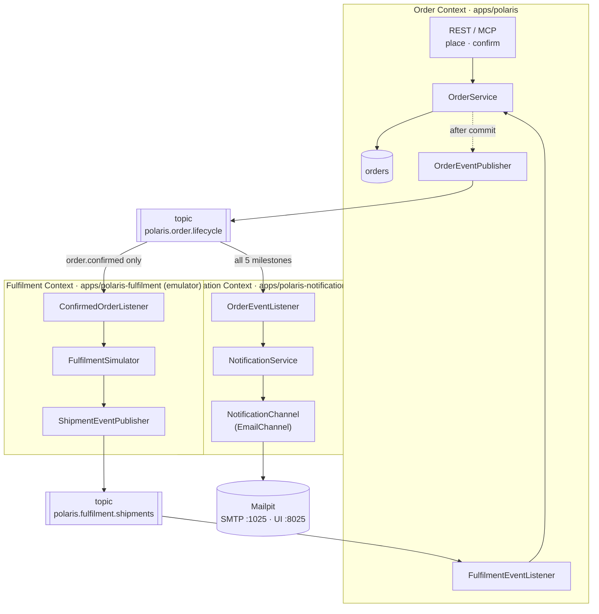
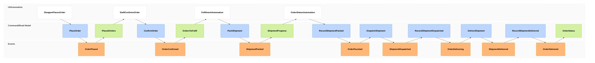
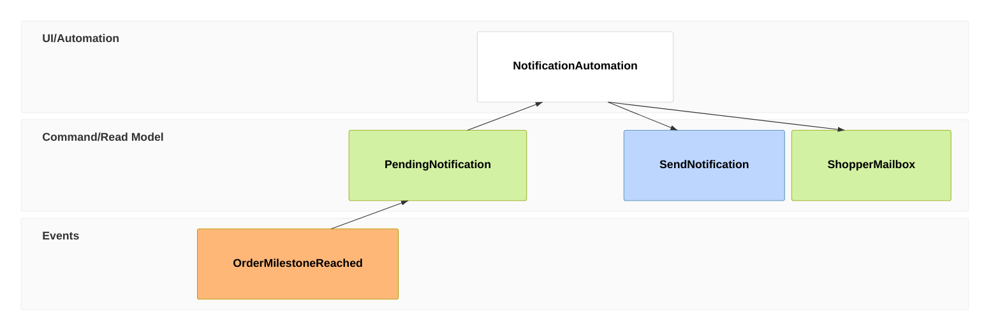

# EM-002: Order Lifecycle Notifications & Fulfilment (Kafka)

- **Use case:** "Follow my order" — [PRD-007](../../business/prds/PRD-007-order-notifications-and-fulfilment-emulator.md) §2, from order placement to delivery, with one shopper email per milestone.
- **Sources:** [PRD-007](../../business/prds/PRD-007-order-notifications-and-fulfilment-emulator.md); order statuses from [PRD-002](../../business/prds/PRD-002-comprehensive-order-apis.md) and [`OrderStatus.java`](../../../apps/polaris/src/main/java/vn/danang/polaris/order/entity/OrderStatus.java).
- **Status:** **Design only, not yet built.** Unlike [EM-001](EM-001-order-staging-out-of-stock-exception.md) this model has no as-built section; every box below is to be implemented. The [As-Is Baseline](#1-as-is-baseline) lists what already exists.
- **Scope:** Happy path only. It is a demo of Kafka + Spring Boot inside Polaris, not a production fulfilment design.

See the [notation](README.md#notation) for frame types. Two conventions are specific to this model:
- An `evt` frame here **is published**: it's a CloudEvent on a Kafka topic, written after the owning context commits its state change (§4).
- An automated application acting on events (Fulfilment, the Order status updater, Notification) appears as a `ui` frame named `…Automation`. It plays the same role as a screen: it reads the preceding view and issues the next command.

---

## 1. As-Is Baseline

| Needed | Exists today? |
| :--- | :--- |
| Statuses `PLACED`, `CONFIRMED`, `PARCELED`, `DELIVERING`, `DELIVERED` | Yes: [`OrderStatus.java:5`](../../../apps/polaris/src/main/java/vn/danang/polaris/order/entity/OrderStatus.java), DB `CHECK` in [`V1__init_schema.sql:22-23`](../../../libs/polaris-common/src/main/resources/db/migration/V1__init_schema.sql). **No migration needed.** |
| `PlaceOrder` command | Yes: `OrderService.placeOrder` ([`OrderService.java:50-121`](../../../apps/polaris/src/main/java/vn/danang/polaris/order/service/OrderService.java)), REST `POST /api/v1/orders` and MCP `place_order` |
| `ConfirmOrder` command | **No.** Nothing sets `CONFIRMED` |
| Transitions to `PARCELED` / `DELIVERING` / `DELIVERED` | **No** |
| Customer email for the recipient | Yes: `Customer.email` ([`Customer.java:29`](../../../apps/polaris/src/main/java/vn/danang/polaris/order/entity/Customer.java)) |
| Kafka, event publishing, Mailpit | **No.** No broker in [`docker-compose.yml`](../../../docker-compose.yml) and no `spring-kafka` dependency |

---

## 2. Context Map

Three bounded contexts talk only through two Kafka topics. Each topic is owned by the context that publishes to it.



**Key decision: Order relays fulfilment progress; Notification never listens to Fulfilment.**
Fulfilment reports *shipment* facts (`packed`, `dispatched`, `delivered`) on its own topic. The Order Context, the single owner of order status, turns them into *order* milestones and republishes them on `polaris.order.lifecycle`. As a result:
- Notification depends on exactly one published contract (Order's), whatever produces the milestones.
- An email is sent only after the order status has actually been saved, so the shopper never hears "delivered" for an order the system still shows as `DELIVERING`.
- Fulfilment never writes to Order's tables or calls Order's internals ([AGENTS.md](../../../AGENTS.md) Principle 2.2).

---

## 3. Event Model

### 3.1 Order journey (Order ↔ Fulfilment)



1. **01–03 — Place (exists):** The shopper (via the Assistant's `place_order` tool or REST) issues `PlaceOrder`. The order is saved `PLACED` and stock deducted, as today. **New:** once the transaction commits, `OrderPlaced` is published. An idempotent replay of the same `Idempotency-Key` returns the existing order and publishes nothing.
2. **04–07 — Confirm (new):** Staff see the placed order (`PlacedOrders` is the existing `GET /api/v1/orders?status=PLACED`) and issue `ConfirmOrder` → `POST /api/v1/orders/{orderNumber}/confirm` (`ROLE_STAFF`). Allowed only from `PLACED`; any other status → `409` Problem Detail and no event. On success: `CONFIRMED`, then `OrderConfirmed` is published.
3. **08–11 — Pack (Fulfilment):** `OrdersToFulfil` is Fulfilment's view of `polaris.order.lifecycle`, filtered to `ce_type = …order.confirmed.v1`; it ignores every other type. `FulfilmentAutomation` waits `step-delay`, then `PackShipment` → publishes `ShipmentPacked` on `polaris.fulfilment.shipments`.
4. **12–15 — Order follows (Order Context):** `OrderStatusAutomation` (`FulfilmentEventListener` in `apps/polaris`) reads `ShipmentPacked` and issues `RecordShipmentPacked` → `OrderService.recordShipmentProgress(orderNumber, PACKED)`, which moves `CONFIRMED → PARCELED` and publishes `OrderParceled`.
5. **16–23 — Dispatch and deliver:** Same pattern twice more. Fulfilment schedules each next step on its own timer (it does not wait for Order), and Order maps `ShipmentDispatched → DELIVERING` and `ShipmentDelivered → DELIVERED`, publishing `OrderDelivering` and `OrderDelivered`.
6. **24 — View:** `OrderStatus` is the existing `GET /api/v1/orders/{orderNumber}/status` and MCP `get_order_details`, now showing `DELIVERED`.

**Rejected / no-op commands (bare `rmo`, no event):** each `Record…` command is guarded by the expected *previous* status (`PACKED` needs `CONFIRMED`, `DISPATCHED` needs `PARCELED`, `DELIVERED` needs `DELIVERING`). A duplicate or late report finds the order in some other status, logs at `INFO`, and publishes nothing, so no duplicate email is sent ([PRD-007](../../business/prds/PRD-007-order-notifications-and-fulfilment-emulator.md) Scenario 5). A `CANCELLED` order also stops here, even if the emulator keeps running.

### 3.2 Notification slice (repeats for each of the 5 order milestones)



1. **01:** Any of `OrderPlaced`, `OrderConfirmed`, `OrderParceled`, `OrderDelivering`, `OrderDelivered` arrives on `polaris.order.lifecycle`.
2. **02:** `PendingNotification` is built only from the event data: recipient (`customer.email`, `customer.name`), order number, milestone, and items and total. Notification never calls back into the Order Context (event-carried state transfer).
3. **03–04:** `NotificationService` picks the template for the milestone and sends `SendNotification` to every enabled `NotificationChannel`. Only `EmailChannel` exists now, and it is the default. It uses Spring `JavaMailSender` over SMTP to Mailpit.
4. **05 — bare `rmo`:** The Notification Context persists nothing (no table, no event). The only outcome is the message in the shopper's mailbox, which is Mailpit's inbox in local development. Adding a notification log with `NotificationSent` events is deferred (§7).

---

## 4. Event Contracts (CloudEvents on Kafka)

Every message uses **CloudEvents 1.0, Kafka protocol binding, binary content mode**:
- CloudEvents attributes go in Kafka headers: `ce_specversion=1.0`, `ce_id` (UUID), `ce_source`, `ce_type`, `ce_subject` (= order number), `ce_time`, `content-type=application/json`.
- The record **key** is the order number, so all events of one order land on the same partition and are consumed in order.
- The record **value** is the JSON `data` shown below.
- W3C `traceparent` / `tracestate` headers are added automatically by Spring Kafka observation (§5.3).

### 4.1 Topics

| Topic | Owner (sole producer) | Consumers (group id) | Partitions (dev) | Key |
| :--- | :--- | :--- | :--- | :--- |
| `polaris.order.lifecycle` | Order Context (`ce_source=/polaris/order`) | `polaris-fulfilment`, `polaris-notification` | 3 | `orderNumber` |
| `polaris.fulfilment.shipments` | Fulfilment Context (`ce_source=/polaris/fulfilment`) | `polaris-order` | 3 | `orderNumber` |

Each owner declares its topic as a `NewTopic` bean, so the topic is created on startup. The broker's auto-create is turned off to keep dev behaviour close to production.

### 4.2 Event catalogue

| `ce_type` | Topic | Emitted when | Consumed by |
| :--- | :--- | :--- | :--- |
| `vn.danang.polaris.order.placed.v1` | order.lifecycle | `PLACED` committed | Notification |
| `vn.danang.polaris.order.confirmed.v1` | order.lifecycle | `PLACED → CONFIRMED` | Notification, Fulfilment |
| `vn.danang.polaris.order.parceled.v1` | order.lifecycle | `CONFIRMED → PARCELED` | Notification |
| `vn.danang.polaris.order.delivering.v1` | order.lifecycle | `PARCELED → DELIVERING` | Notification |
| `vn.danang.polaris.order.delivered.v1` | order.lifecycle | `DELIVERING → DELIVERED` | Notification |
| `vn.danang.polaris.fulfilment.shipment.packed.v1` | fulfilment.shipments | emulator packed | Order |
| `vn.danang.polaris.fulfilment.shipment.dispatched.v1` | fulfilment.shipments | emulator dispatched | Order |
| `vn.danang.polaris.fulfilment.shipment.delivered.v1` | fulfilment.shipments | emulator delivered | Order |

All five order events share **one payload shape** (`OrderLifecycleEvent`), so consumers use a single DTO and switch on `ce_type`/`status`. All three shipment events share `ShipmentEvent`.

`OrderLifecycleEvent` (value of `vn.danang.polaris.order.*.v1`):
```json
{
  "orderNumber": "ORD-10042",
  "status": "CONFIRMED",
  "occurredAt": "2026-09-28T09:15:02.311Z",
  "customer": { "id": 1, "name": "Alice Tran", "email": "alice.tran@example.com" },
  "items": [
    { "sku": "NG-EARBUD-01", "name": "Nova Wireless Earbuds", "quantity": 1, "unitPrice": "49.90" },
    { "sku": "NG-CHARGER-01", "name": "Fast Charger", "quantity": 2, "unitPrice": "24.90" }
  ],
  "totalAmount": "99.70",
  "currency": "USD"
}
```
Money is a JSON **string**, so no float rounding is possible and consumers need no special `BigDecimal` deserializer settings.

`ShipmentEvent` (value of `vn.danang.polaris.fulfilment.shipment.*.v1`):
```json
{ "orderNumber": "ORD-10042", "shipmentId": "SHP-7f3c…", "step": "PACKED", "occurredAt": "2026-09-28T09:15:07.402Z" }
```

**Versioning:** The `.v1` suffix is in `ce_type`, not the topic name. Changes are additive only (new optional fields). A breaking change would introduce `.v2` types on the same topic, published alongside `.v1` during a deprecation window.

**Where the contract lives:** The payload records go in `libs/polaris-common` under `vn.danang.polaris.events.order` / `.fulfilment`, together with a `CloudEventHeaders` constants class. This shared package is the *published contract* only: no behaviour, and no JPA entities.

---

## 5. Application Design

### 5.1 Order Context: `apps/polaris` (changed)

| Component | Responsibility |
| :--- | :--- |
| `OrderController` | **+** `POST /api/v1/orders/{orderNumber}/confirm`, `@PreAuthorize("hasRole('STAFF')")` → `200 OrderResponse`, `404`/`409` Problem Detail |
| `OrderService` | **+** `confirmOrder(orderNumber)`, **+** `recordShipmentProgress(orderNumber, ShipmentStep)`. Each state change publishes a Spring `OrderStatusChanged` application event *inside* the transaction; so does the existing `placeOrder` (new orders only, not idempotent replays). |
| `order/messaging/OrderEventPublisher` | `@TransactionalEventListener(phase = AFTER_COMMIT)` maps `OrderStatusChanged` → `OrderLifecycleEvent` and sends it with `KafkaTemplate`. Because it runs after commit, an event is never published for a rolled-back change. |
| `order/messaging/FulfilmentEventListener` | `@KafkaListener(topics = "polaris.fulfilment.shipments", groupId = "polaris-order")` → `OrderService.recordShipmentProgress` |
| `order/messaging/KafkaTopicsConfig` | `NewTopic polaris.order.lifecycle` |

Status guard (the only new domain rule), added to `OrderStatus`:
```java
public OrderStatus next(ShipmentStep step)   // CONFIRMED+PACKED→PARCELED, PARCELED+DISPATCHED→DELIVERING, DELIVERING+DELIVERED→DELIVERED, else empty/no-op
```

### 5.2 Fulfilment Context: `apps/polaris-fulfilment` (new, stateless emulator)

| Package | Component | Responsibility |
| :--- | :--- | :--- |
| `messaging` | `ConfirmedOrderListener` | Consumes `polaris.order.lifecycle` and ignores every `ce_type` except `order.confirmed.v1` |
| `domain` | `FulfilmentSimulator` | Uses `TaskScheduler` to schedule `PACKED` at +d, `DISPATCHED` at +2d and `DELIVERED` at +3d (`d = polaris.fulfilment.step-delay`, default `PT5S`) |
| `messaging` | `ShipmentEventPublisher` | Sends `ShipmentEvent` to `polaris.fulfilment.shipments` |
| `config` | `FulfilmentProperties`, `KafkaTopicsConfig` | Step delay; `NewTopic polaris.fulfilment.shipments` |

No database and no REST API (only `/actuator`). If the emulator restarts, in-flight simulations are lost. That is acceptable for a demo; to recover an order, confirm a new one.

### 5.3 Notification Context: `apps/polaris-notification` (new, stateless)

| Package | Component | Responsibility |
| :--- | :--- | :--- |
| `messaging` | `OrderEventListener` | Consumes all 5 `order.*.v1` types from `polaris.order.lifecycle` |
| `domain` | `NotificationService` | Builds a `Notification(recipient, subject, body, milestone)` from the event and sends it to every enabled channel |
| `domain` | `NotificationChannel` (interface) | `ChannelType type(); void send(Notification n)`. Adding SMS or push later means adding one more bean. |
| `channel.email` | `EmailChannel` | `JavaMailSender`, plain-text templates per milestone (`templates/order-<status>.txt`) |
| `config` | `NotificationProperties` | `polaris.notification.channels=email` (default), `polaris.notification.from=no-reply@polaris.local` |

Dependency direction: `messaging → domain ← channel.email` (the domain owns the `NotificationChannel` port, and channels implement it).

### 5.4 Cross-cutting (applies to all three apps)

| Concern | How |
| :--- | :--- |
| **Tracing** | `spring.kafka.template.observation-enabled=true` and `spring.kafka.listener.observation-enabled=true` add W3C `traceparent` to each record header and continue the trace on consume. Fulfilment's delayed steps run on a `TaskScheduler` wrapped with `ContextPropagatingTaskDecorator`, so the trace survives the delay. Result: one trace from `POST /confirm` through three shipment steps to the emails. |
| **Logs** | Existing OTLP logback appender; every log line carries `trace_id`, `span_id`, `orderNumber`, `ce_type`. |
| **Metrics** | Built-in `spring.kafka.template` / `spring.kafka.listener` timers; **+** `polaris.notifications.sent{channel,milestone,outcome}` counter. Exported over OTLP as today. |
| **Serialization** | Producer: `JsonSerializer` with `spring.json.add.type.headers=false`, so there are no Java class names on the wire. Consumer: `StringDeserializer`, then Jackson maps the value to the DTO chosen by `ce_type`. |
| **Errors** | Default `DefaultErrorHandler` (a few in-memory retries with back-off, then log and skip). No DLT for the demo. |
| **Config (12-factor)** | `SPRING_KAFKA_BOOTSTRAP_SERVERS=kafka:9092`, `SPRING_MAIL_HOST=mailpit`, `SPRING_MAIL_PORT=1025`, `POLARIS_FULFILMENT_STEP_DELAY=PT5S`, plus the existing `MANAGEMENT_OTLP_*` / `MANAGEMENT_OPENTELEMETRY_*` endpoints |

### 5.5 Local infrastructure (`docker-compose.yml` additions)

| Service | Image | Notes |
| :--- | :--- | :--- |
| `kafka` | `apache/kafka` (pin the version when implementing) | Single node in KRaft mode (no ZooKeeper), PLAINTEXT listener `kafka:9092` on `polaris-net`, `KAFKA_AUTO_CREATE_TOPICS_ENABLE=false` |
| `mailpit` | `axllent/mailpit` (pin the version when implementing) | SMTP `1025` (internal), web UI `8025` published to the host → `http://localhost:8025` |
| `polaris-fulfilment` | built from `apps/polaris-fulfilment/Dockerfile` | depends on `kafka` |
| `polaris-notification` | built from `apps/polaris-notification/Dockerfile` | depends on `kafka`, `mailpit` |

`pom.xml` gets two new `<module>` entries. `spring-kafka` and `spring-boot-starter-mail` versions come from the Spring Boot parent.

---

## 6. Delivery Guarantees (what "simple" gives up)

| Situation | Behaviour | Accepted because |
| :--- | :--- | :--- |
| DB commit succeeds, then the Kafka send fails or the app crashes | Milestone event lost: no email, and Fulfilment never starts for a lost `confirmed` | Demo scope. Upgrade path: a **transactional outbox** table in `polaris-db`, relayed to Kafka |
| Consumer processes a record, then crashes before committing the offset | Record redelivered (at-least-once). Order: the status guard makes it a no-op. Notification: **duplicate email** | Demo scope. Upgrade path: a `processed_events(ce_id)` table in Notification |
| Emulator restarts mid-simulation | That order stays at its last milestone | Emulator only |
| Order cancelled while fulfilment is simulated | Emulator keeps publishing. Order's status guard ignores the reports (`CANCELLED` is not a valid previous state). No email | Cancellation notifications are out of scope ([PRD-007](../../business/prds/PRD-007-order-notifications-and-fulfilment-emulator.md) §6) |

Ordering: per-order ordering holds because every event is keyed by `orderNumber` and each consumer group reads a partition sequentially.

---

## 7. Implementation Slices

Split per bounded context ([AGENTS.md](../../../AGENTS.md) Principle 2). Each slice works end-to-end on its own and can be verified against real Kafka.

| # | Slice | Context | Done when | Tests |
| :--- | :--- | :--- | :--- | :--- |
| S0 | Kafka + Mailpit in compose; `events` contract package in `polaris-common` | Platform | `docker compose up` starts both, and Mailpit UI is reachable | JSON round-trip test for each payload record |
| S1 | `ConfirmOrder` endpoint + `OrderEventPublisher` | Order | Placing and confirming an order produces `placed`/`confirmed` records on `polaris.order.lifecycle` | `@SpringBootTest` + **Testcontainers Kafka**: publish after commit, nothing on rollback, nothing on idempotent replay; `409` on invalid confirm |
| S2 | `FulfilmentEventListener` + `recordShipmentProgress` | Order | Hand-produced shipment events move the order to `DELIVERED` and republish milestones | Testcontainers Kafka; guard matrix (valid, duplicate, out-of-order, cancelled) |
| S3 | `apps/polaris-fulfilment` | Fulfilment | A confirmed event yields 3 shipment events in order | Testcontainers Kafka, with `step-delay=PT0.1S` |
| S4 | `apps/polaris-notification` | Notification | Each order event yields one email in Mailpit | Testcontainers Kafka + **Mailpit container**, asserting through Mailpit's REST API (`GET /api/v1/messages`) |
| S5 | End-to-end demo | All | [PRD-007](../../business/prds/PRD-007-order-notifications-and-fulfilment-emulator.md) Scenarios 1–3 and 6: 5 emails in Mailpit and one connected trace in Grafana | `tests/e2e` script: place → confirm → poll Mailpit for 5 messages |

S3 and S4 depend only on S0's contract and can be built in parallel with S1–S2.
