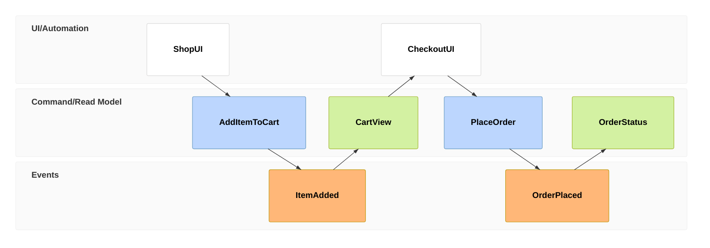

# Event Models

Event Modeling decomposes a single use case into the chronological sequence of **Commands**, **Events**, and **Read Models / Views** that carry it out — a complement to the [BPMN process flows](../../business/README.md) (control flow across actors) and [sequence diagrams](../architecture/) (call order between components), focused instead on *what information moves through the system, and what it's built from*.

## Why a separate lane from BPMN/sequence diagrams

- BPMN answers "who does what, in what order." Event Modeling answers "what command was issued, what fact resulted (or didn't), and what did the acting party actually see" — which surfaces gaps between a *designed* flow and what's *actually implemented* far more readily than a process flowchart does, because every box has to name a concrete command, event, or read model rather than a step description.
- This matters most for exception/branch paths, where PRDs and ADRs tend to specify an idealized recovery flow (e.g. a persisted draft with a TTL) well before — or instead of — it being built. An Event Model is only useful if it's honest about which boxes are real, citing `file:line`, and which are design-only.

## Notation

Diagrams use Mermaid's `eventmodeling` diagram type: a single chronological timeline of numbered frames (`tf NN <type> <Name>`), one frame per Command/Event/Read-Model/UI step:

| Frame type | Meaning |
| :--- | :--- |
| `ui` | The acting party's trigger — a screen, chat turn, or button click that issues the next command. |
| `cmd` | An intent to change state, named as an imperative verb phrase: `PlaceOrder`. |
| `evt` | A fact that already happened, named in past tense: `OrderPlaced`. This repo has no event bus or domain-event classes (see [EM-001](EM-001-order-staging-out-of-stock-exception.md) Gap Analysis), so an `evt` frame here means a durable fact committed to the database, not a published object. |
| `rmo` | A read model / view projected from state. `->> NN` names the `evt` frame it was built from; a bare `rmo` with no `->>` is a live query or a response with no new event behind it — including a **rejected command**, which is always shown as a `rmo` with no `->>` rather than invented as a fake `evt`, since a rejection changes nothing. |

The frame immediately consulted by a `cmd` (its "Given") is whichever `rmo` precedes it in the timeline.

## Numbering

Event Models are numbered `EM-NNN`, sequentially, independent of the `ADR-NNNN`/`WO-NNN`/`PRD-NNN` series. Each one should cite:
1. The business use case it documents (link into [`business/README.md`](../../business/README.md) or a [PRD](../../business/prds/)).
2. Any [ADR](../decisions/) that specifies the intended design.
3. `file:line` citations for every box claimed as already implemented.

## Index

- [EM-001 — Out-of-Stock at Order Staging](EM-001-order-staging-out-of-stock-exception.md) — the exception path branching off [Business Process: Shopper Search & Order Placement](../../business/README.md#exception-path-out-of-stock-at-order-staging); as-designed draft-staging flow (PRD-003 / ADR-0004) vs. as-built single atomic `place_order` command.
