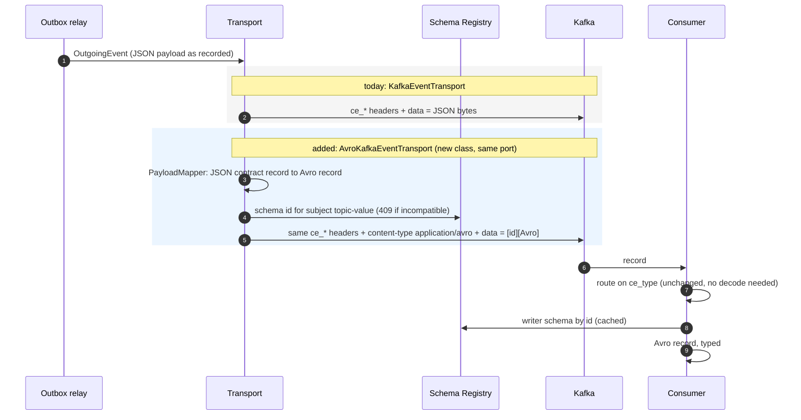
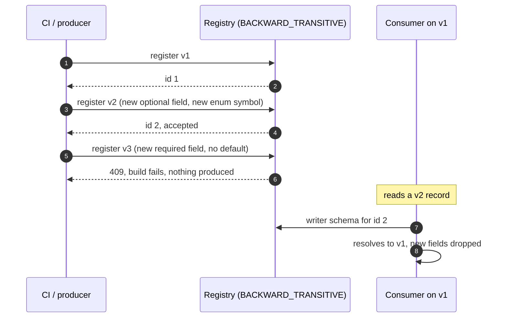
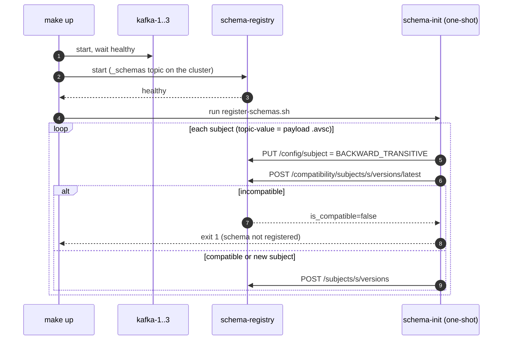

# Experiment: an Avro layer inside the CloudEvents envelope

* **Status:** Experiment, not adopted. Branch `experiment/avro-schema-evolution`. Nothing in `apps/`, `polaris-outbox` or `polaris-events` is changed.
* **Decision record:** [ADR-0021](../decisions/0021-avro-schema-registry-vs-cloudevents.md).
* **Question:** keep CloudEvents (ADR-0019) and add Avro + Schema Registry only as a stronger **payload** schema. What changes, and what does Avro add?
* Labels: **[measured]** observed in this module's tests; **[doc]** known behaviour not re-tested here.

## 1. What changes in the architecture

Only the `data` of the record and one new dependency. Envelope, key, trace headers and the relay are the same.

| Piece (all in `libs/polaris-events-avro`) | Role |
|:--|:--|
| `*.avsc` payload schemas | Avro twins of the order and shipment payloads; generated classes |
| `AvroPayloadMapper` per destination | `OutgoingEvent` JSON to the Avro payload record |
| `AvroKafkaEventTransport implements EventTransport` | Builds the CloudEvent through the SDK with Avro `data`; reuses `KafkaEventTransport.producerOverrides` |
| `AvroEventCodec` | Confluent wire format encode/decode against the registry |

## 2. What Avro adds

### 2.1 Schema changes: from convention to a checked rule **[measured]**

| Change | Backward | Forward |
|:--|:--|:--|
| Add optional field (default) | OK | OK |
| Add required field, no default | **breaks** | OK |
| Remove field without default | OK | **breaks** |
| `string` to `int` | **breaks** | **breaks** |
| `int` to `long` | OK | **breaks** |
| Add enum symbol, enum has `default` | OK | OK |
| Add enum symbol, no enum `default` | OK | **breaks** |
| Rename with alias | OK, value kept | n/a |
| Rename **without** alias | reported compatible, **value lost** | n/a |

The table is checkable with `SchemaCompatibility` in a unit test with no broker (`AvroSchemaEvolutionTest`).

### 2.2 Schema contract: the producer cannot emit off-schema data **[measured]**

| | JSON (today) | Avro layer |
|:--|:--|:--|
| Breaking schema | reaches the topic | refused at registration (HTTP 409) |
| Malformed payload | produced, consumer fails | fails at encode, relay retries, nothing produced |
| Money / time | string workaround / ISO text | `decimal(12,2)`, `timestamp-millis` |
| Enum from a newer producer | string, consumer decides | enum with `default: UNKNOWN`, old readers survive |
| Payload size (one `order.confirmed`, 2 items) | 410 B | 150 B (155 B framed) |

## 3. What does not improve, or gets worse

* **Compatibility is configuration.** The same breaking change is accepted on a subject set to `NONE` **[measured]**. Set the mode from provisioning code and check it in CI.
* **"Compatible" is not "correct".** A v1 consumer silently drops v2 fields, and a rename without alias passes the check and loses the value **[measured]**.
* **The registry is on the relay's path.** An unreachable registry fails every Avro send; the relay retries **[measured]**.
* **Two representations.** The mapper between the JSON contract record and the Avro record is hand-written; a forgotten field fails only if a test covers it.
* **Tooling friction [measured]:** decimals need `enableDecimalLogicalType`; Avro 1.12 needs the generated package trusted (`SERIALIZABLE_PACKAGES` or `ClassSecurityValidator`) or decoding throws at runtime; Confluent artifacts need `packages.confluent.io`; stale generated sources survive incremental builds.
* **Debuggability.** `kafka-tail`, `verify-kafka-events.sh` and k6 read `data` as JSON; they need an Avro-aware consumer. Headers stay readable.

## 4. Local schema CI (docker compose)

The registry is a compose service and `schema-init` is the local stand-in for a CI job: it registers nothing that breaks the subject's compatibility rule.

| Command | What it does |
|:--|:--|
| `make up` | starts the registry and runs `schema-init` (idempotent: re-registering an identical schema returns the same id) |
| `make schema-register` | re-runs the gate after editing `libs/polaris-events-avro/src/main/avro/*.avsc` |
| `make schema-check SUBJECT=polaris.order.lifecycle-value FILE=x.avsc` | checks a candidate, registers nothing, exits 1 when rejected |
| `make schema-subjects` | lists subjects and the compatibility mode (registry also on `localhost:8085`) |

Verified locally: first run registers ids 1 and 2; a re-run is idempotent; `order-lifecycle-v2-additive.avsc` passes; `order-lifecycle-bad-required-field.avsc` is rejected with `READER_FIELD_MISSING_DEFAULT_VALUE` and `make` exits 1. Files: `docker-compose.yml`, `docker/schema-registry/register-schemas.sh`, `Makefile`.

Producers should then run with `auto.register.schemas=false` so only this gate registers schemas.

## 5. Evidence

Run: `mvn -pl libs/polaris-events-avro test` (Docker; real `apache/kafka:3.9.1` and `cp-schema-registry:8.0.0`). 21 tests pass.

* `AvroKafkaEventTransportIntegrationTest`: an order and a shipment event arrive as CloudEvents readable by the SDK (`ce_*`, key = aggregate, trace headers, `content-type: application/avro`); `data` decodes back equal to the contract record; the registry holds the payload schema under `<topic>-value`; unknown destination, unmappable payload and unreachable registry fail the send.
* `RegistryKafkaIntegrationTest`: 409 on a breaking schema, additive v2 accepted, v1 reader decodes v2, `NONE` accepts the break.
* `AvroSchemaEvolutionTest`, `PayloadMappersTest`: the matrix above and the mapping rules.
* The existing `CloudEventsKafkaBindingTest` and `KafkaEventTransportIntegrationTest` are untouched.

## 6. Not covered

Outbox storing Avro instead of JSON text, auto-configuration and app wiring, consumer migration and dual-format rollout, registry HA/ACLs/performance, Protobuf or JSON Schema as alternatives.
